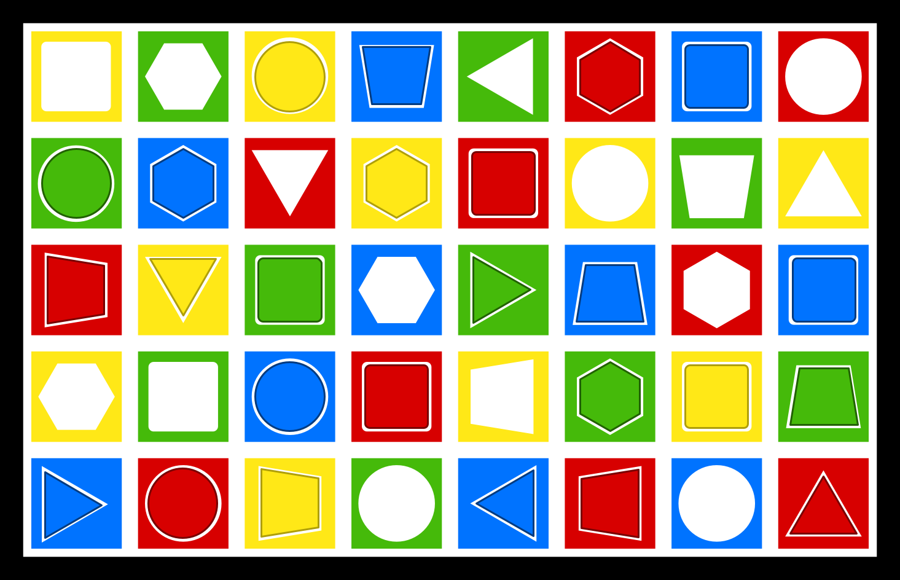
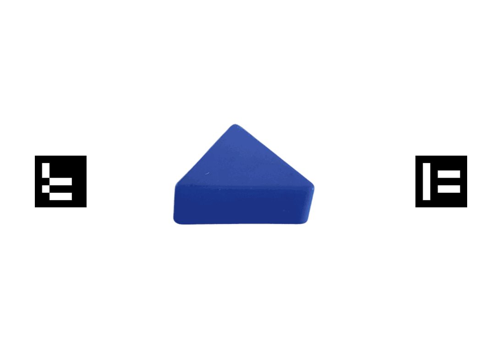
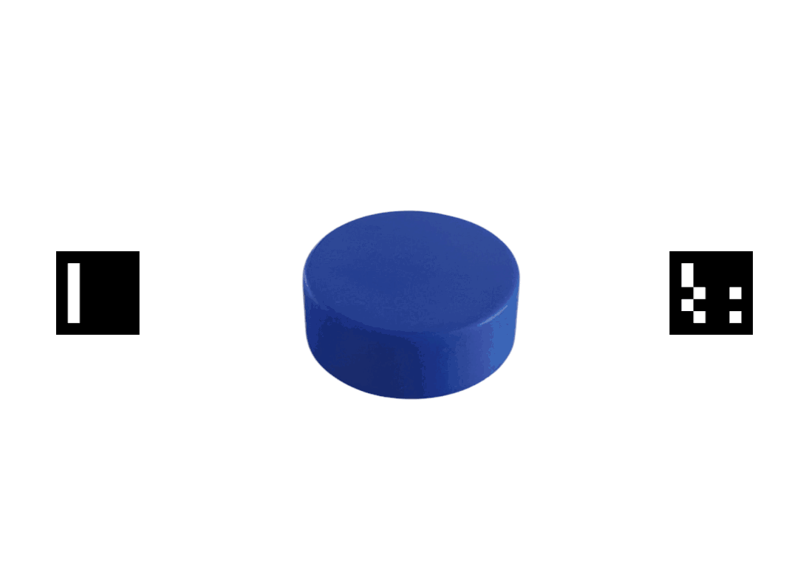
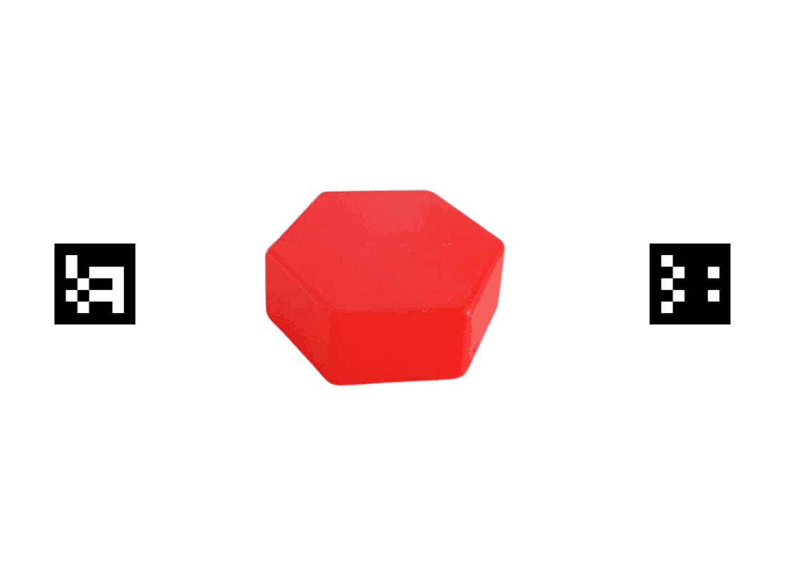

<h1>Data extraction from visual search experiments in natural environments</h1>

## Table of contents <!-- omit in toc -->
- [Introduction](#introduction)
- [Code description](#code-description)
- [Installation And Usage](#installation-and-usage)
  - [What it produces](#what-it-produces)
- [Contributions and Dissemination](#contributions-and-dissemination)
- [Contributors and Contact Information](#contributors-and-contact-information)

## Introduction

The task consists on finding one of the following targets, that are shown to the participant in a panel in the board below.

<!-- GitHub strips style attributes (flex layouts do not render): use aligned
     paragraphs with percentage widths, which GitHub does support -->
<p align="center">
  
  <br>
  <em>Figure 1. The physical board — an 8&times;5 grid of coloured pieces (and matching empty slots) that the participant visually searches.</em>
</p>

<p align="center">
  &nbsp;
  &nbsp;
  
  <br>
  <em>Figure 2. Synchronised carousel of the sample panels (one target each) shown to the participant before every trial.</em>
</p>

The whole experiment is composed by six blocks of ten trials each.


|           | Trial 1 | Trial 2 | Trial 3 | Trial 4 | Trial 5 | Trial 6 | Trial 7 | Trial 8 | Trial 9 | Trial 10 |
|-----------|----------|----------|----------|----------|----------|----------|----------|----------|----------|-----------|
| Block 1  |  |  |  |  |  |  |  |  |  |  |
| Block 2  |  |  |  |  |  |  |  |  |  |  |
| Block 3  |  |  |  |  |  |  |  |  |  |  |
| Block 4  |  |  |  |  |  |  |  |  |  |  |
| Block 5  |  |  |  |  |  |  |  |  |  |  |
| Block 6  |  |  |  |  |  |  |  |  |  |  |


> ⚠️ **In the 4th block (`Block 4` above; `block_index` 3 in the CSVs/code) the board is presented rotated 180°**, by design. The processing detects and compensates for it automatically, so the per-cell results (gaze→cell, touch, marks) are correct; only the *absolute* cell index of that block is expressed in the rotated frame.

## Code description

The software processes the Pupil Labs recordings (world video + gaze) and
reconstructs, for each trial, which board cell the participant was looking at and
for how long. Documentation (Spanish):

- **[Processing guide](docs/guia_procesamiento.md)** — start here. User-facing: what the
  outputs mean and how to interpret them. Self-contained for analysing the CSVs.
- **[Technical documentation](docs/documentacion_tecnica.md)** — how it works inside (board
  localization/homography, contour detection, touch detector, state machine, gaze drift
  correction, a **per-sample gaze uncertainty model** —each gaze as a covariance ellipse →
  probabilistic cell mapping and a graded `target_found_confidence`—, measured engineering findings).
- **[Dataset characterization](docs/caracterizacion_dataset.md)** — the 22 recordings actually
  processed here: per-participant capture configuration (mapping model, eye, gaze rate,
  calibrations) and why they are heterogeneous.
- **[Experimental-design recommendations](docs/recomendaciones_diseno_experimental.md)** — for the
  methodology team: what to change in a future recording to make processing more robust, each
  point grounded in a concrete case from this cohort.

Version history is in the [CHANGELOG](CHANGELOG.md); the current version is **1.4.0**.

Repository layout:

| Path | Content |
|---|---|
| `src/process_video.py` | Main entry point: processes one participant. |
| `src/run_all.py` | Batch entry point: processes several participants in parallel. |
| `src/core/` | Pipeline library (board/panel/eye-data handlers, state machine...). |
| `src/tools/` | Auxiliary tools: output checks, plots, output comparison between versions, camera calibration. |
| `cfg/` | Board, ArUco, sample-panel and trial-sequence configuration. |
| `calibration/` | Camera calibration data (`camera_calib.json`). |
| `scripts/` | Shell wrappers. |
| `docs/` | Documentation (processing guide, technical, dataset characterization, design recommendations) and media assets. |

## Installation And Usage

It is recommended to install the setup into a virtual environment. Create one and activate it with the following command (or just ignore these an execute without venv):

```sh
    python3 -m venv path_venv
    source path_venv/bin/activate
```

The environment can be deactivated as follows:
```sh
    deactivate
```

Clone the repository in a given location and install its requirementes with the following command, executed from the root folder of the repository. You can check the requirements file to check the libraries that will be installed into your system.

```sh
    pip3 install -r requirements.txt
```

Input and output locations default to an external data drive and can be overridden
with `--data_root`/`--output_root` (or the `EEHA_DATA_ROOT`/`EEHA_OUTPUT_ROOT`
environment variables). Outputs are stored under `OutputData_v<version>/<topic>/<id>/`
so results of different software versions never mix.

Slow/precise analysis is the **default**; `--fast_analysis` opts into a ~6.5× subsampled
run that is only meant for quick iteration (it may miss marginally-detected trial starts).

```sh
    # One participant (add -v for the debug visualization)
    python3 src/process_video.py -p 002 -t gaze

    # All participants found in the data root, in parallel
    python3 src/run_all.py

    # Compare the outputs of two software versions at a glance
    python3 src/tools/compare_outputs.py --old <old_output_root> --new <new_output_root>
```

### What it produces

For each participant, under `OutputData_v<version>/<topic>/<id>/`, the run writes (see the
[processing guide](docs/guia_procesamiento.md) for the full column-by-column meaning):

| File | Content |
|---|---|
| `trials_data_<id>.csv` | Per-trial summary — the base for most analyses. |
| `trials_data_<id>_sequence.csv` | The gaze path over time (one row per gaze sample, tagged by phase). |
| `trials_data_<id>_transitions.csv` | The trial timeline: state changes and behavioural marks (touch, hand exit, ...) interleaved by frame. |
| `data_<id>.yaml` / `data_<id>.pkl` | All of the above, human-readable and Python-loadable respectively. |

A batch run additionally produces an HTML report and batch CSVs (e.g.
`informe_comparativa_frequencies.csv`, with the empirically-measured per-participant gaze rate).


## Contributions and Dissemination

Below is a summary of the key presentations and publications associated with the code and information contained in this repository:


- `[Poster presentation]` **Laura Cepero Amores, Enrique Heredia-Aguado, Lucía Bernardino, Alejandro Rujano, Jose David Moreno, M. Pilar Aivar, Victoria Plaza.**  
  *11th Iberian Congress of Perception (CIP 2026)* (Mayo 2026).   
  [**From Screens to the Real World: How context shapes Visual Search.**](https://doi.org/10.13140/RG.2.2.15132.04488)

- `[Poster presentation]` **M. Pilar Aivar, Laura Cepero Amores, Enrique Heredia-Aguado, Alejandro Rujano, Rocío Asperilla, Victoria Plaza.**  
  *Vision Sciences Society Annual Meeting (VSS 2026)* (St. Pete Beach, Florida, EE. UU. Mayo 2026).  
  **Visual search for real objects: how spatial consistency facilitates performance.**

- `[Conference Talk]` **Laura Cepero Amores, Enrique Heredia-Aguado, Alejandro Rujano, M. Pilar Aivar, Victoria Plaza.**  
  *VI Congreso Anual de Estudiantes de Doctorado (UMH)* (Elche, España. 2026).  
  [**Búsqueda visual repetida en contexto natural, ¿eficiencia o aprendizaje?**](https://www.researchgate.net/publication/403332278_Busqueda_visual_repetida_en_contexto_natural_eficiencia_o_aprendizaje)

- `[Conference Talk]` **Laura Cepero, Enrique Heredia-Aguado, Victoria Plaza, María Pilar Aivar.**  
  *Reunión Científica sobre Atención (RECA14)* (Madrid, España. Abril 2025).
  [**Visual Search Strategies: Comparing Screen-Based and Real-World Contexts.**](https://www.researchgate.net/publication/396733528_Visual_Search_Strategies_Comparing_Screen-Based_and_Real-World_Contexts)

- `[Conference Talk]` **Enrique Heredia-Aguado, Laura Cepero, Luis Miguel Jiménez, Victoria Plaza, María Pilar Aivar.**  
  *V Congreso Anual de Estudiantes de Doctorado* (Elche, España. Febrero 2025). 
  [**Colaboración interdisciplinar en estudios de doctorado: Estudiando el proceso de búsqueda visual en personas a través de la visión por computador.**](https://www.researchgate.net/publication/390364612_Colaboracion_interdisciplinar_en_estudios_de_doctorado_Estudiando_el_proceso_de_busqueda_visual_en_personas_a_traves_de_la_vision_por_computador)

- `[Poster presentation]` **Laura Cepero, Enrique Heredia-Aguado, Lidia Sobrino, Laura Cantero, María García de Viedma, Victoria Plaza, María Pilar Aivar.**  
  *XIV Congress of the Spanish Society for Experimental Psychology (SEPEX)* (Almería, España. Octubre 2024).
  [**Bringing Visual Search to Life: how we find colored objects when performing a natural task.**](https://www.researchgate.net/publication/395732728_Bringing_Visual_Search_to_Life_how_we_find_colored_objects_when_performing_a_natural_task)
  

## Contributors and Contact Information

This processing pipeline is developed and maintained by **Enrique Heredia-Aguado**
(<enrique.he.ag@gmail.com>) as part of an interdisciplinary collaboration at the Universidad
Miguel Hernández (UMH), in coordination with **Laura Cepero Amores** predoctoral thesis as part of the visual-search research team from Universidad Autónoma de Madrid (UAM) listed in the
presentations above (M. Pilar Aivar, Victoria Plaza, and colleagues).

For questions about the code, the processed outputs, or reusing the pipeline, open an issue on
the repository or contact the maintainer at the address above.
