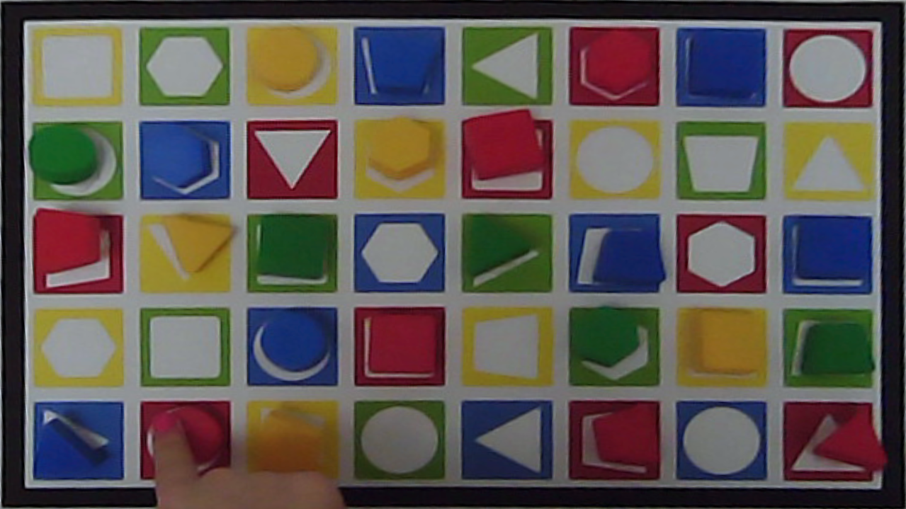
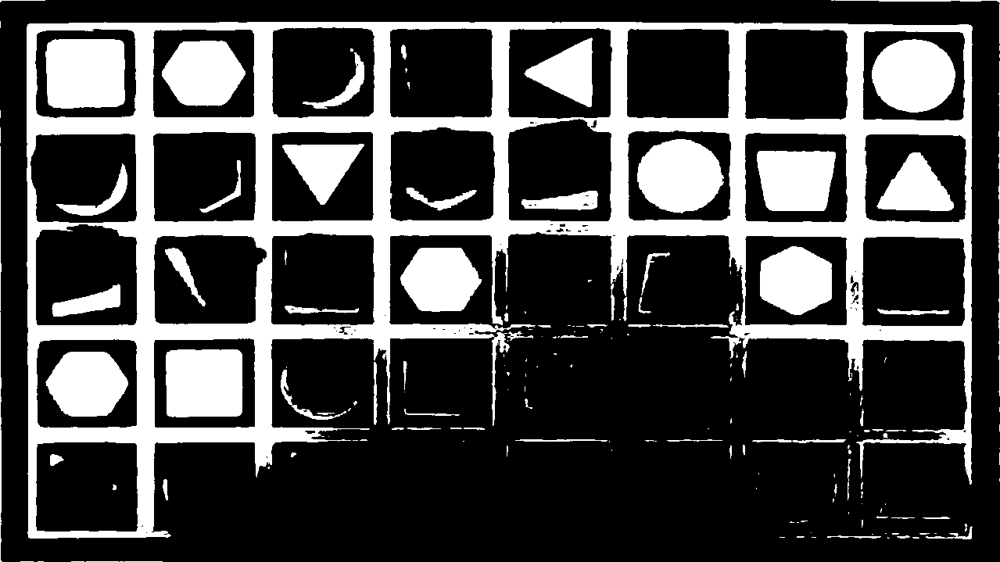
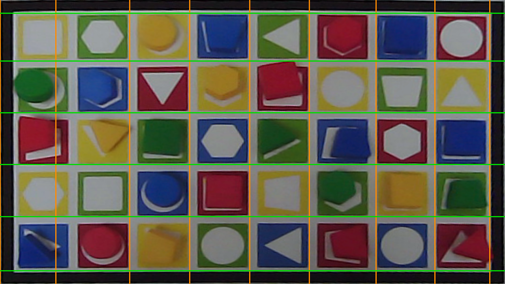

# Documentación técnica — *eyes_board_color*

Este documento describe **cómo funciona** el procesamiento por dentro (algoritmos,
máquina de estados, hallazgos de ingeniería medidos). Es complementario a la
[guía de procesamiento](guia_procesamiento.md), que es de **usuario** (qué significan los
CSV y cómo interpretarlos). Los **números concretos** por participante están en el informe
HTML y los CSV combinados, que se regeneran con cada ejecución.

> Convención: todo lo que aquí se afirma como **medido** se ha comprobado con un script
> sobre fotogramas reales del vídeo; lo que sea hipótesis se marca como tal.

---

## 1. Arquitectura y flujo

Una participante = un vídeo de *World* (1080p, ~30 fps) + datos de *gaze* de Pupil Labs.
Por cada fotograma:

1. **Corrección de color** (`ARUCOColorCorrection`) y **desdistorsión** con la calibración
   de cámara (`DistortionHandler`).
2. **Detección de ArUcos** una sola vez por fotograma (`detectAllArucos`), filtrando los
   ids que no pertenecen al tablero ni a los paneles (`filterValidArucos`).
3. La **máquina de estados** (`StateMachineHandler.StateMachine`) decide en qué fase del
   experimento estamos y delega en:
   - `BoardHandler` — localiza y endereza el tablero, segmenta casillas, detecta el toque.
   - `PanelHandler` — detecta el panel de estímulo (qué objeto buscar).
   - `EyeDataHandler` — empareja las muestras de *gaze* con el fotograma.

Entradas/salidas y ejecución por lotes: ver el [README](../README.md) y la guía.

---

## 2. Localización del tablero (homografía + rejilla)

El tablero se localiza con los **marcadores ArUco** que lo rodean: con sus esquinas se
calcula una **homografía** que proyecta el tablero a una **vista cenital** fija
(`board_view`, ~1280×720). Sobre esa vista se reconstruye la rejilla de 8×5 casillas.

Para estabilizar la rejilla cuando faltan marcadores, se guarda una **rejilla de
referencia** (mediana del rectángulo del tablero sobre ≥5 muestras estables,
`reference_board_rect`); con ella la `cell_matrix` se mantiene aunque el contorno del
fotograma actual no se reconstruya.

El **contorno del tablero** (`detectContour`, [BoardHandler.py](../src/core/BoardHandler.py))
no es un borde genérico: muestrea el **color del marco** en los bordes de la vista cenital,
construye una máscara de ese color, aplica Canny + `findContours` y se queda con el
**rectángulo** grande. Es, en la práctica, el **borde blanco** del tablero.

| Tablero despejado | Mano dentro (alcance) | Máscara de blanco (alcance) |
|---|---|---|
|  |  |  |

La rejilla blanca se segmenta de forma limpia y por **ajuste de retícula periódica**
(perfil de proyección + periodicidad, robusto a líneas rotas por sombras o por el relieve
3D de las piezas):

### Hallazgo medido: la homografía es estable ante pérdida de ArUcos

Midiendo la **deriva** de la vista cenital (correlación cruzada del perfil de blanco frente
a un fotograma limpio) a lo largo de varios trials, la vista se mantiene **estable
(≈1 px)** aunque los ArUcos bajen a 6–8 y el contorno se pierda; `board_view` **sigue
presente** durante todo el alcance (medido en 12 trials de 4 participantes: `board_view`
presente el 100% del tiempo). La rejilla de referencia estable mantiene la homografía
anclada. **Consecuencia práctica:** los fallos del detector de toque **no** vienen de que
la proyección se desplace o desaparezca (salvo cuando los ArUcos caen a 2–3 y la
`cell_matrix` deja de poder calcularse).

---

## 3. Detector de toque (best-effort)

El toque de la pieza objetivo (`frame_target_touch`) se detecta por **cambio de imagen**
(no por color) en el entorno de la casilla objetivo de la vista cenital, comparado con su
apariencia de referencia limpia (`getTargetOcclusionMeasure`). Funciona con manga de
cualquier color. Tres salvaguardas contra falsos positivos:

1. **Composición de color (histograma H-S)**: un desplazamiento del *warp* mantiene los
   colores; una mano mete un color nuevo. Si el histograma apenas cambia, es deriva → 0.
2. **Alineación por correlación de fase**: compensa el micro-temblor del *warp* (±10 px)
   antes de medir el cambio.
3. **Separación frente a celdas de control**: el cambio en el objetivo debe destacar sobre
   la **mediana de celdas de control** alejadas, para descartar cambios globales (la mano
   sobre todo el tablero).

La señal blanco/color de la casilla se mide sobre los **píxeles** (umbral de saturación),
no por geometría, así que un pequeño desfase de la celda no reasigna las zonas.

### Hallazgo medido: el fallo del toque era de temporización, no de homografía

El toque ocurre en la **fase motora**, cuando la mano ya está sobre el tablero. La señal de
oclusión del objetivo **sube con claridad** durante el alcance (medido: `fT` llega a ~1.0).
El detector vigila el toque tanto en `test_execution` como en `test_motor_recovery`.

El problema medido (7/7 fallos recuperables) era que `test_motor_recovery` **cerraba el
trial antes** de que el toque culminara: el **contorno del tablero reaparece a mitad del
alcance** (la mano ya cruzó el borde y está en el centro; el marco vuelve a verse completo)
y la máquina lo leía como "la mano salió". El toque ocurría 13–57 fotogramas **después** de
ese cierre. Solución: registrar `hand_exit` pero **no cerrar** con esa reaparición; el
cierre y el `hand_exit` *real* se toman con el contorno que vuelve **después** del toque, o
con el panel siguiente, o por *timeout*. No cambia la segmentación (`end_capture` ya está
fijado por la pérdida de contorno).

Cobertura best-effort: del orden del **80%** en muestra (sube respecto a versiones
previas). Limitaciones residuales medidas: ArUcos a 2–3 (sin `cell_matrix`), geometría del
alcance que no oclúye la casilla, o celdas de control más ocluidas que el objetivo.

---

## 4. Marcas motoras y la ambigüedad del contorno

| Marca | Señal que usa |
|---|---|
| `frame_motor_onset` / `frame_end` | **pérdida sostenida del contorno** (la mano cruza el borde hacia dentro) |
| `frame_target_touch` | **oclusión por cambio** del entorno de la casilla objetivo (mejor esfuerzo) |
| `frame_hand_exit` | **contorno que vuelve de forma sostenida después del toque** (la mano sale) |

Orden temporal: borde-entra (`end`) → toque → borde-sale (`hand_exit`). Clave: el
**contorno (borde) solo se oculta mientras la mano lo cruza**, no mientras está realcanzando
en el centro; por eso reaparece a mitad de alcance y no sirve, por sí solo, para distinguir
*mano-dentro-realcanzando* de *mano-fuera*. Por eso `hand_exit` se ancla al contorno que
vuelve **tras** el toque (ver apartado 3).

---

## 5. Máquina de estados

Hay **una sola** máquina de estados; los "dos niveles" (detección vs trial) son dos formas
de leer su resultado, no dos máquinas (ver el modelo conceptual y el diagrama en la
[guía, apartado 3](guia_procesamiento.md)). Estados:

`init → get_test_name → test_start_execution → test_execution → test_motor_recovery → test_finish_execution → init`

### Gestión de saltos / errores (robustez)

- **Panel inesperado** mientras se prepara o corre un trial: un único manejador
  (`_handleUnexpectedPanel`) usado por `test_start_execution`, `test_execution` y
  `get_test_name`. Con datos ya recogidos cierra el trial como `test_finish_by_next_panel`
  (válido, duración = cota superior); sin datos, `transition_error_no_init`. Luego vuelve a
  `init` para re-emparejar el panel nuevo.
- **Panel fuera de secuencia / espurio en `init`** (`_detectedInRemaining`): si el panel
  detectado no aparece en lo que queda de secuencia, se **ignora** (sigue en `init`) en vez
  de consumir toda la secuencia como *missing* y terminar el run.
- **`test_motor_recovery` cede a cualquier panel confirmado** (mismo o distinto): el panel
  de muestra se retira al inicio del trial, así que un panel confirmado durante la fase
  motora es la presentación siguiente → cierra y deja que `init` la recoloque (esto evitó
  perder trials con doble presentación del mismo panel).

### Errores que publica (qué significan)

| Tag | Significado |
|---|---|
| `missing_trial_error_*` | un panel esperado no se detectó; suele ser fallo de detección, no del participante |
| `transition_error_no_init_*` | apareció otro panel antes de que el trial recogiera datos |
| `test_finish_by_next_panel` | trial **válido** cerrado al aparecer el panel siguiente (duración = cota superior) |
| `test_finish_by_end_of_video` | trial cerrado por fin de grabación |

---

## 6. Frecuencia de muestreo del *gaze*

No se asume 200 Hz: se **mide** por participante como `1 / mediana(intervalos entre
muestras)`, usando **todas** las muestras (válidas e inválidas), porque cada muestra
representa un intervalo de muestreo. `gaze_continuity` = fracción de intervalos dentro de
±20% de la mediana (avisa de muestreo irregular). Valores observados ≈124 Hz y ≈248 Hz
según el participante. Detalle de uso (conteo de muestras → tiempo) en la guía, apartado 4.

---

## 7. Parámetros clave

| Parámetro | Dónde | Valor | Qué controla |
|---|---|---|---|
| `board_contour_switch_state_threshold` | StateMachine | 4 | fotogramas sin contorno para cerrar el trial (motor_onset) |
| `board_contour_start_confirm_threshold` | StateMachine | 6 | fotogramas de contorno estable para iniciar el trial |
| `target_occlusion_threshold` / `_separation` | StateMachine | 0.20 / 0.10 | umbrales del detector de toque |
| `target_occlusion_confirm_threshold` | StateMachine | 2 | fotogramas de oclusión sostenida para confirmar el toque |
| `motor_recovery_max_frames` | StateMachine | 75 | ventana (~2,5 s) para vigilar toque + salida de mano |
| `motor_recovery_confirm` / `_miss_tolerance` | StateMachine | 3 / 2 | contorno sostenido para `hand_exit`, con tolerancia a parpadeo |
| `occlusion_*` (patch, hist, align) | BoardHandler | — | internos del detector de cambio (ver código) |

Los valores se han ajustado **midiendo** sobre muestra; no son nominales.
