# Documentación técnica — *eyes_board_color*

> Documento técnico, complementario a la [guía de procesamiento](guia_procesamiento.md). Da por
> conocidos sus conceptos (*trial*, fases, marcas, CSV, máquina de estados a nivel usuario) y entra
> en el **cómo**: algoritmos, implementación y hallazgos medidos. Las referencias `[guía §X]`
> enlazan cada concepto en la guía.

Cubre la arquitectura, el flujo por fotograma, los algoritmos de cada módulo, la máquina de estados
en detalle, el contrato de entradas/salidas y los hallazgos de ingeniería medidos. Los números
concretos por participante están en el informe HTML y los CSV combinados.

> Convención: lo que se afirma como *medido* se ha comprobado con un script sobre fotogramas reales
> del vídeo; las hipótesis se marcan como tales.

**Índice**

- [1. Arquitectura y flujo por fotograma](#1-arquitectura-y-flujo-por-fotograma)
  - [El bucle de despacho (`StateMachine.step`)](#el-bucle-de-despacho-statemachinestep)
  - [Mapa de módulos (`src/core/`)](#mapa-de-módulos-srccore)
  - [Por qué este enfoque (ArUco + homografía) y no detección por aprendizaje](#por-qué-este-enfoque-aruco--homografía-y-no-detección-por-aprendizaje)
- [2. Entradas y salidas (contrato técnico)](#2-entradas-y-salidas-contrato-técnico)
  - [Entradas](#entradas)
  - [Estructura de datos interna (`data_store`)](#estructura-de-datos-interna-data_store)
  - [Salidas (ficheros)](#salidas-ficheros)
- [3. Corrección de imagen y detección de ArUcos](#3-corrección-de-imagen-y-detección-de-arucos)
  - [Desdistorsión (`DistortionHandler`)](#desdistorsión-distortionhandler)
  - [Corrección de color (`ARUCOColorCorrection`)](#corrección-de-color-arucocolorcorrection)
  - [Detección y filtrado de ArUcos](#detección-y-filtrado-de-arucos)
- [4. Localización del tablero (homografía + rejilla)](#4-localización-del-tablero-homografía--rejilla)
  - [Hallazgo medido: la homografía es estable ante pérdida de ArUcos](#hallazgo-medido-la-homografía-es-estable-ante-pérdida-de-arucos)
  - [Hallazgo medido: detección robusta del marco (referencia estable, sin Canny)](#hallazgo-medido-detección-robusta-del-marco-referencia-estable-sin-canny)
- [5. Detección del panel de estímulo (`PanelHandler`)](#5-detección-del-panel-de-estímulo-panelhandler)
  - [Robustez ante falsos positivos: persistencia temporal](#robustez-ante-falsos-positivos-persistencia-temporal)
- [6. Emparejamiento mirada–vídeo (`EyeDataHandler`)](#6-emparejamiento-miradavídeo-eyedatahandler)
  - [Clasificación de la mirada (qué cuenta y qué no)](#clasificación-de-la-mirada-qué-cuenta-y-qué-no)
- [7. Limpieza de la mirada: corrección de deriva y suavizado](#7-limpieza-de-la-mirada-corrección-de-deriva-y-suavizado)
  - [7.1 Medida offline — `src/tools/gaze_calibration.py`](#71-medida-offline--srctoolsgaze_calibrationpy)
    - [Lo que se mide y lo que corrige la compuerta (figuras)](#lo-que-se-mide-y-lo-que-corrige-la-compuerta-figuras)
  - [7.2 Aplicación al vuelo — `EyeDataHandler`](#72-aplicación-al-vuelo--eyedatahandler)
  - [7.3 Filtrado y suavizado de la mirada — `EyeDataHandler`](#73-filtrado-y-suavizado-de-la-mirada--eyedatahandler)
  - [7.4 Incertidumbre por muestra: la mirada como elipse, no como punto](#74-incertidumbre-por-muestra-la-mirada-como-elipse-no-como-punto)
  - [7.5 Proyección probabilística a casillas y `target_found_confidence`](#75-proyección-probabilística-a-casillas-y-target_found_confidence)
- [8. Frecuencia de muestreo del *gaze*](#8-frecuencia-de-muestreo-del-gaze)
- [9. Máquina de estados en detalle](#9-máquina-de-estados-en-detalle)
  - [`init` — espera y casado con la secuencia](#init--espera-y-casado-con-la-secuencia)
  - [`get_test_name` — panel visible (codificación)](#get_test_name--panel-visible-codificación)
  - [`test_start_execution` — el tablero aparece](#test_start_execution--el-tablero-aparece)
  - [`test_execution` — búsqueda](#test_execution--búsqueda)
  - [`test_motor_recovery` — fase motora (toque + salida de mano)](#test_motor_recovery--fase-motora-toque--salida-de-mano)
  - [`test_finish_execution` — cierre](#test_finish_execution--cierre)
  - [Gestión de saltos / errores (robustez)](#gestión-de-saltos--errores-robustez)
  - [Errores que publica](#errores-que-publica)
- [10. Derivación de marcas, fases y línea de tiempo (`store_results`)](#10-derivación-de-marcas-fases-y-línea-de-tiempo-store_results)
  - [Línea de tiempo unificada (estados + marcas)](#línea-de-tiempo-unificada-estados--marcas)
  - [Diagnóstico de toque (`touch_diag`)](#diagnóstico-de-toque-touch_diag)
- [11. Detector de toque (best-effort)](#11-detector-de-toque-best-effort)
  - [Hallazgo medido: el fallo del toque era de temporización, no de homografía](#hallazgo-medido-el-fallo-del-toque-era-de-temporización-no-de-homografía)
  - [Limitación conocida (medida, sin resolver): toque temprano sobre ruido de `fT`](#limitación-conocida-medida-sin-resolver-toque-temprano-sobre-ruido-de-ft)
- [12. Marcas motoras y la ambigüedad del contorno](#12-marcas-motoras-y-la-ambigüedad-del-contorno)
  - [12.1 `motor_onset` validado por oclusión](#121-motor_onset-validado-por-oclusión)
  - [12.2 Anomalías "fuera de target", validación de mirada y pieza tocada](#122-anomalías-fuera-de-target-validación-de-mirada-y-pieza-tocada)
- [13. Limitaciones del equipo de medida (mecanismo)](#13-limitaciones-del-equipo-de-medida-mecanismo)
- [14. Parámetros clave](#14-parámetros-clave)
  - [14.1 Modos de ejecución y fiabilidad](#141-modos-de-ejecución-y-fiabilidad)
- [Referencias](#referencias)

---

## 1. Arquitectura y flujo por fotograma

Una participante = un vídeo de *World* (**1280×720**, ~30 fps) + datos de *gaze* de Pupil Labs. El
punto de entrada es `src/process_video.py`, que instancia los *handlers* y recorre el vídeo
de forma secuencial (decodificación en streaming, no *seeks* por fotograma: ~6,5× más rápido que
con acceso aleatorio).

**Fase previa** (al instanciar, una sola vez). Antes del bucle por fotograma, `EyeDataHandler`
carga y limpia toda la mirada de golpe: filtrado por confianza, exclusión de parpadeos, corrección
de deriva, suavizado y modelo de incertidumbre por muestra (todo en §7). Las correcciones de mirada
ocurren, por tanto, primero; el bucle por fotograma solo empareja cada muestra ya limpia con su
fotograma (§6). Por eso la mirada (§6–§8) se documenta antes de la máquina de estados, aunque parte
de su procesado sea previo al bucle.

Para cada fotograma `capture_idx`:

1. **Corrección de color** (`ARUCOColorCorrection`) sobre la imagen original; todo lo demás
   trabaja ya sobre la imagen color-corregida (apartado 3).
2. **Desdistorsión** (`DistortionHandler.undistortImage`) con la calibración de cámara, dentro de
   `StateMachine.step`. La imagen desdistorsionada se calcula una sola vez y se comparte entre
   todos los handlers.
3. **Detección de ArUcos** una sola vez (`detectAllArucos`) sobre la imagen original
   (distorsionada) —para no perder los marcadores de los bordes que el undistort recorta—,
   desdistorsionando luego sus esquinas (`correctCoordinates`, ver apartado 3); se filtran los ids
   que no pertenecen al tablero ni a los paneles (`filterValidArucos`).
4. **Emparejamiento de *gaze*** del fotograma (`EyeDataHandler.step`, apartado 6).
5. **Despacho a la máquina de estados** (bucle interno de `StateMachine.step`), que delega en
   `BoardHandler`, `PanelHandler` y `EyeDataHandler` según la fase.

### El bucle de despacho (`StateMachine.step`)

El corazón del procesamiento es un bucle que reejecuta el estado actual mientras el estado
cambie dentro del mismo fotograma:

```python
previous_state = None
while self.current_state != previous_state:
    previous_state = self.current_state
    self.state_info[self.current_state]['callback'](undistorted_image, capture_idx, gaze_list)
    self.frame_speed_multiplier = self.state_info[self.current_state]['frame_mult']
    if self.current_state != previous_state:
        self._recordTransition(previous_state, self.current_state, capture_idx)
```

Esto permite encadenar varias transiciones en un mismo fotograma (p. ej.
`test_finish_execution → init → get_test_name` cuando el panel siguiente ya está visible al
cerrar) sin perder pasos. Cada transición se registra con su *frame* exacto y el block/trial
activo (apartado 9 y 8).

- **Multiplicador de velocidad** (`frame_speed_multiplier`): cada estado declara cuántos
  fotogramas puede saltar el lector. Los estados de espera (`init`) avanzan más rápido; los
  de búsqueda y fase motora procesan fotograma a fotograma.
- **E/S de vídeo con hilos** (`ThreadVideoStream`): la lectura (y, en modo visualización, la
  escritura del `debug_<id>.mp4`) corre en hilos aparte para no bloquear el procesado.
- **Hilos de OpenCV**: limitados por `EEHA_CV_THREADS` (lo fija `run_all.py`) para no
  sobre-suscribir la máquina cuando se procesan varios participantes en paralelo. Con
  `cv_threads=1` el resultado es determinista entre ejecuciones.

### Mapa de módulos (`src/core/`)

| Módulo | Responsabilidad |
|---|---|
| `process_video.py` (raíz `src/`) | Punto de entrada: bucle de vídeo, instancia handlers, vuelca resultados. |
| `DistortionHandler` | Desdistorsión de imagen y de coordenadas (con homografía opcional). |
| `ArucoBoardHandler` | Detección/casado de ArUcos, pose, rotación 180°, homografía a vista cenital; corrección de color. |
| `BoardHandler` | Localiza y endereza el tablero, segmenta la rejilla, mide oclusión y toque. |
| `PanelHandler` | Detecta el panel de estímulo (identidad color/forma) y su polígono. |
| `EyeDataHandler` | Carga *gaze*/*fixations* `.pldata` y los empareja a *frames* de *World*. |
| `StateMachineHandler` | Máquina de estados del experimento; deriva marcas y vuelca CSV/PKL. |
| `ThreadVideoStream` | Lectura/escritura de vídeo con hilos. |
| `utils` | Máscaras de color (`getMaskHue`), proyecciones, logging por niveles. |

### Por qué este enfoque (ArUco + homografía) y no detección por aprendizaje

El problema concreto es **proyectar la mirada a la casilla exacta** de un tablero conocido y
detectar un toque breve sobre la pieza objetivo, todo desde el vídeo egocéntrico de las
gafas. Para eso se eligió localización por **marcadores fiduciales (ArUco) + homografía**:

- El tablero es un objeto fijo y diseñado; los marcadores fiduciales dan una geometría
  conocida y calibrada, de la que sale una homografía precisa que mapea cada muestra de
  *gaze* a su celda con error de píxeles. Es determinista, transparente, reproducible y
  ligero (sin GPU ni modelos).
- Para el toque se usa detección de **cambio/oclusión** sobre la casilla, no seguimiento de
  mano: en la vista egocéntrica la mano suele entrar parcialmente ocluida por el borde del
  tablero o salirse del encuadre al alcanzar, y el cambio de imagen funciona con manga de
  cualquier color y sin necesidad de ver la mano entera.

Se valoraron enfoques basados en modelos aprendidos (p. ej. MediaPipe, sólido para seguimiento
de manos/pose/objetos en general). Resuelven un problema distinto: no aportan la geometría métrica
por celda del tablero —lo que necesita la proyección de la mirada— y añadirían una dependencia más
pesada, menos transparente y no determinista, sin mejorar la medida central (*gaze* → celda). La
combinación fiducial + homografía encaja con los requisitos de esta tarea: precisión por celda,
calibración y reproducibilidad.

---

## 2. Entradas y salidas (contrato técnico)

### Entradas

Por participante (`<data_root>/<id>/`): `world.mp4`, `world_timestamps.npy`,
`gaze.pldata` + `gaze_timestamps.npy` (o `fixations.*`), `camera_calib.json`. Configuración
común (`cfg/`): `game_config.yaml` (tablero 8×5: color/forma/ficha por casilla),
`game_aruco_board.yaml` (layout de los ArUcos del tablero), `default_trials_config.yaml`
(secuencia esperada; excepciones por participante en `cfg/trials_config_exceptions/`),
`sample_shape_cfg/` (un YAML por panel de estímulo). Detalle de uso en la [guía §2].

### Estructura de datos interna (`data_store`)

`store_results` serializa un único diccionario a `data_<id>.pkl` (carga rápida) y
`data_<id>.yaml` (legible):

```
sw_version, slow_analysis, run_config, video_fps, gaze_sampling_rate, participant_id,
frames_info{estado: nº frames}, fixations_info{estado: nº muestras},
trials_data{(block,trial): {nombre_trial: board_metrics}},
state_transitions[ {frame, block, trial, trial_name, from_state, to_state} ]
```

`run_config` es la **procedencia** del run: las opciones de ejecución que afectan a la calidad
(`slow_analysis`, `topic`, `use_offline_data`, `start_frame`, `end_frame`). Se graba para que un
resultado sea autodescriptivo y una degradación por un cambio de opción no haya que
investigarla a posteriori (ver [§14.1 modos de ejecución](#141-modos-de-ejecución-y-fiabilidad)).

Cada `board_metrics` de un *trial* contiene: `init_capture`, `end_capture`,
`early_init_capture`, `motor_onset_capture` (+ `motor_onset_live`/`motor_onset_source` si se
validó por curva), `target_touch_capture`, `hand_exit_capture` (+ `hand_exit_source`),
`target_cord` ([fila,col]), `target_norm_coord`, `status`, `touch_diag`, `bump` (los 6
*landmarks* de las dos curvas + congruencia + `reach_style`), `signal_trace` (perfil de oclusión
por *frame*, base del post-hoc) y `sequence` (lista de muestras `{color, shape, slot, frame,
phase, board_coord, norm_board_coord}`).

### Salidas (ficheros)

Por participante, desde `store_results`: `trials_data_<id>.csv` (resumen por trial),
`trials_data_<id>_sequence.csv` (una fila por muestra de *gaze*),
`trials_data_<id>_transitions.csv` (línea de tiempo estados+marcas), `data_<id>.{pkl,yaml}`,
`result_log_<id>.txt`, y `debug_<id>.mp4` (solo con visualización). Por lote, desde
`src/tools/process_outputs.py`: `combined_{trials,sequence,transitions}_<topic>.csv`
(apilados con columna `participant`), `target_geometry.csv` (referencia por casilla),
`informe_comparativa.html` + `_frequencies.csv`. El contenido columna a columna está en la
[guía §5–§6]; el contrato es que **los CSV se derivan del `data_store`**, que es la
fuente de verdad (el PKL conserva campos que los CSV resumen no exponen).

---

## 3. Corrección de imagen y detección de ArUcos

### Desdistorsión (`DistortionHandler`)

De `camera_calib.json` se leen `camera_matrix` y `distortion_coefficients`. En el arranque se
precomputan los mapas de remapeo (`initUndistortRectifyMap` con `getOptimalNewCameraMatrix`,
`alpha=0`), y cada fotograma se corrige con `cv.remap` + recorte al ROI. Las **coordenadas de
mirada** se corrigen aparte (`correctCoordinates`): `undistortPoints` y, opcionalmente,
aplicación de una homografía para llevarlas a la vista cenital del tablero. Así un punto
de *gaze* puede proyectarse tanto a la imagen desdistorsionada (sin homografía) como a la
casilla del tablero (con la homografía del tablero).

| Original (con distorsión de lente) | Desdistorsionada |
|---|---|
|  | 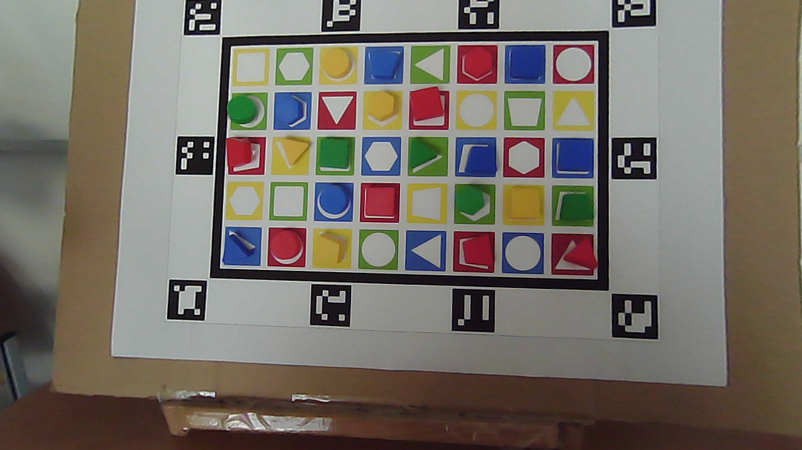 |

*Las líneas rectas del tablero vuelven a verse rectas tras corregir la distorsión del objetivo.*

### Corrección de color (`ARUCOColorCorrection`)

Balance de blanco tipo *gray-world* en espacio **LAB** con peso por luminancia: se estima el
sesgo medio de los canales `a` y `b` (submuestreando 1 de cada 4 px por eje, `[::4,::4]` = 1/16 de los píxeles, por velocidad) y se resta
ponderado por la luma del píxel (`luma·1.1`), de modo que las zonas claras se corrigen más que
las sombras. Se aplica a todo el fotograma desdistorsionado. Mantiene los colores de las
fichas estables ante cambios de iluminación, lo que es clave para las máscaras de color (borde
del tablero, máscara de panel) y para la corrección de color del propio tablero.

| Original | Corregida (LAB gray-world) |
|---|---|
| 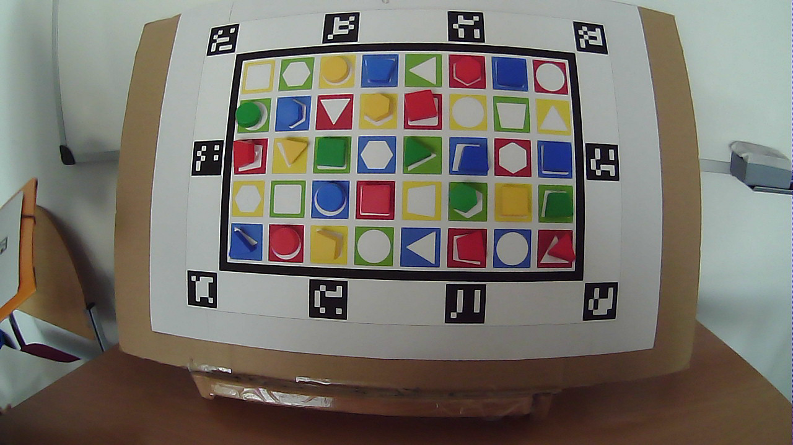 | 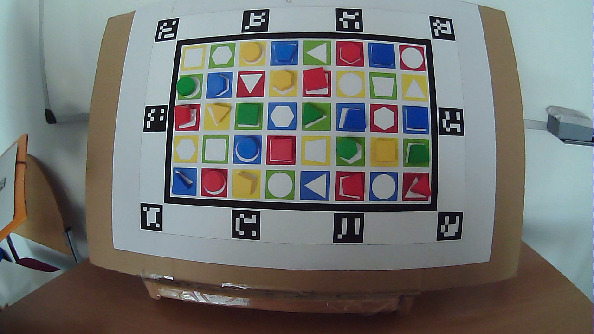 |

*Mismo fotograma antes (dominante cálida del entorno) y después de la corrección.*

### Detección y filtrado de ArUcos

`detectAllArucos` corre el detector una vez por fotograma. `filterValidArucos` descarta
cualquier id que no esté en la *whitelist* (ids del tablero ∪ ids de todos los paneles): el
detector dispara ocasionalmente el id 0 sobre piezas del tablero, y esas detecciones espurias
se eliminan antes de cualquier proceso o dibujo. Las esquinas de los ArUcos no se suavizan
entre fotogramas (`smoothArucos`): medido, el suavizado estabiliza algo la homografía pero degrada
la detección de contorno y pierde *trials*.

**Detección sobre la imagen original (no la desdistorsionada).** Los ArUcos se detectan en la
imagen original (distorsionada) y sus esquinas se desdistorsionan después
(`correctCoordinates`). La desdistorsión (`alpha=0`) empuja los marcadores de los bordes
—sobre todo la fila superior— fuera del encuadre y los pierde, aunque estaban completos en
la original (un marcador cortado no lo detecta OpenCV). Medido: el participante 042 perdía
marcadores en 16/16 fotogramas (~5 por fotograma), debilitando la homografía y provocando
fallos `few_arucos`. Las esquinas detectadas se reproyectan al espacio de la imagen `alpha=0`
(`correctCoordinates`: `undistortPoints` + reproyección con la `camera_matrix` original); con
`alpha=0` y mismo tamaño de imagen la nueva matriz de cámara apenas difiere de la original, de modo
que las esquinas reproyectadas coinciden con la imagen `alpha=0` a 0,15 px (medido). Así no cambian
ni la resolución ni la proyección de la mirada: solo se recuperan marcadores.

| Detectados en la imagen original (todos) | En la desdistorsionada (se pierden los del borde) |
|---|---|
| 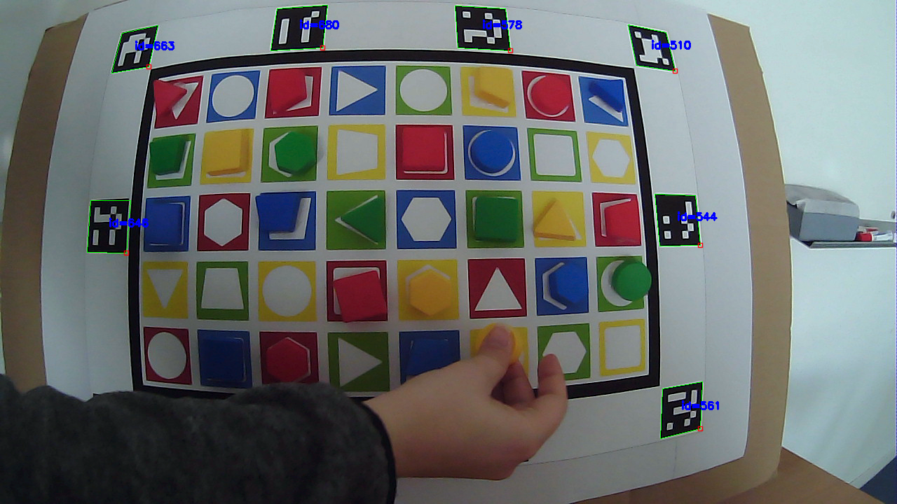 | 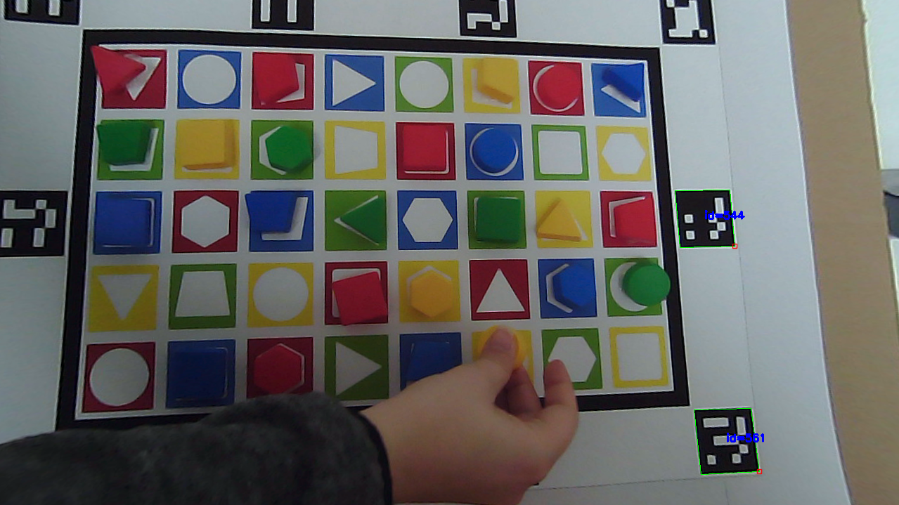 |

*Mismo fotograma de 042: 7 marcadores en la original vs 2 en la desdistorsionada (la fila
superior se pierde). Por eso se detecta sobre la original.*

---

## 4. Localización del tablero (homografía + rejilla)

El tablero se localiza con los **marcadores ArUco** que lo rodean: con sus esquinas se calcula
una homografía que proyecta el tablero a una vista cenital fija (`board_view`,
~1280×720). Sobre esa vista se reconstruye la rejilla de 8×5 casillas.

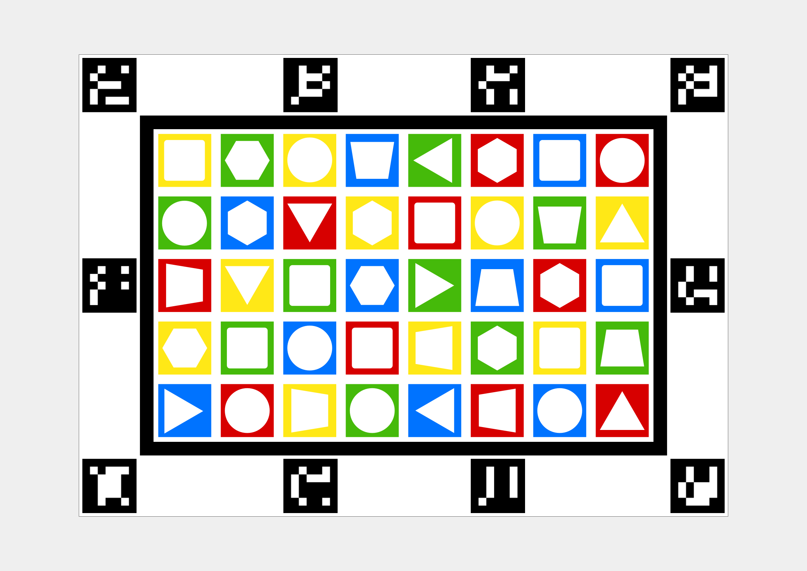

`ArucoBoardHandler.getTransform` casa los ArUcos detectados con los configurados
(`game_aruco_board.yaml`), estima si el tablero se ve **girado 180°** (solo para el tablero,
no para los paneles: la rejilla se voltea con él) mediante `estimatePoseSingleMarkers` con
histéresis (`rotation_flip_threshold=3`, así un marcador suelto no fuerza el giro), y
calcula la homografía a la vista cenital.

La **rejilla se proyecta de forma determinista desde la homografía de ArUcos** (v1.4.1), no se
ancla al marco negro detectado. El *warp* rectifica el tablero a un marco métrico fijo (el
rectángulo `board_3d` siempre llena toda la vista cenital), así que el **borde interior del marco
negro** —que delimita la rejilla de celdas, siendo cada celda su cuadrado de color más el margen
blanco que lo rodea— cae en coordenadas warpeadas **constantes** para todo fotograma y participante
(medido sobre los 22: desviación ~0.002–0.012 del frame por borde). La rejilla se coloca con ese
*bounding box* calibrado (`colored_grid_frac` en `game_config.yaml`) escalado por las dimensiones
del *warp*. Ventajas: no necesita detección del marco por fotograma (la rejilla
existe siempre que haya pose, lo que ayuda a clasificar la mirada durante la retirada del panel
y oclusiones parciales) y —al compartir rejilla y mirada la **misma** homografía— el temblor de
ArUco mueve ambas a la vez y se cancela en la asignación de casilla.

> **Por qué no se divide el marco detectado (corregido en v1.4.1).** El enfoque anterior dividía
> el `boundingRect` del marco negro en 8×5. Pero `detectContour` (`RETR_EXTERNAL`) sigue el borde
> **exterior** del marco, mientras las casillas pintadas están en el borde **interior**: la
> rejilla quedaba más grande y derivaba hasta **~0.25 celda en los bordes** del tablero (0 en el
> centro). El error casi se triplicó en v1.4.0 al quitar Canny (que, sin pretenderlo, caía en el
> borde interior): medido ~0.07 celda en ≤v1.2.0 frente a ~0.25 en v1.4.0. La proyección
> determinista elimina ese sesgo sistemático; el residual restante es el temblor de ArUco, que
> rejilla y mirada comparten y por tanto se cancela en la asignación de casilla.

El **contorno del tablero** (`detectContour`, [BoardHandler.py](../src/core/BoardHandler.py))
se mantiene, pero ya **no** alimenta la rejilla: sirve como señal de «tablero limpio y
completamente visible» (`contour_detected_raw`, que la mano rompe al cruzar el borde). No es un
borde genérico: muestrea el color del marco oscuro que rodea el tablero en los bordes de la
vista cenital, construye su máscara y se queda con el rectángulo grande buscándolo con
`findContours` directamente sobre la máscara (sin Canny). La robustez de ese muestreo y por qué
se hace así se detalla en el hallazgo de §4 más abajo.

| Tablero despejado | Mano dentro (alcance) | Máscara de blanco (alcance) |
|---|---|---|
|  |  |  |

`computeBoardMatrixFromRect` divide ese rectángulo calibrado en la rejilla regular de 8×5. Los
tamaños de celda son flotantes (la división entera acumulaba hasta `board_size−1` px de resto en
los bordes derecho/inferior y clasificaba mal la mirada de las últimas casillas como
`not_board`). A cada casilla se le asigna su **propiedad** —color, forma y si es ficha o
hueco— desde `game_config.yaml` (rotada 180° si el tablero se ve girado).
`getCellIndex` localiza la casilla de una coordenada ya proyectada; `getPixelBoardNorm` la
normaliza contra el área del tablero (0,0 esquina superior izquierda; 1,1 inferior derecha).

La imagen siguiente es el procesamiento real sobre un fotograma: los **ArUcos detectados**
(marcas con punto), el **contorno del tablero** (recuadro verde), la **vista cenital
reproyectada** con la rejilla y las propiedades de cada casilla (recuadro inferior derecho,
*picture-in-picture*) y el **estado de la máquina** (texto superior). Es el mismo render que
produce el `debug_<id>.mp4`, donde además la mirada se dibuja como círculos de color según
dónde cae (verde = casilla del tablero, naranja = anticipada, rojo = sobre el panel y por tanto
no contabilizada, blanco = fuera del tablero).


### Hallazgo medido: la homografía es estable ante pérdida de ArUcos

Midiendo la deriva de la vista cenital (correlación cruzada del perfil de blanco frente a
un fotograma limpio) a lo largo de varios trials, la vista se mantiene estable (≈1 px)
aunque los ArUcos bajen a 6–8 y el contorno se pierda; `board_view` sigue presente durante
todo el alcance (medido en 12 trials de 4 participantes: `board_view` presente el 100% del
tiempo). La rejilla de referencia estable mantiene la homografía anclada. **Consecuencia
práctica:** los fallos del detector de toque no vienen de que la proyección se desplace o
desaparezca (salvo cuando los ArUcos caen a 2–3 y la `cell_matrix` deja de poder calcularse).

### Hallazgo medido: detección robusta del marco (referencia estable, sin Canny)

El marco se detecta umbralizando el color muestreado en los márgenes de la vista cenital. La
versión inicial recalculaba ese umbral cada fotograma con media±desviación: cuando la mano
entra por un margen corrompe la referencia (la piel sube la media/desviación del "negro"),
el umbral se ensancha y la máscara degenera —pasa a marcar todos los píxeles oscuros del
interior (huecos entre celdas, sombras)—, de modo que el marco parecía intacto aunque la mano
estuviera cruzándolo (medido, fotograma 2184 de un alcance). En la fila inferior se ve el
arreglo: con la mano dentro, el marco queda intacto salvo el hueco por donde entra.

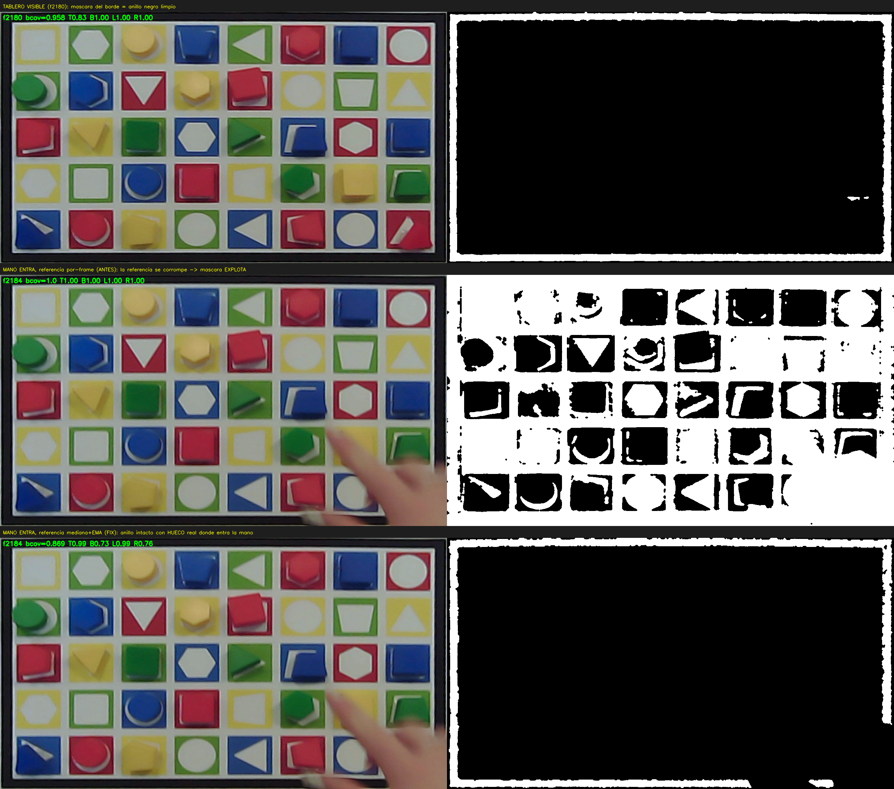

El arreglo tiene dos partes, ambas medidas:

1. **Referencia robusta y estable en el tiempo.** El umbral se calcula con mediana + MAD
   (la mano es minoría del perímetro → la mediana sigue siendo el negro) y se suaviza con un
   EMA temporal (el marco es el mismo fotograma a fotograma; recalcularlo cada vez
   metía *flicker*). La mano transitoria ya no desplaza el umbral.
2. **Sin Canny.** El rectángulo se busca directamente sobre la máscara, no sobre un mapa de
   bordes Canny: sobre una banda gruesa, Canny producía un doble filo que fragmentaba el
   contorno y lo hacía parpadear. Y sin operación de `close`: un *close* rellenaría el hueco
   que abre la mano y cegaría la señal de corte (el `motor_onset` se detecta como pérdida de
   este contorno; ver §12).

> Nota (v1.4.1): quitar Canny tenía un efecto lateral —el rectángulo pasaba del borde interior
> del marco al exterior, desalineando la rejilla (ver el recuadro de §4)—. Desde v1.4.1 la
> rejilla se proyecta desde la homografía y **no** depende de este contorno, así que esta
> detección sirve solo como señal de marco visible/roto, donde «sin Canny» sí es la mejor opción.

**Resultado** (participante 008, fase de búsqueda): el *flicker* del contorno (transiciones 0↔1
por fotograma) baja de 0,097 a 0,033 sin perder arranques, y un alcance real rompe el
rectángulo (el `motor_onset` se conserva). El equilibrio es deliberado: el marco se detecta
estable cuando está visible y se rompe cuando se corta, que es lo que las dos marcas que
dependen de él (arranque de *trial* y `motor_onset`) necesitan.

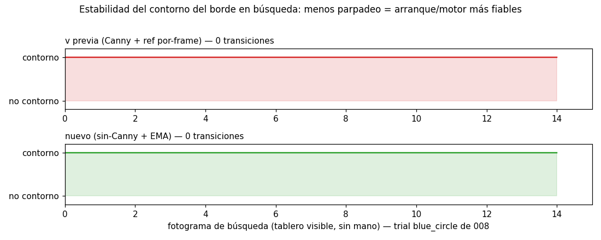

---

## 5. Detección del panel de estímulo (`PanelHandler`)

El panel de muestra que se enseña antes de cada *trial* se detecta igual que el tablero, pero
con un `ArucoBoardHandler` por cada panel configurado (`sample_shape_cfg/`, un YAML por
combinación color×forma). El nombre del fichero codifica la identidad (`<forma>_<color>.yaml`),
así que detectar el panel equivale a identificar qué objeto se busca; no hace falta leer la imagen
del panel. Los paneles se crean con `estimate_rotation=False`: su orientación es irrelevante
(solo importan presencia e identidad), lo que ahorra la estimación de pose por panel.

`PanelHandler.step` prueba cada handler de panel y se queda con el primero cuyos ArUcos casen.
`processPanel` en la máquina de estados aplica además una **confirmación de 4 fotogramas
consecutivos** (`panel_detected_threshold=4`) para no disparar con una detección aislada ni con un
falso positivo del detector (ver *Robustez ante falsos positivos* más abajo).

**Panel como máscara de oclusión** (`getPanelPolygon`): mientras el panel se retira, su área
se proyecta a la imagen (homografía inversa de su vista, expandida 1,05× alrededor del centro)
y se excluye de tres cosas: de la clasificación de la mirada (gaze sobre el panel → fase
`on_panel`, ver guía §3), de la detección del borde del tablero y de la medida de oclusión de
mano. Así el panel —que barre sobre el tablero al retirarse— no rompe el contorno ni finge una
entrada de mano, pero la mano entrando por la zona ya libre sí se detecta.

El panel se identifica por sus ArUcos (recuadro = polígono detectado), de donde sale el
color/forma del objetivo a buscar:

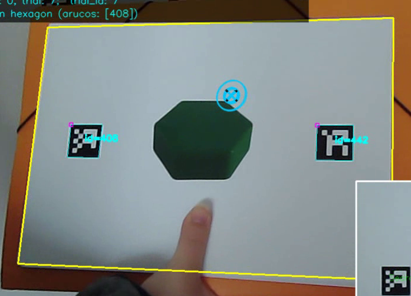

### Robustez ante falsos positivos: persistencia temporal

La identificación solo por ArUco es vulnerable a falsos positivos del detector: un marcador
leído donde no lo hay (el detector ArUco decodifica ruido/patrón como un ID válido) fija un
panel fantasma. Caso medido (participante 001): el marcador `204` (red_triangle) apareció 2
fotogramas mientras se retiraba otra carta (green_hexagon), sin carta de red_triangle presente;
bastó para enganchar un panel fantasma y arrastrar 3 *trials* a error en cascada.

La defensa es **geométrica/temporal, no de color**: un falso positivo así es un blip de un solo
marcador durante pocos fotogramas (homografía poco fiable), mientras una carta real se muestra
durante decenas de fotogramas. Subir el umbral de confirmación de panel de 2 a 4 fotogramas
consecutivos (`panel_detected_threshold=4`) rechaza el blip de 2 frames sin afectar a los paneles
reales —incluidos los de un solo marcador (blue_circle, yellow_circle), que persisten igual—.
En la figura, los paneles reales son bloques altos que superan el umbral; el misread `204` y los
blips espurios (p.ej. del marcador `0`) se quedan por debajo y se descartan:

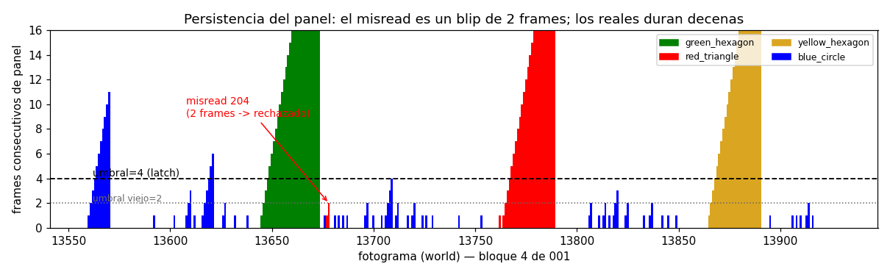

**Resultado.** En el subconjunto revisado en vídeo (001 008 042 055 002), 001 pasa de 3 errores a 0
(green_hexagon y yellow_hexagon recuperados; red_triangle re-temporizado a su carta real), sin
perder ningún panel real. A escala de cohorte (22 participantes), los *trials* cerrados por un panel
detectado (`test_finish_by_next_panel`) bajan de 321 a 46 (−86 %): la reducción se concentra en
los participantes que sufrían cascadas de panel fantasma —001 74→0, 002 103→32, 024 58→0, 035 21→0,
042 16→0, 012 15→0, 064 9→0, 032 7→0— y ningún participante gana cortes espurios (solo ruido: 011
+1, 044 +3; el residuo de 46 son 002 32, 044 8, 011 6). El reparto de `error_type` se mantiene
(~95 % `correct`) y no desaparece ninguna condición (claves *(bloque, trial)* ≈ constantes): el
endurecimiento no degrada la detección correcta.

**Alternativa descartada.** Un segundo testigo por color de la figura de la carta —exigir un blob
del color esperado— no generaliza entre participantes: el balance de blancos desplaza el tono (el
verde de 042 cae en ~150° frente a los 125° de config), así que un umbral de color fijo rechaza
paneles válidos (042 perdía 12 *trials*, 055 perdía 44). Muestrear el tono del propio tablero
tampoco es fiable (la carta lo tapa mientras se la detecta). La persistencia temporal es libre de
color y robusta, y por eso es la elegida.

---

## 6. Emparejamiento mirada–vídeo (`EyeDataHandler`)

La explicación a nivel de usuario (dos relojes, conteo→tiempo) está en la [guía §4 y §7]; aquí
el **cómo**. `EyeDataHandlerPLDATA` carga el `.pldata` (vía `msgpack`) y, en el arranque:

1. **Filtra y limpia la mirada**: descarta muestras con `confidence ≤ 0.6` (umbral sugerido por
   Pupil Labs) y las que caen en parpadeos, y luego aplica la corrección de deriva y el suavizado
   de *scatter*. El detalle (umbral, parpadeos, suavizador *gated* por velocidad) está en §7.3;
   las inválidas se conservan solo para medir la frecuencia (abajo).
2. **Mide la frecuencia real** `gaze_sampling_rate = 1 / mediana(Δt)` sobre todas las
   muestras (válidas e inválidas), porque cada muestra ocupa un intervalo de muestreo del
   aparato. `gaze_continuity = fracción de Δt dentro de ±20% de la mediana`. (Por qué *todas*
   y no solo las válidas: [guía §7].)
3. **Empareja cada muestra a un *frame* de *World*** comparando *timestamps* con
   `bisect_right` sobre `world_timestamps` ordenados (la muestra "cae" en el frame cuyo
   intervalo la contiene). El *gaze* no trae número de *frame*; se calcula aquí.
4. **Propaga la duración** (solo *fixations*): una fijación de `duration` ms se replica por
   `int(fps · duration/1000)` *frames* consecutivos (mínimo 1). El *gaze* crudo dura un frame.
5. **Voltea el eje vertical** (`Y → 1−Y`) al servir cada muestra en `step`: las gafas usan
   origen abajo-izquierda; la imagen, arriba-izquierda. El almacén interno conserva las coordenadas
   crudas (origen abajo-izquierda), donde opera la corrección de deriva (§7); el giro se aplica solo
   a la salida.

El resultado es `fixation_start_world_frame{frame: [índices de muestra]}`. `step(frame)`
devuelve las coordenadas normalizadas (ya volteadas) de las muestras de ese *frame*; por eso a un
*frame* le corresponden varias muestras (la mirada va más rápido que el vídeo).

> Existe también `EyeDataHandlerCSV` (mismo contrato `step()` sobre un CSV con
> `start_frame_index`/`end_frame_index`), pero el procesado de referencia usa la vía `.pldata`.

### Clasificación de la mirada (qué cuenta y qué no)

Cada muestra proyectada se etiqueta según dónde cae, y eso decide si entra en los
contadores. El `debug_<id>.mp4` la dibuja con un marcador unificado (halo oscuro + núcleo de
color + anillo claro) para que se lea sobre cualquier fondo y no se confunda con las esquinas
de los ArUcos. Colores: verde = casilla (cuenta); naranja = anticipada sobre el tablero
(cuenta); magenta = sobre el panel (no cuenta); azul = fuera del tablero (`not_board`, no
cuenta); gris = casilla aún tapada por el panel (no cuenta). Cada fila muestra la vista
general (el recuadro amarillo marca la zona) y su recorte ampliado:

| Caso | Vista general | Recorte |
|---|---|---|
| **Cuenta** — sobre una casilla | 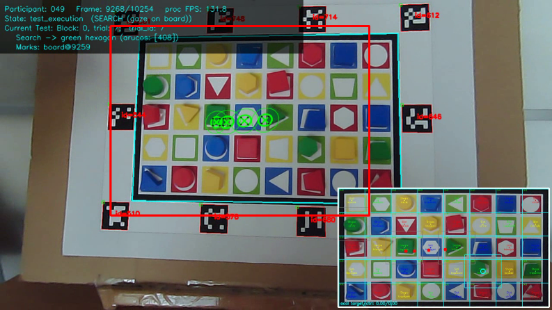 | 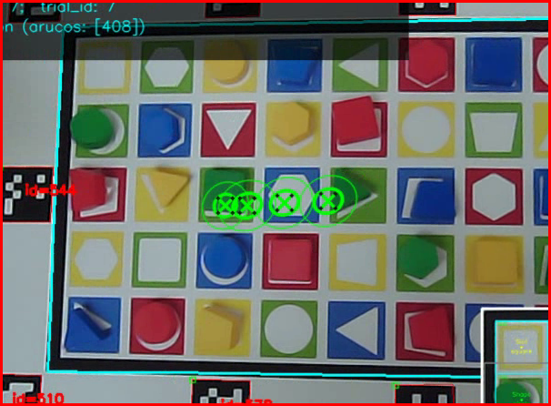 |
| **Cuenta** — anticipada (panel saliendo) | 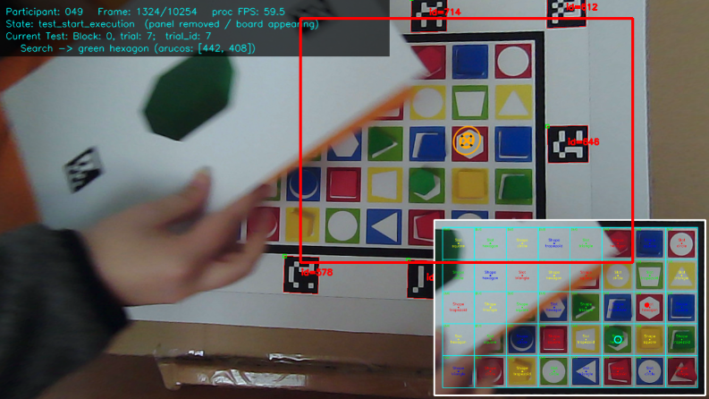 | 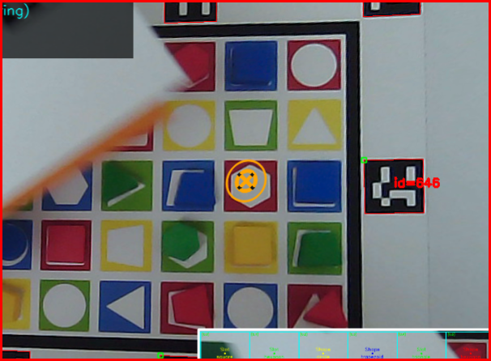 |
| **No cuenta** — sobre el panel de muestra (mirando la señal) | 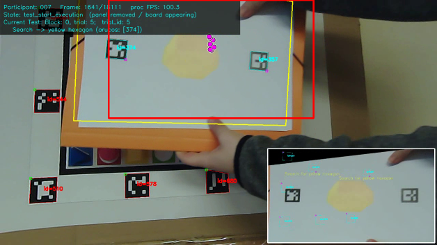 | 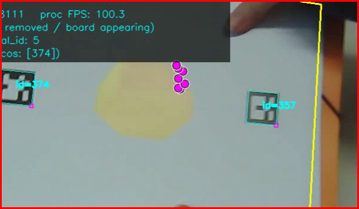 |
| **No cuenta** — junto al panel mientras se retira (`not_board`) | 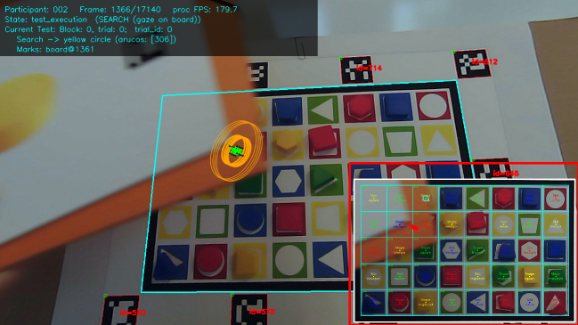 | 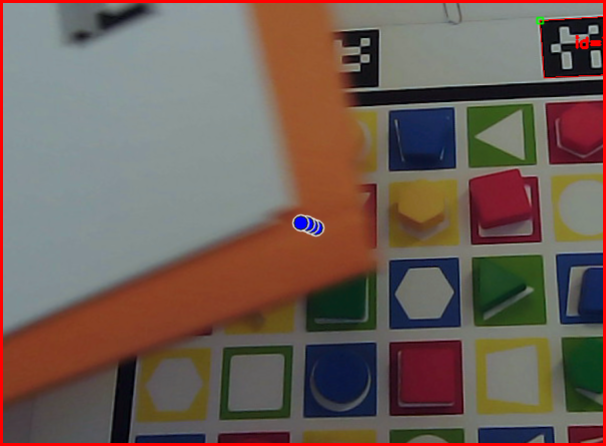 |
| **No cuenta** — fuera del tablero | 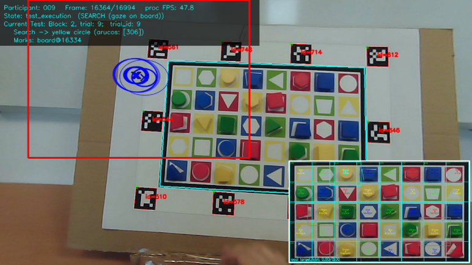 | 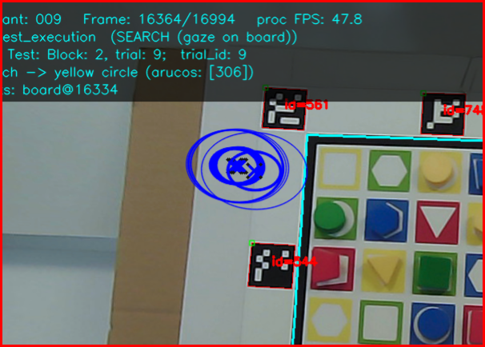 |

---

## 7. Limpieza de la mirada: corrección de deriva y suavizado

La mirada se **limpia en dos etapas independientes** antes de mapearla a casillas: (a) una
**corrección de deriva** por participante y consciente del segmento de calibración (esta sección), y
(b) un **filtrado/suavizado** de la mirada en el dataloader (§7.3). Las dos conservan la frecuencia
de muestreo y los *timestamps*; la motivación común es que el *scatter* y el sesgo de la mirada cruda
**emborronan la asignación a casilla** (una casilla mide una fracción pequeña del campo, así que unos
pocos píxeles de error o de ruido bastan para caer en la vecina).

**Qué es físicamente la deriva.** Las cámaras oculares van montadas en la diadema; a lo largo de la
sesión la diadema **resbala** sobre la cara (sudor, ajustes de la persona, golpes a la montura). Ese
desplazamiento mecánico mueve la imagen del ojo respecto al modelo aprendido en la calibración, de
modo que el mapeo ojo→escena adquiere un **sesgo que crece lentamente con el tiempo** (deriva). No es
ruido de alta frecuencia: es un *offset* casi-uniforme sobre el campo que va migrando — exactamente lo
que muestran las figuras de abajo.

La calibración registrada por Pupil deja, además, un **residual que deriva con el tiempo** (§13). En
muchas grabaciones el operador volvía a mostrar el **panel de calibración** (una lámina con una
**matriz de 9 puntos 3×3**) entre bloques cuando veía divergencia, pero **no siempre se lo indicaba a
Pupil** — así que esas recalibraciones **no quedaron registradas** en `notify.pldata`, pero **sí están
en el vídeo** `world.mp4`. Esta etapa las recupera y corrige la deriva **por participante**, sin la GUI
de Pupil. Es un proceso en dos partes, igual que la calibración de cámara: medida **offline** que
produce un artefacto, y aplicación **al vuelo** en el dataloader.

### 7.1 Medida offline — [`src/tools/gaze_calibration.py`](../src/tools/gaze_calibration.py)

Por participante, a partir de `world.mp4 + gaze.pldata + notify.pldata + blinks.pldata`:

1. **Detección de paneles**: barrido del vídeo buscando segmentos con la rejilla de 9 puntos
   (umbral de gris **adaptativo** a la exposición; el color no aporta — el panel es acromático).
2. **9 puntos por homografía**: en cada panel se ajusta una rejilla **3×3** (homografía de la rejilla
   canónica a los puntos detectados) → las 9 posiciones sub-píxel, completando los que falten y
   rechazando espurios. La posición en píxeles de cada punto **es** el objetivo de verdad-terreno (no
   hace falta su tamaño físico; todo vive en coordenadas de imagen-mundo).
3. **Fijaciones y residuo**: el gaze de cada panel se agrupa en **fijaciones** (dispersión temporal);
   cada fijación se asigna a su punto más cercano y se agrega **por punto** (mediana robusta) → el
   residuo `gaze − punto` en hasta 9 ubicaciones por panel.
4. **Deriva consciente del segmento**: el gaze grabado usa la calibración **más reciente**, así que
   la deriva **se resetea** en cada recalibración registrada (patrón de **diente de sierra**). La
   corrección interpola el offset medido **dentro de cada segmento de calibración**, sin cruzar los
   resets.

**Compuerta por validación cruzada (no empeorar nunca).** El paso clave no es estimar el offset,
sino **decidir si conviene aplicarlo**. La estimación siempre "encaja" algo (residuos no nulos →
offset no nulo), pero eso no garantiza que reduzca el error en datos no vistos: con pocos paneles
ruidosos, ajustar el sesgo puede ser sobreajuste y empeorar la mirada. Por eso media una compuerta
(`gate_decision`):

- **Validación cruzada *leave-one-panel-out*.** Se deja fuera un panel entero, se interpola el offset
  **solo con los demás paneles del mismo segmento de calibración**, y se mide el error en el panel
  excluido **antes** y **después** de corregir (`base` vs `corr`). Predecir un panel que no entró en el
  ajuste es la prueba honesta de generalización; si acaso **infraestima** la ganancia, porque la
  verdad-terreno del panel excluido también tiene ruido.
- **Bootstrap de la ganancia.** La ganancia relativa `1 − corr/base` se **remuestrea** 500 veces sobre
  los puntos (`N_BOOTSTRAP=500`) y se toma el **percentil 5** como límite inferior `gain_lo`. Esto
  protege frente a una ganancia mediana positiva pero **inestable** (un par de puntos afortunados).
- **Criterio de adopción.** Se aplica solo si `gain_lo > GATE_MIN_GAIN_LOWER` (=0: ganancia
  *fiablemente* positiva, no solo positiva en mediana) **y** el error base es relevante,
  `base_px ≥ GATE_MIN_BASE_PX` (=12 px). El segundo término evita "corregir" a quien ya está bien:
  por debajo de ~12 px de error el margen de mejora no compensa el riesgo de añadir sesgo.

Si cualquiera de las dos condiciones falla, el artefacto se marca `apply=false` y el handler queda en
**identidad**: es un diseño *fail-safe*, la corrección solo puede ayudar, nunca empeorar la mirada
de un participante. Sobre los 22 artefactos de `calibration/gaze/`, **8 adoptan** la corrección
(`apply=true`) y los **14 restantes** quedan en identidad. Los adoptados muestran ganancias claras
—varios **entre +20 % y +40 %** y un caso de **+72 %** (044)—, casi todos de **1 sola calibración**
(participantes a quienes Pupil nunca reseteó la deriva). Reparto por participante en
[caracterizacion_dataset.md](caracterizacion_dataset.md).

El artefacto `calibration/gaze/<id>.json` guarda los offsets por panel en **coordenadas normalizadas
de imagen con origen arriba-izquierda** (el mismo marco que emite el dataloader tras su giro `1−Y`),
los tiempos de los segmentos de calibración, la decisión de la compuerta y las estadísticas
(`base_px`, `corr_px`, `gain`, `gain_lo`, `gain_hi`).

#### Lo que se mide y lo que corrige la compuerta (figuras)

Las tres vistas siguientes (generadas por
[`gaze_drift_figures.py`](../src/tools/gaze_drift_figures.py)) ilustran un caso **adoptado**, el
participante **044** (ganancia **+72 %**, una sola calibración):

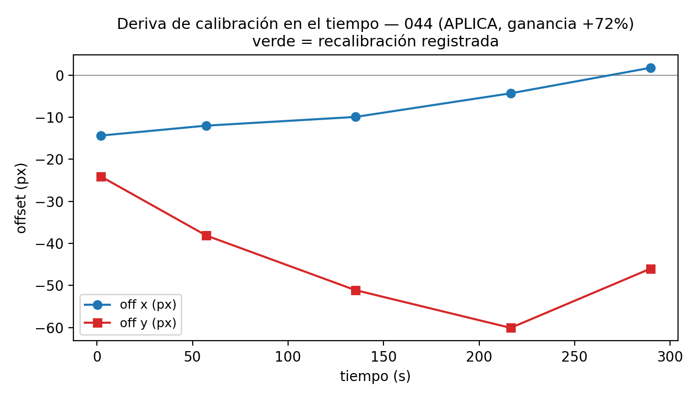

*Offset medido por panel a lo largo del tiempo (x en azul, y en rojo), en píxeles. La componente
vertical deriva de ~−24 px a ~−60 px de forma **lenta y monótona** durante los ~5 min de sesión: ese
sesgo casi-uniforme y creciente es la firma del deslizamiento de la diadema. Al no haber recalibración
registrada (sin líneas verdes), todos los paneles caen en un único segmento y la corrección interpola
el offset suavemente entre ellos.*

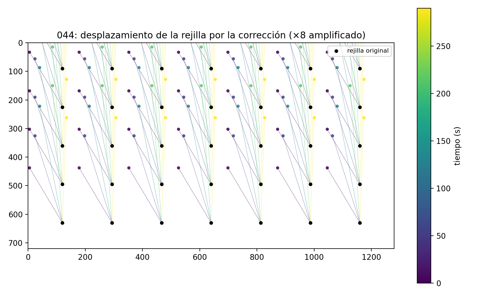

*Efecto espacial de la corrección sobre una rejilla regular del tablero (negro = posición original;
color = posición desplazada por el offset de cada panel, **×8 amplificado** para que se vea; el color
codifica el tiempo). El desplazamiento es una **traslación rígida** que migra con el tiempo: la
corrección es un *offset* dependiente del tiempo, no una deformación local del campo.*

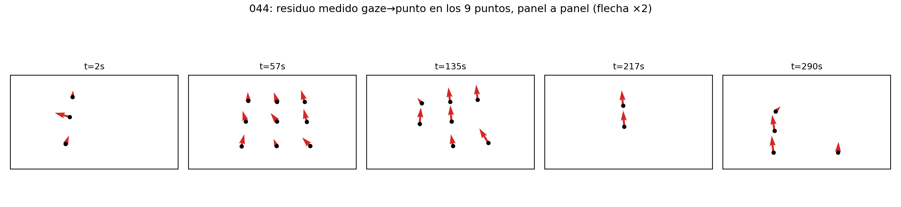

*Residuo medido `gaze → punto` en los 9 puntos, panel a panel (flecha ×2). El campo de vectores es
**aproximadamente uniforme** dentro de cada panel y **crece con el tiempo** (paneles t=2…290 s): esto
es lo que justifica modelar la deriva como un offset global por instante, y lo que la corrección
encoge al restar ese offset.*

A modo de **contraste**, el participante **058** es un caso **NO adoptado** (identidad):

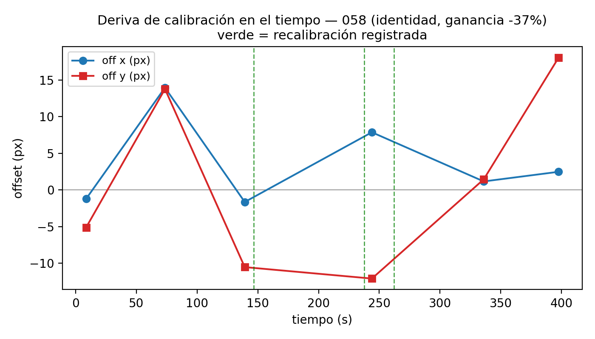

*Aquí el offset es errático y no monótono (oscila de signo entre paneles) y hay 3 recalibraciones
registradas (líneas verdes) que segmentan la sesión. Con tan poca estructura temporal, el offset
interpolado no generaliza: la CV da ganancia mediana negativa (−37 %) y su límite inferior
*bootstrap* es claramente <0, así que la compuerta rechaza la corrección y el participante queda en
identidad — el caso que la compuerta descarta por diseño.*

### 7.2 Aplicación al vuelo — [`EyeDataHandler`](../src/core/EyeDataHandler.py)

Al cargar el gaze, el dataloader (`EyeDataHandlerPLDATA.__init__`) aplica una **cadena de tres pasos**
que **conservan la frecuencia de muestreo** (una salida por entrada, mismos *timestamps*; ver §7.3
sobre por qué eso importa):

1. **Filtrado por confianza y exclusión de parpadeos** (§7.3). Solo se conservan las muestras con
   `confidence > 0.6` que **además** no caen en una ventana de parpadeo.
2. **Corrección de deriva** ([`GazeCorrectionHandler`](../src/core/GazeCorrectionHandler.py)): si la
   compuerta lo activó, resta por muestra el offset interpolado *segment-aware* (`correct_bottomleft`,
   usando `world_t0` para pasar de *timestamp* absoluto a tiempo relativo); **identidad** si no hay
   artefacto o `apply=false`.
3. **Suavizado de scatter** (solo `topic_data == 'gaze'`; §7.3): media ponderada por **varianza
   inversa** (`confidence²` como respaldo si no hay modelo de incertidumbre), centrada y segmentada
   por sacadas.

> Orden importante: el suavizado va después de la corrección de deriva, sobre la mirada ya
> insesgada, de modo que no mezcla el sesgo de deriva con el ruido de fijación. Los tres pasos operan
> sobre el almacén interno en coordenadas crudas (origen abajo-izquierda); el giro `1−Y` se aplica solo
> al servir cada muestra en `step` (§6).

### 7.3 Filtrado y suavizado de la mirada — [`EyeDataHandler`](../src/core/EyeDataHandler.py)

El suavizado y el filtrado atacan un problema distinto al de la deriva: la mirada cruda tiene
**scatter de alta frecuencia** (jitter de la detección de pupila + microsacadas) que, aunque esté
**centrado** en la casilla correcta, hace que muestras individuales **salten a casillas vecinas** y
ensucien el conteo. La cadena de limpieza tiene tres componentes.

**(a) Filtrado por confianza (`> 0.6`).** Pupil adjunta a cada muestra una `confidence` (calidad del
ajuste de pupila). Se descartan las muestras con `confidence ≤ 0.6` (umbral sugerido por Pupil Labs).
No se sube el umbral porque las muestras con confianza <0,6 **no son ruido insesgado** sino detecciones
*sesgadas* (párpado a media asta, reflejo corneal): incluirlas empeora; la cola de confianza
intermedia se trata mejor con los promedios robustos de abajo. Las muestras inválidas se conservan
solo para medir la frecuencia real (§8), no para mapear.

**(b) Exclusión de parpadeos (`blinks.pldata`, ±50 ms).** El filtro de confianza no basta: Pupil sigue
emitiendo gaze **durante** el parpadeo y, sobre todo, en la **fase de párpado a media asta** que lo
rodea la pupila se detecta **desplazada** pero con confianza que puede superar 0,6. `load_blink_intervals`
reconstruye las ventanas `onset→offset` de `blinks.pldata` y las **dilata ±50 ms**
(`BLINK_MARGIN_S = 0.05`) para cubrir esa fase de transición; cualquier muestra dentro de una ventana
se descarta aunque pase el umbral de confianza. Si `blinks.pldata` no existe, este paso es nulo (no
falla).

**(c) Suavizador ponderado por varianza inversa (confianza² de respaldo) y *gated* por velocidad (`velocity_gated_smooth`).** Es el
núcleo del suavizado. Sobre la lista de muestras de gaze ya filtrada y ordenada en el tiempo:

- **Qué suaviza.** El *scatter dentro de una fijación*: por cada muestra calcula una media **centrada
  (bidireccional)** de las `±SMOOTH_WINDOW` (=4) muestras vecinas. El peso es **varianza inversa**
  (`1/σ_meas²`, el estimador de mínima varianza de la media) cuando hay **modelo de incertidumbre**
  (§7.4), o `confidence²` como respaldo si no lo hay; en ambos casos las muestras de peor calidad pesan
  mucho menos sin descartarse del todo. Eso colapsa el jitter de fijación hacia el centro real de la
  fijación, que es justo lo que necesita una asignación a casilla estable. Cuando hay modelo, además,
  **propaga una covarianza por muestra** (§7.4).
- **Qué NO debe suavizar — el *gate* por velocidad.** Promediar a ciegas con una ventana fija
  **emborronaría las sacadas**: una transición rápida entre dos puntos del tablero se convertiría en
  una serie de posiciones intermedias **inventadas** (que caerían en casillas por las que la mirada
  nunca se fijó). Para evitarlo se calcula la **velocidad muestra-a-muestra** en píxeles
  (`hypot(Δx·W, Δy·H)`) y se marca como **sacada** todo salto `> SMOOTH_VEL_THRESHOLD_PX` (=15 px). El
  `cumsum` de esas marcas define **segmentos** (fijación/*pursuit* entre sacadas) y la media **se
  reinicia en cada segmento** (`sel = idx[...]` se recorta a los índices del mismo segmento): la
  ventana **nunca cruza una sacada**, así que las sacadas y el *pursuit* lento quedan intactos y solo
  se promedia el ruido *dentro* de cada tramo estable. Es un suavizado *edge-preserving* donde el
  "borde" es la sacada.
- **Preserva la frecuencia de muestreo.** Produce **una salida por entrada** y **no toca los
  `timestamp`**: solo reescribe `norm_pos` in situ. Esto es deliberado — el tiempo de mirada por
  casilla se calcula contando muestras × (1/frecuencia) (§8), así que **diezmar o remuestrear
  falsearía los tiempos de permanencia**. El suavizado cambia *dónde* cae cada muestra, no *cuántas*
  hay ni *cuándo*.
- **Guarda de tamaño.** Si hay menos de `2·win+1` muestras no hace nada (no hay vecindario suficiente).

### 7.4 Incertidumbre por muestra: la mirada como elipse, no como punto

La asignación a casilla trata cada mirada como un **punto**, pero el equipo no resuelve un punto sino
una **distribución**. Una casilla mide ~⅛×⅕ del tablero y la precisión del aparato es de ese mismo
orden (§13), así que afirmar "miró la casilla *(c,r)*" con certeza binaria es **optimista**. Cada
muestra lleva una **covarianza 2×2** (`norm_board_cov`) que la modela como una **elipse de
incertidumbre**; de ahí salen un reparto de probabilidad sobre casillas y un `target_found_confidence`
graduado (§7.5). La covarianza tiene **dos componentes físicamente distintos** —precisión (jitter,
**reducible** promediando) y accuracy/drift (bias, **irreducible**):

$$\Sigma_{\text{total}} = \Sigma_{\text{jitter}} + \Sigma_{\text{bias}}$$

**Fase 0 — caracterización** (en [`gaze_calibration.py`](../src/tools/gaze_calibration.py),
`measure_uncertainty`). De los mismos paneles de calibración (§7.1), por participante:

- **Jitter (precisión)** — covarianza 2×2 de la dispersión *por muestra* dentro de cada punto, tras
  **quitar el sesgo por punto** (la media de cada punto = su offset; lo que queda = jitter). Es
  **anisótropo** (p.ej. 049: 11,2 × 6,8 px) → se guarda como `jitter_cov_px` (eje mayor/menor/ángulo).
- **Factor de confianza** `f_conf(conf)` — cómo escala la varianza con la `confidence` de Pupil.
  **Medido**, no asumido: el jitter baja ~2–3× de `conf≈0,65` a `conf≈0,95`. Se fuerza **monótono no
  creciente** (más confianza no puede dar más error; corrige el repunte espurio en `conf>0,98`).
- **Factor espacial** `f_spatial(ecc)` — variación con la excentricidad. **Medido** de los 9 puntos × N
  paneles. *Hallazgo:* la suposición habitual de que el error crece hacia la periferia no se cumple
  aquí (008 plano; 049 mayor en el centro) — por eso se mide en lugar de asumirla. Los puntos cubren la **zona del tablero**
  (~120–335 px de excentricidad); fuera no se extrapola (ni el tablero ni el gaze-sobre-celda están en
  la periferia verdadera).
- **Bias (accuracy/drift)** — covarianza 2×2 = **segundo momento** `E[r·rᵀ]` de los residuos
  `gaze − punto` (corregidos si la compuerta adoptó la corrección, §7.1; crudos si no). *Hallazgo:*
  medido por-eje sale **~isótropo** (1,04–1,08×): la accuracy del aparato es simétrica en x/y.

El **ruido de medida por muestra** es entonces el jitter base escalado por los dos factores:

$$\Sigma_{\text{meas}}(c,\, p) = \Sigma_{\text{jitter}}\; f_{\text{conf}}(c)\; f_{\text{esp}}(\text{ecc})$$

Todo se guarda en `calibration/gaze/<id>.json` (bloque `uncertainty`) con un **fingerprint** SHA-256 de
toda la cadena de cálculo (`calibration_fingerprint`). Al cargar el artefacto, `GazeUncertaintyModel`
**compara** el hash guardado con el del código actual y avisa por log si el artefacto es obsoleto
(se generó con un método antiguo) → hay que re-lanzar `gaze_calibration.py`. El disparo automático
de la re-calibración al detectar desfase no está implementado: hoy el aviso por log es la señal para
regenerar a mano.

**Fase 1 — propagación por el suavizador** (§7.3c). El peso pasa de `conf²` a **varianza inversa**, el
estimador de **mínima varianza** de la media (Gauss-Markov):

$$w_i = \frac{1}{\sigma^2_{\text{meas}}(c_i,\, p_i)} = \frac{1}{f_{\text{conf}}\, f_{\text{esp}}}, \qquad \Sigma_{\text{jitter}} = \frac{\Sigma_{\text{base}}}{\sum_i w_i}$$

(la segunda es la **varianza de la media ponderada** en la ventana).

Sobre esto, un **suelo** para no infraestimar nunca: se calcula la **covarianza 2×2 observada** de la
ventana (`Var(media) ≈ cov_obs / N_eff`) y se eleva `Σ_jitter` con un **robust-max** (blanquear por
`Σ_jitter`, capar a ≥1 los autovalores de la observada, des-blanquear) para que **domine la dispersión
observada en CADA dirección**. *Por qué no por traza:* una fusión puramente horizontal ensancha *x*
pero deja *y* en la base → misma traza; un test por traza no dispararía. Finalmente
`Σ_total = Σ_jitter + Σ_bias`. Todo en un único marco de coordenadas (el
modelo convierte `base/bias` al marco abajo-izquierda de `norm_pos`; `step()` gira posición y covarianza
juntas al marco arriba-izquierda).

> **Hallazgo medido — la elipse es ~redonda.** En la práctica domina el bias (accuracy irreducible,
> isótropo) sobre el jitter (que el promediado encoge): la covarianza total queda ~redonda (ratio
> ~1,05 en imagen) aunque el jitter sea anisótropo. La incertidumbre dominante —no poder localizar
> mejor que el residuo de accuracy— es isótropa; la dirección de la fusión moldea el jitter
> (robust-max), pero queda amortiguada por el suelo redondo del bias. La **resolución efectiva es
> ~½ casilla**: una fijación perfectamente centrada concentra solo ~55–60 % de su masa en una casilla.

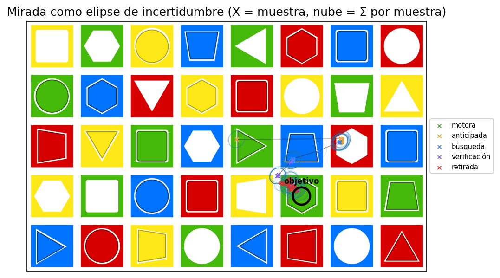

*Trayectoria de un trial (búsqueda → verificación → motora → retirada) con la X en cada muestra y la
elipse 1σ de su covarianza (nube azul). Donde la nube se acumula, más tiempo de mirada (la
transparencia ≈ permanencia). Las elipses pisan 2–3 casillas: es la resolución real del aparato. La
mirada `on_panel`/`blank` (tapada) no se pinta (§7.5).*

### 7.5 Proyección probabilística a casillas y `target_found_confidence`

Con la `Σ_total` por muestra (coords de imagen, §7.4), `recordGazeSample` la **proyecta al tablero**
con el Jacobiano numérico de la misma transformación que mapea la posición
(`correctCoordinates` → `getPixelBoardNorm`):

$$\Sigma_{\text{tablero}} = J\, \Sigma_{\text{imagen}}\, J^{\top}, \qquad J = \frac{\partial(\text{coord tablero})}{\partial(\text{píxel})} \;\;\text{(diferencias finitas, 1 px)}$$

guardada como `norm_board_cov` en cada entrada de la secuencia. De ahí:

- **`cell_dist` + `onboard_mass`** (CSV de secuencia, por muestra). La masa de probabilidad dentro de
  cada casilla se aproxima por el **producto de CDFs gaussianas marginales** sobre el rectángulo de la
  casilla (`_cell_mass`; aproximación de **ejes independientes** — descarta la correlación que el
  Jacobiano `J` pueda introducir, despreciable con la elipse casi redonda dominada por el bias);
  `cell_dist` lista las **3 casillas más probables** (masa > 2 %) con su masa
  (`"c,r:masa|…"`) y `onboard_mass` es la masa total sobre el tablero (indica si miraba al tablero o
  casi fuera). El reparto sobre 2–3 casillas es la resolución real: con σ≈½ casilla, una fijación
  pisa varias.
- **`target_found_confidence`** (CSV de trials, por trial). Sobre las fijaciones I-DT del trial, la
  **masa media** de cada fijación sobre la **casilla objetivo**, tomando el **máximo** del trial. Es el
  valor continuo detrás de la marca `frame_target_found`, que se dispara en la **primera fijación** cuya
  masa media alcanza `target_found_mass_threshold` (0,34; re-ajustado en v1.4.1, ver abajo): una mirada
  en la frontera del objetivo —dentro del error del aparato— cuenta como encontrada, en vez de exigir la
  mayoría de centroides en la celda exacta. La columna continua permite graduar más fino si el análisis lo necesita.
- **Mirada tapada = 0 % tablero.** El gaze `on_panel` (dentro del polígono del panel detectado, §5)
  y el `blank` (celda tapada por una superficie plano-blanca —el cartón del panel barriendo— durante
  la retirada) no se proyectan: `onboard_mass = 0`, sin `cell_dist`. No son observaciones de una
  casilla visible. La posición geométrica sigue en `norm_board_coord` y `Phase` desambigua
  (`on_panel` = sobre la carta detectada; `blank` = posición de tablero tapada).

**Hallazgo medido — found por masa, no por voto discreto.** El criterio de `frame_target_found` es la
masa, no la mayoría de centroides en la celda: una fijación pegada a la frontera del objetivo
(centroide técnicamente dentro, pero la elipse repartida con la vecina) la decidía el voto a sí/no,
cuando ese reparto **es** el error que el modelo compensa. Sobre los 22 (1280 trials con confianza),
pasar de la mayoría-en-celda a masa por encima del umbral **recupera ~50** trials que el voto descartaba
(la mirada estaba en la frontera o la contigua) y apenas descarta casos-frontera que el voto redondeaba a
dentro. Los cortes 0,2/0,5 de la figura son una **lectura sugerida** para graduar el análisis, no
umbrales que aplique el procesado.

**Re-ajuste del umbral (v1.4.1).** La masa por celda se calculaba antes con una aproximación **marginal**
(producto de dos CDF 1-D), que ignora la inclinación de la elipse y erraba hasta ~0,16 en celdas con
elipse inclinada; v1.4.1 la sustituye por la **integral normal bivariante** exacta. Eso desplaza la
escala de masa: la **frontera geométrica 50/50** (centroide justo en el borde objetivo/vecina), que el
marginal situaba en ~0,34, está en realidad en **~0,443** (medido sobre los 22, ~12k fijaciones). El
umbral se fija **por debajo** de esa frontera a propósito —la elipse ya absorbe el error del aparato, así
que una fijación que el *tracker* empujó algo hacia la vecina pero cuya elipse aún deja masa sustancial
en el objetivo debe contar como vista—: **0,34**, que rescata esos casos y se mantiene muy por encima del
ruido (~0,2), sin la laxitud del viejo 0,30 (que contaba fijaciones con el centroide claramente fuera de
la celda). En la cohorte: `found` 1088 (0,30) → **1069** (0,34) → 1037 (0,38). El informe HTML reproduce
exactamente este criterio (misma `_cell_mass` bivariante y mismo umbral).

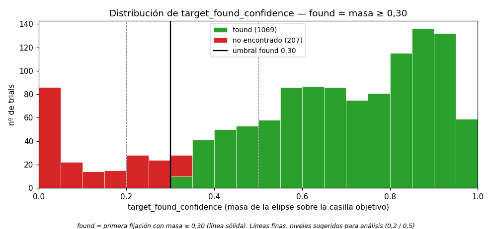

**Visualización (vídeo de debug).** Con `-v`, `StateMachine.visualization` dibuja cada mirada como una
**X** (centro) más su **elipse 1σ/2σ** de incertidumbre en coordenadas de imagen, del mismo color que la
fase; coherente con las figuras de trayectoria. Es una ayuda de inspección para ver *in situ* cuánto
podría desviarse cada gaze; la mirada `on_panel`/`blank` se muestra sin elipse.

---

## 8. Frecuencia de muestreo del *gaze*

No se asume 200 Hz: se mide por participante como `1 / mediana(Δt entre muestras)`, usando
todas las muestras (válidas e inválidas), porque cada muestra representa un intervalo de
muestreo (implementación en el apartado 6; conteo→tiempo en la [guía §7]). `gaze_continuity` =
fracción de Δt dentro de ±20% de la mediana (avisa de muestreo irregular). Valores observados
≈124 Hz y ≈248 Hz según el participante. Mezclar participantes a frecuencias distintas sin
corregir introduciría un sesgo sistemático; por eso el tiempo de mirada se calcula siempre con
la frecuencia medida de cada uno.

---

## 9. Máquina de estados en detalle

Hay una sola máquina de estados; los "dos niveles" (detección vs trial) son dos formas de
leer su resultado, no dos máquinas (modelo conceptual y diagramas en la [guía §3]). Estados:

`init → get_test_name → test_start_execution → test_execution → test_motor_recovery → test_finish_execution → init`

Cada callback recibe `(undistorted_image, capture_idx, gaze_list)` y puede cambiar
`self.current_state`; el bucle de despacho (apartado 1) reejecuta el nuevo estado en el mismo
fotograma si hace falta.

```mermaid
stateDiagram-v2
    [*] --> init
    init --> get_test_name: panel de muestra detectado
    get_test_name --> test_start_execution: panel identificado (color/forma)
    test_start_execution --> test_execution: contorno del tablero confirmado
    test_execution --> test_motor_recovery: contorno perdido = motor_onset (la mano entra)
    test_motor_recovery --> test_finish_execution: hand_exit, o aparece el panel siguiente (by_next_panel)
    test_finish_execution --> init: trial cerrado y publicado
    note left of test_start_execution: search_start: empiezan a contar la búsqueda y la mirada anticipada
    note right of test_execution: target_found: primera fijación (I-DT) con masa ≥0,34 sobre el objetivo
    note right of test_motor_recovery: marcas target_touch y hand_exit (mejor esfuerzo)
```

El ciclo se cierra en `init`, listo para el siguiente panel. Las **marcas** (`search_start`,
`target_found`, `motor_onset`, `target_touch`, `hand_exit`) no son estados: son instantes
dentro de estos estados, y delimitan las fases del trial (búsqueda → verificación → motora →
retirada). La derivación exacta está en el apartado 10.

Los tres fotogramas siguientes (del `debug_<id>.mp4`, que rotula el estado en la esquina
superior) muestran las transiciones clave de un *trial* real: el panel de muestra mostrado, su
retirada con el tablero apareciendo, y la búsqueda con la mirada ya proyectada sobre las
casillas y la vista cenital en el *picture-in-picture*.

| Estado | Qué dispara el cambio | Fotograma |
|---|---|---|
| `init` / `get_test_name` | aparece el **panel de muestra** (señal: hexágono verde) sobre el tablero | 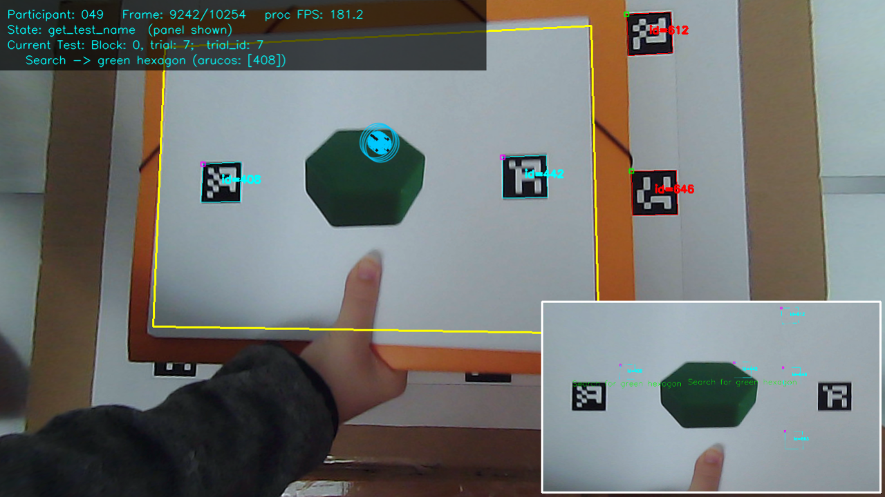 |
| `test_start_execution` | el experimentador retira el panel; el tablero queda visible y la búsqueda visual comienza | 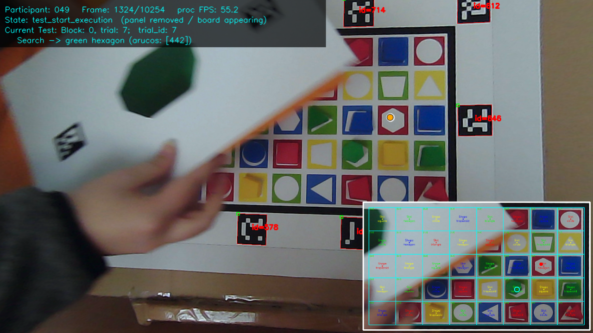 |
| `test_execution` | el **contorno del tablero** se confirma → búsqueda; la mirada se clasifica por casilla | 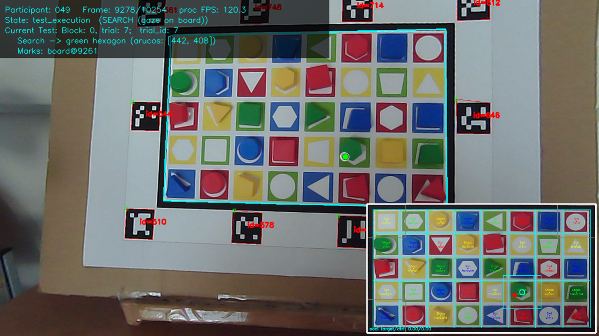 |
| `test_motor_recovery` | la mano cruza el borde y alcanza la pieza (contorno perdido) | 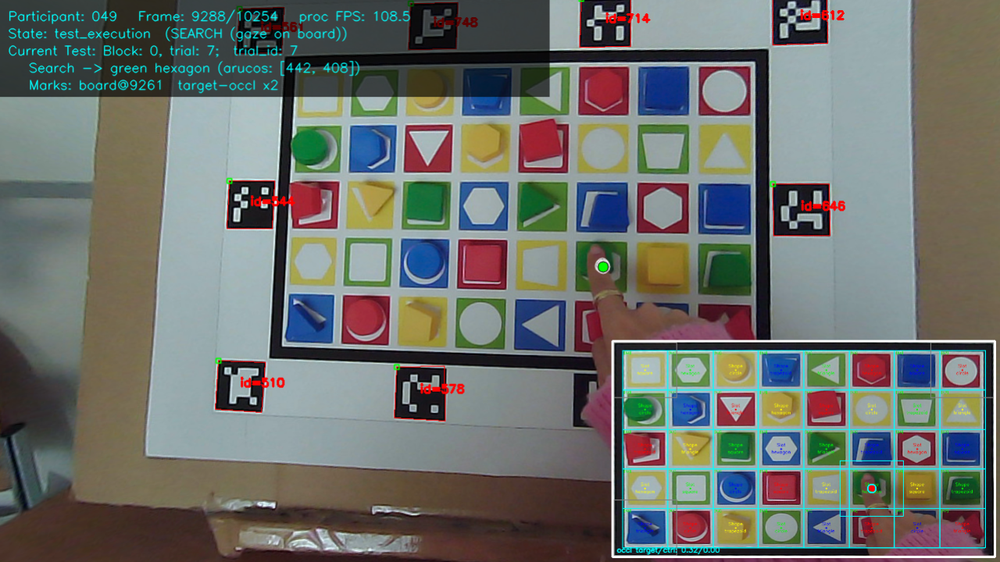 |

Dentro de `test_motor_recovery` se resuelven tres sub-marcas (no son estados, son los
hitos que delimitan las fases motoras): la mano entra (cruza el borde, `motor_onset`),
toca la pieza objetivo (`target_touch`) y sale del tablero (`hand_exit`):

| Sub-marca | Qué señala | Fotograma |
|---|---|---|
| **entra** (`motor_onset`) | la mano cruza el borde del tablero hacia la pieza | 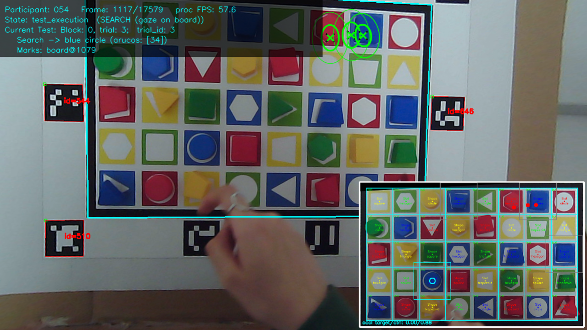 |
| **toca** (`target_touch`) | la mano alcanza la pieza objetivo (mejor esfuerzo) | 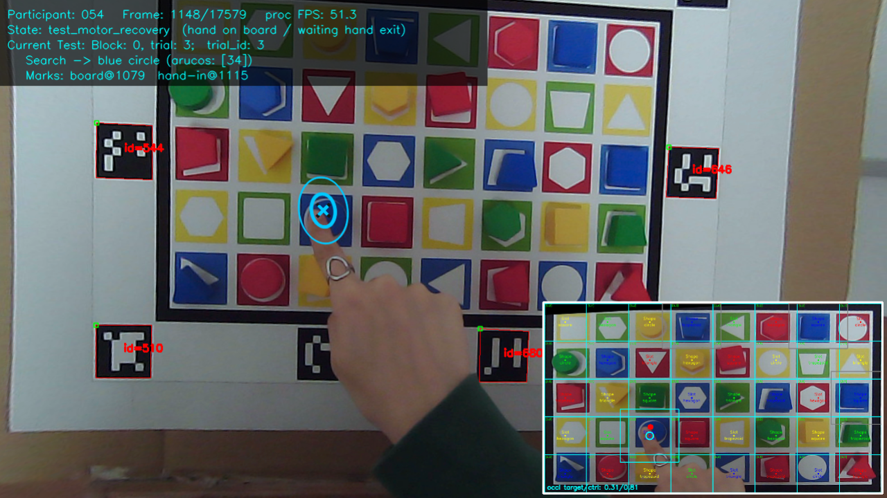 |
| **sale** (`hand_exit`) | la mano abandona el tablero tras responder | 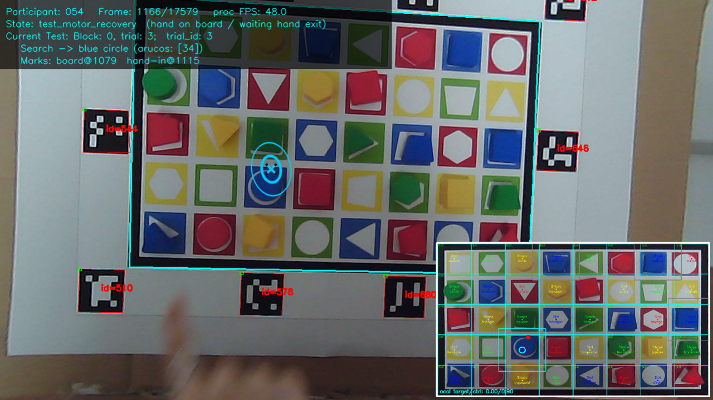 |

La segmentación de estas tres marcas en el tiempo se ve además en la señal de oclusión del
objetivo (apartado 11, `oclusion_temporal`): sube al entrar/tocar y baja al salir.

### `init` — espera y casado con la secuencia

Vigila la aparición de un panel (`processPanel`). Cuando aparece uno:

- **Casado con la secuencia esperada** (`default_trials_config.yaml`): si el panel detectado
  no coincide con el *trial* esperado, se avanzan e inscriben los *trials* intermedios como
  `missing_trial_error_<esperado>` (con `init/end = -1`) hasta encontrar el que casa. Así un
  fallo de detección no descuadra el resto.
- **Rechazo de paneles fuera de secuencia / espurios** (`_detectedInRemaining`): si el panel
  no aparece en lo que queda de secuencia, se ignora (sigue en `init`) en vez de consumir
  toda la secuencia como *missing* y terminar el run.
- Al casar, fija `block_id`/`trial_id` y pasa a `get_test_name`.

### `get_test_name` — panel visible (codificación)

El panel está presente y el objeto a buscar identificado. Espera a que el panel desaparezca
(se retira) para pasar a `test_start_execution`. Si en su lugar aparece un panel distinto
(salto), `_handleUnexpectedPanel` lo gestiona (abajo).

### `test_start_execution` — el tablero aparece

Mientras el panel se retira:

- **Mirada anticipada** (`processEarlyGaze`): la pose del tablero ya se conoce por los ArUcos,
  así que el *gaze* de esta ventana se registra etiquetado por dónde cae —`pre_start`,
  `on_panel`, `blank`, `not_board`— (ver guía §3 y §6.2). Ninguna se descarta.
- **Cebado de la referencia de toque** (`_primeTouchReference`): captura una referencia limpia
  de la casilla objetivo en esta ventana permisiva, para objetivos de borde a los que la mano
  llega antes de poder capturarla más tarde.
- **Racha de confirmación de contorno**: requiere `board_contour_start_confirm_threshold=6`
  fotogramas con contorno estable antes de arrancar el *trial* (una detección aislada producía
  *trials* degenerados). El primer *frame* de la racha (`contour_streak_start_frame`) se guarda
  para retrotraer `init_capture` sobre él. Confirmada la racha → `test_execution`.

### `test_execution` — búsqueda

Al entrar (primera vez):

- **Retrodatado de `init_capture`** al primer *frame* de la racha; las muestras `pre_start`
  dentro de la racha se relabelan a `execution` y pasan a contar.
- **Inicio del seguimiento de toque** (`initTargetTracking`): umbral por color
  (`touch_threshold_by_color`, apartado 11 y 13), marca de objetivo cálido (rojo/amarillo),
  celdas de control. Se salta si `_primeTouchReference` ya cebó una referencia limpia.
- **Referencia de oclusión de tablero** (`board_occ_ref`): se captura el tablero limpio para,
  desde aquí, medir cada fotograma cuánto lo ocluye la mano (sirve a `hand_exit`).

En cada fotograma: registra el *gaze* (fase `execution`), vigila el toque (`_trackTargetTouch`)
y la oclusión de tablero (`_trackBoardOcclusion`). **Fin del *trial*** = pérdida sostenida del
contorno (la mano cruza el borde): tras `board_contour_switch_state_threshold=4` *frames* sin
contorno, `finishTrial` fija `end_capture` retrotraído al último *frame* con tablero visible y
publica `frame_motor_onset`. También sale por `_handleUnexpectedPanel` si aparece el panel
siguiente (cierre `test_finish_by_next_panel`, duración = cota superior).

### `test_motor_recovery` — fase motora (toque + salida de mano)

Tras decidir el fin, no cierra aún: sigue para anotar el toque y la salida de la mano.
Es el estado más delicado. En cada fotograma:

1. **Cede a cualquier panel confirmado** (mismo o distinto): el panel de muestra ya se retiró
   al inicio del *trial*, así que un panel confirmado aquí es la presentación siguiente → cierra
   y deja que `init` la recoloque. Sin esto se perdían *trials* con re-presentación del mismo
   panel (~3% de *trials* válidos, medido).
2. **Registra el *gaze*** como fase `motor` (alcance + retirada), que va a la secuencia pero no
   a los contadores.
3. **Vigila el toque** (`_trackTargetTouch`); si el toque se confirma justo ahora, reinicia
   la cuenta de `hand_exit` para que ésta sea el contorno que vuelve *después* del toque, no el
   de mitad de alcance (ver apartado 12).
4. **`hand_exit` por tres fuentes**, en orden de sensibilidad:
   - **`ft_return`**: la oclusión local del objetivo (`fT`), tras subir por encima de
     `ft_enter_level=0.20`, vuelve sostenidamente bajo `ft_exit_level=0.05`. La más sensible
     para alcances pequeños (un dedo sobre una casilla).
   - **`board_occ`**: la oclusión del tablero completo vuelve a reposo tras haber subido.
     A diferencia del contorno, se mantiene alta a mitad de alcance, así que su retorno es la
     mano saliendo de verdad aun sin toque detectado.
   - **`contour`**: el contorno reaparece de forma sostenida (`motor_recovery_confirm=3`) y
     después del toque, con tolerancia a parpadeo (`motor_recovery_miss_tolerance=2`).
   - **`deadline`**: a `motor_recovery_max_frames=75` (~2,5 s) cierra con la mejor estimación
     disponible.

### `test_finish_execution` — cierre

`trimTrialToFrame` recorta la secuencia al `end_capture` (conservando las muestras `motor`),
recalcula los contadores por color hasta el toque, deriva `touch_diag`, y guarda una copia
profunda en `board_metrics_store[(block,trial)]`. Vuelve a `init`.

### Gestión de saltos / errores (robustez)

- **`_handleUnexpectedPanel`** (usado por `test_start_execution`, `test_execution`,
  `get_test_name`): con datos ya recogidos cierra como `test_finish_by_next_panel` (válido,
  cota superior); sin datos, `transition_error_no_init`. Vuelve a `init` para re-emparejar.
- **Registro de transiciones** (`_recordTransition`): cada cambio de estado se anota con
  *frame*, origen/destino y block/trial; se fusiona luego con las marcas (apartado 10).
- **Inicio re-basado y registro completo de gaze**: el *trial* arranca en `frame_search_start`
  (primera mirada al tablero durante la retirada del panel), no en `frame_init`; `trial_duration_s`
  se mide desde ese inicio re-basado. Detalle de fases en la [guía §3].

### Errores que publica

| Tag | Significado |
|---|---|
| `missing_trial_error_*` | un panel esperado no se detectó (suele ser fallo de detección, no del participante). |
| `transition_error_no_init_*` | apareció otro panel antes de que el *trial* recogiera datos. |
| `test_finish_by_next_panel` | *trial* **válido** cerrado al aparecer el panel siguiente (duración = cota superior). |
| `test_finish_by_end_of_video` | *trial* cerrado por fin de grabación. |

---

## 10. Derivación de marcas, fases y línea de tiempo (`store_results`)

A partir del `board_metrics` de cada *trial*, `store_results` calcula las columnas de los CSV:

- **Marcas crudas** (`frame_*`): `search_start = early_init_capture (o init_capture)`,
  `init`, `target_found`, `motor_onset = motor_onset_capture`, `target_touch`, `hand_exit`,
  `end = end_capture`.
- **`target_found` por fijación (I-DT), no por muestra suelta.** No es la primera muestra que
  cae sobre la casilla objetivo (eso disparaba en un paso fugaz de camino a otra pieza), sino el
  inicio de la primera fijación cuya **masa de incertidumbre** sobre el objetivo alcanza el umbral
  (`target_found_mass_threshold` = 0,34; §7.5), consciente del error del aparato en vez de un voto
  duro de centroides. Una fijación
  es una racha de ≥`target_found_min_fixation_samples` (6) muestras cuyo *bounding-box* normalizado
  al tablero se mantiene por debajo de `target_found_fixation_dispersion` (0,06): es una dispersión
  ventaneada (robusta donde una velocidad por muestra no lo es — dos muestras próximas pueden
  pertenecer a un tránsito rápido, y un vagabundeo lento *alrededor* del objetivo sigue siendo
  fijación sobre él). El mismo detector (`_idtFixations`) se reutiliza para la validación de
  mirada del §12.2 (la última fijación de tablero antes del toque). La pieza objetivo se resalta
  en la vista cenital.

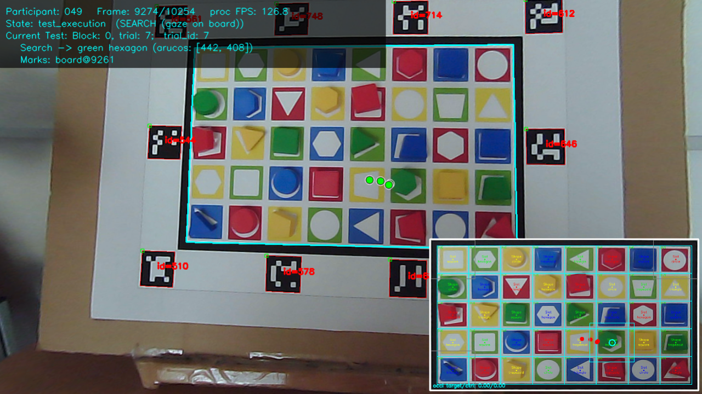
- **Duraciones por fase**: `time_to_target`, `search` (inicio→motor_onset), `reach`
  (motor_onset→toque), `withdraw` (toque→hand_exit). Vacías si falta la marca que las acota.
- **Covariables**: `anticipatory_gaze` (nº de muestras `pre_start`), `anticipation_lead_s`,
  `target_row/col`. La distancia de alcance (mm) no se repite por trial: vive en
  `target_geometry.csv` (la calcula `writeTargetGeometry` desde `game_config.yaml`: centro de
  celda en mm y distancia recta 2D desde el lado de entrada del participante).
- **`phaseOf(frame, base_phase)`**: las muestras de la ventana previa conservan su etiqueta de
  localización (`pre_start`/`on_panel`/`blank`/`not_board`); el resto se parte por las marcas
  en `search`/`verification`/`motor`/`withdraw` (definición en la [guía §3]).

Las marcas son los límites de las fases. La primera vista abarca el ciclo completo —
desde que aparece el panel de muestra hasta que aparece el del trial siguiente — para situar el
alcance en su contexto; el intervalo entre trials es ~3× el alcance, así que la segunda vista
amplía el trial propiamente dicho (panel → salida de la mano), donde se aprecian las fases
cortas:

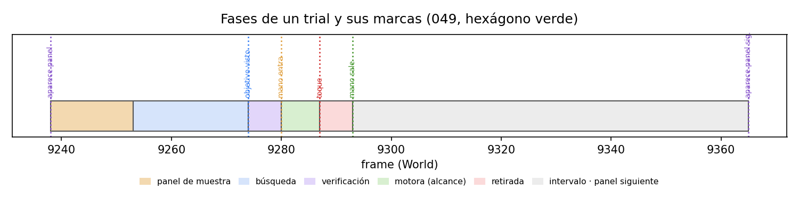

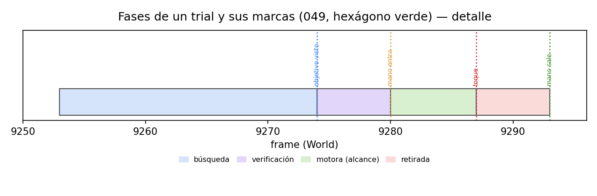

### Línea de tiempo unificada (estados + marcas)

`state_transitions` se fusiona con las marcas conductuales (cada `frame_*` se convierte en
una fila-evento) en una sola tabla cronológica por *trial* (`..._transitions.csv`, columna
`event`). El toque no es un estado: hacerlo estado acoplaría la segmentación a una señal
*best-effort* y desincronizaría la secuencia ante un toque perdido (~10%). La fusión da la
vista unificada sin ese acoplamiento. Formato y ejemplo en la [guía §6.3].

### Diagnóstico de toque (`touch_diag`)

`_deriveTouchDiagnostics` clasifica por qué un *trial* tiene o no toque, para depurar cobertura:
`confirmed`, `fT_below` (subió pero no llegó al umbral), `control_ge` (una celda de control
cambió tanto como el objetivo), `unconfirmed`, `few_arucos` (sin `cell_matrix`),
`never_activated`. No es una columna de los CSV de análisis; se usa en el informe HTML.

---

## 11. Detector de toque (best-effort)

El toque de la pieza objetivo (`frame_target_touch`) se detecta por **cambio de imagen** (no
por color) en el entorno de la casilla objetivo de la vista cenital, comparado con su
apariencia de referencia limpia (`getTargetOcclusionMeasure`). Funciona con manga de cualquier
color. Tres salvaguardas contra falsos positivos:

1. **Composición de color (histograma H-S)**: un desplazamiento del *warp* mantiene los
   colores; una mano mete un color nuevo. Si el histograma apenas cambia, es deriva → 0.
2. **Alineación por correlación de fase**: compensa el micro-temblor del *warp* (±10 px) antes
   de medir el cambio.
3. **Separación frente a celdas de control**: el cambio en el objetivo debe destacar sobre la
   mediana de celdas de control alejadas, para descartar cambios globales (la mano sobre
   todo el tablero).

La señal blanco/color de la casilla se mide sobre los píxeles (umbral de saturación), no
por geometría, así que un pequeño desfase de la celda no reasigna las zonas.

Sobre la vista cenital se marcan la **celda objetivo** (recuadro amarillo) y las **celdas de
control** (gris); abajo se lee `occl target/ctrl`. La oclusión solo se confirma cuando el
objetivo cambia y el control no:

| Tablero limpio (objetivo visible) | Mano alcanzando (objetivo ocluido) |
|---|---|
| 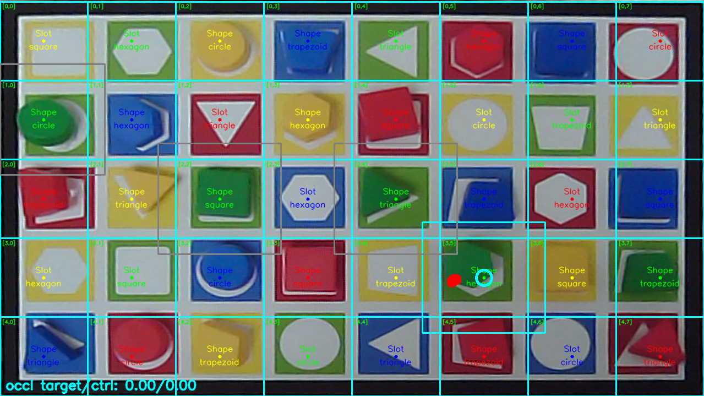 | 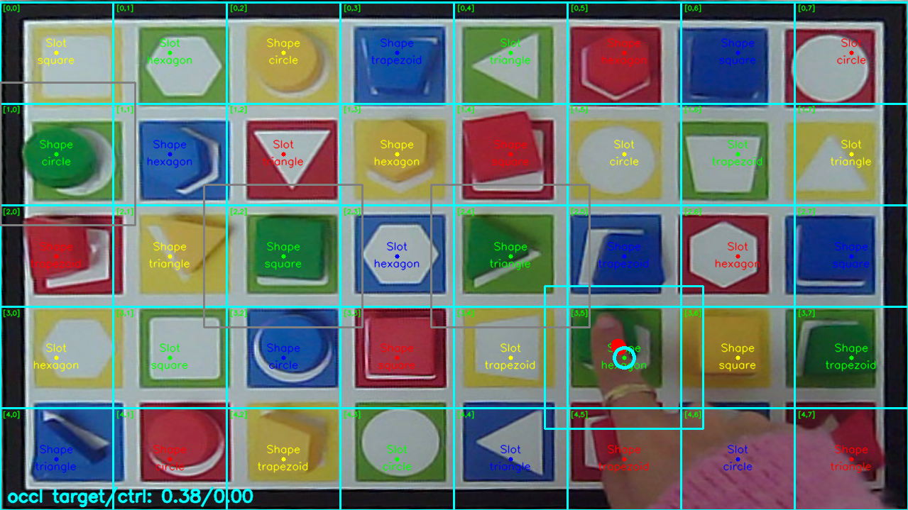 |

*`occl target/ctrl` pasa de **0.00/0.00** (limpio) a **0.50/0.00** (la mano oclúye el objetivo
mientras las celdas de control siguen a 0): esa separación es la que confirma el toque.*

A lo largo del trial, la oclusión del **objetivo** (`fT`) permanece a 0 durante la búsqueda,
sube al cruzar el umbral cuando la mano alcanza la pieza y vuelve a 0 al retirarse, mientras
la del **control** (`fC`) se mantiene plana — esa es la señal que se vigila:

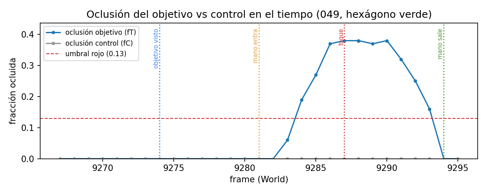

Las **máscaras intermedias** del detector parten de comparar una entrada en vivo con su
referencia limpia, a dos niveles: la celda objetivo (para confirmar el toque) y el
tablero completo (`board_occ`, la señal que sostiene `hand_exit`). Las cuatro entradas
(ejemplo: 049, círculo amarillo):

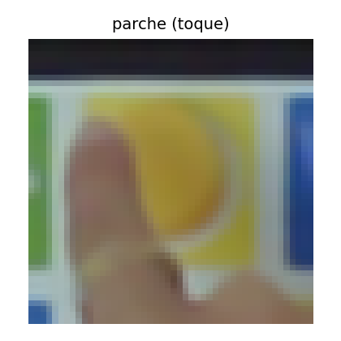 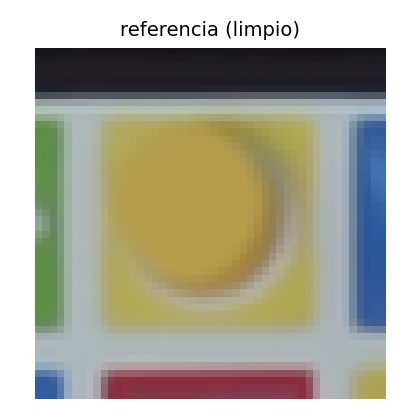 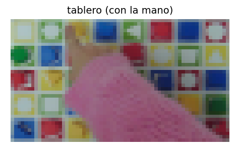 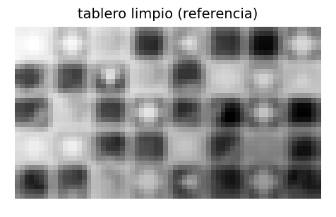

**A nivel de celda (objetivo)** calcula varios componentes de cambio sobre esa comparación y
los combina en la máscara final. La fila *limpia* (la misma celda unos fotogramas antes, sin la
mano) los deja ~vacíos; con el dedo encima se encienden y la máscara final recupera su
silueta — esa es la separación que confirma el toque:

| | diferencia de píxel | borde/textura | SSIM | máscara final |
|---|---|---|---|---|
| **limpia** | 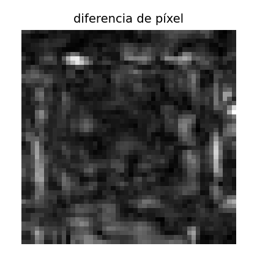 | 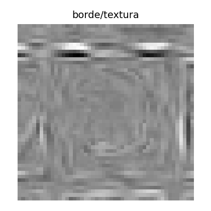 | 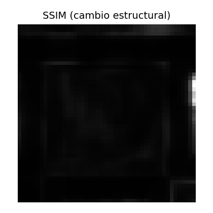 | 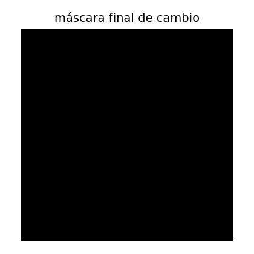 |
| **toque** | 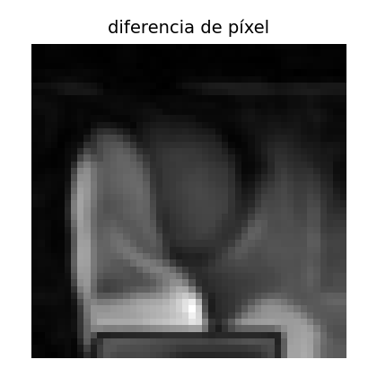 | 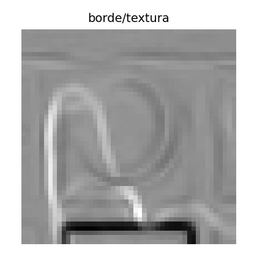 | 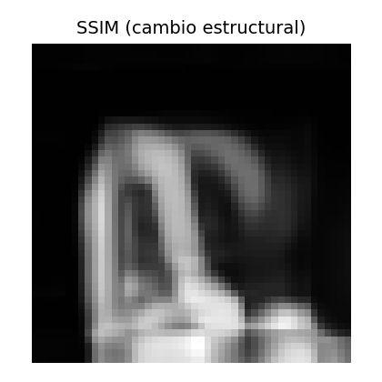 | 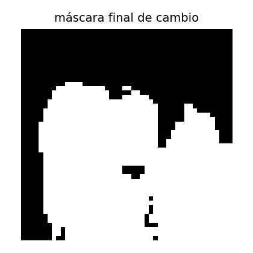 |

**A nivel de tablero** (`board_occ`) la señal es más basta — sin SSIM/borde por celda, solo la
fracción de píxeles cambiada (excluyendo el panel de muestra). Aquí el «activo» es el brazo
cruzando el tablero, suficiente para detectar la entrada/salida de la mano:

| | diferencia | máscara de cambio |
|---|---|---|
| **limpia** | 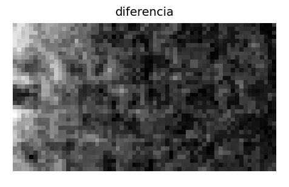 | 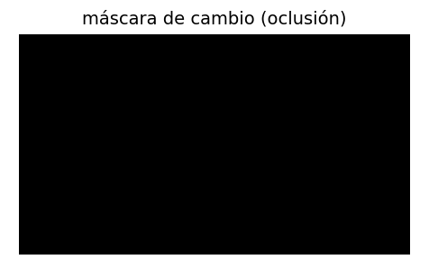 |
| **mano** | 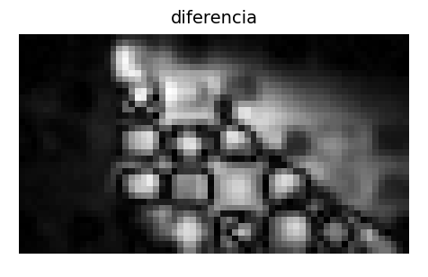 | 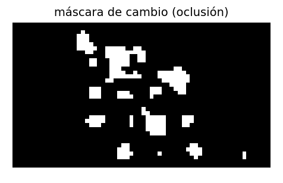 |

Sobre ese detector base se añaden:

- **Umbral de toque por color** (`touch_threshold_by_color = {red:0.13, yellow:0.15, blue:0.20,
  green:0.20}`). Medido sobre la distribución de `fT` de los 20 participantes: los toques reales
  superan ~0.22 en todos los colores, pero las piezas cálidas (rojo/amarillo ≈ tono de piel) dan una
  señal genuinamente menor mucho más a menudo (una mano cálida sobre una pieza cálida apenas cambia
  el color), así que muchos toques reales caían en ~0.13–0.20 y se perdían (rojo: 68 fallos vs azul
  11). Para esos colores se baja el umbral; la separación frente a control sigue protegiendo contra
  falsos positivos.
- **GATE 1 (color) se omite para objetivos cálidos**: el histograma H-S apenas cambia cuando mano y
  pieza comparten tono, así que para rojo/amarillo se confía en el cambio de gris/borde.
- **Componentes de cambio adicionales**: además del histograma, gradiente de bordes (Sobel) y SSIM
  (`structural_similarity`, `scikit-image`) entre la casilla y su referencia limpia, más sensibles a
  la estructura (un dedo) que al ruido de color.
- **Plantilla de sesión** (`session_template`): referencia limpia persistente del tablero,
  refrescada cada 15 fotogramas, usada como respaldo cuando no hay ventana limpia reciente para la
  casilla objetivo.

> **Coste:** estos componentes (SSIM + Sobel + oclusión per-frame + blend de plantilla) elevan el
> tiempo de procesado a ~25 min/participante (≈3× el coste sin ellos). Si la velocidad importara, el
> camino es calcular SSIM/Sobel de forma perezosa (solo cuando los gates baratos ya sugieren toque),
> no en todos los fotogramas.

### Hallazgo medido: el fallo del toque era de temporización, no de homografía

El toque ocurre en la **fase motora**, con la mano ya sobre el tablero; la señal de oclusión
del objetivo sube con claridad (medido: `fT` llega a ~1.0). El problema medido (7/7 fallos
recuperables) era que `test_motor_recovery` cerraba el trial antes de que el toque
culminara: el contorno reaparece a mitad de alcance (la mano ya cruzó el borde y está en el
centro) y se leía como "la mano salió". El toque ocurría 13–57 fotogramas después. Solución:
registrar `hand_exit` pero no cerrar con esa reaparición; el cierre y el `hand_exit` real se
toman con el contorno que vuelve después del toque, o con el panel siguiente, o por *timeout*.

Cobertura best-effort sobre los **22 participantes** (1289 trials reales): **94,6 %** de toque
detectado, con 0 toques implausibles (ninguno antes de aparecer el tablero ni después de salir la
mano). La progresión medida a lo largo del desarrollo fue 82,8 % → 92,0 % → 94,6 %; el salto final
no viene del detector de toque (que no cambió) sino de recuperar trials con el modo lento. Desglose
por color/fila en el informe HTML (pestañas *Toque* y *Cobertura marcas*).
Limitaciones residuales medidas: ArUcos a 2–3 (sin `cell_matrix`), geometría del alcance que no
oclúye la casilla, o celdas de control más ocluidas que el objetivo. El cierre del *trial* no
depende del toque (es el cruce del borde, `frame_end`), así que un toque perdido no descuadra la
segmentación.

### Limitación conocida (medida, sin resolver): toque temprano sobre ruido de `fT`

La **marca temporal** del toque puede adelantarse: en ~12 % de los trials (cohorte) el `motor_onset`
queda después del `target_touch` (imposible físicamente), porque el toque disparó sobre una subida
transitoria y débil de `fT` —un sobrevuelo de la mano o un roce— en lugar del contacto real, que
llega más tarde. La cobertura (si hubo toque) no se ve afectada; lo que sufre es la fiabilidad de la
marca.

Diagnóstico medido (lo consolidado):

- **Umbral de toque por color y ruido de base** (figura): el objetivo rojo tiene el umbral más bajo
  (`0,13` vs `0,20` azul/verde) y la base más ruidosa. La causa está en el propio detector: la GATE 1
  (histograma de color, que descarta cambios de pura luz) se salta para objetivos cálidos
  (rojo/amarillo ≈ tono piel), porque una mano cálida sobre una pieza cálida apenas cambia el tono y
  la GATE 1 anularía el toque real; el precio es que las fluctuaciones de luz sobre las piezas
  saturadas se cuelan como ruido de `fT`.

  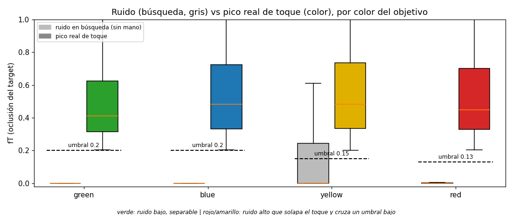

- **La magnitud no separa** ruido de toque: el pico real de `fT` en un toque tiene mediana ~0,45 (el
  dedo tapa ~la mitad del ROI) y solapa con las colas del ruido. Subir el umbral perdería toques
  reales. Medido en cohorte, no es viable.

- **El bump envenenado**: `motor_onset`/`target_touch` se refinan con el modelo de *bump*
  (subida→pico→valle, §12.1), pero la búsqueda del pico está acotada por el frame del toque *live*;
  si el *live* disparó pronto (sobre el ruido), la ventana no alcanza el pico real y la marca queda
  en el ruido.

**Alternativas descartadas:** un umbral de magnitud (solapa) y exigir consenso estructural entre
cues (pixel-diff/edge/SSIM) — medido: la estructura escala junto al brillo, no los separa.

**Dirección del arreglo (pendiente):** el discriminador fiable es temporal — un toque real coincide
con el alcance (la oclusión de tablero / `motor_onset` sube), mientras una transitoria durante la
búsqueda no. Re-anclar el *bump* al alcance en vez de al toque *live* requiere rediseño y validación
de cohorte; queda como trabajo pendiente.

---

## 12. Marcas motoras y la ambigüedad del contorno

| Marca | Señal que usa |
|---|---|
| `frame_motor_onset` / `frame_end` | **pérdida sostenida del contorno** (la mano cruza el borde hacia dentro) |
| `frame_target_touch` | **oclusión por cambio** del entorno de la casilla objetivo (mejor esfuerzo) |
| `frame_hand_exit` | **oclusión que vuelve a reposo** (local o de tablero), o contorno que vuelve tras el toque |

Orden temporal: borde-entra (`motor_onset`/`end`) → toque → mano-sale (`hand_exit`). Clave: el
contorno (borde) solo se oculta mientras la mano lo cruza, no mientras está realcanzando en
el centro; por eso reaparece a mitad de alcance y no sirve, por sí solo, para distinguir
*mano-dentro-realcanzando* de *mano-fuera*. De ahí que `hand_exit` se ancle a la **oclusión**
(que sí se mantiene alta a mitad de alcance) y, como respaldo, al contorno que vuelve tras
el toque. Es también la razón de que `target_touch` pueda caer un par de *frames* después
de `motor_onset`/`trial_end` (ver el ejemplo de la [guía §6.3]).

### 12.1 `motor_onset` validado por oclusión

El contorno-perdido es la señal natural de entrada (la mano cruza el borde), pero también
salta sin mano: por *flicker* de homografía o por una mano apoyada en el borde extremo que no
llega a tapar celdas. Medido sobre los 22: en 7,4 % de los *trials* el contorno se pierde mientras
la oclusión del objetivo (`fT`) y la del tablero (`board_occ`) siguen ~0 durante ~1,7 s, y
solo entonces un alcance rápido las dispara en el toque — ese contorno-perdido era un artefacto,
no la entrada.

Las dos curvas de oclusión de un alcance — objetivo (`fT`, rojo) y tablero completo (`board_occ`,
azul) — con sus tres landmarks: **entrada** (inicio de la subida), **toque** (pico) y **salida**
(valle). La oclusión solo se registra durante el alcance (fases de ejecución/recuperación
motora), así que la curva queda confinada al *bump*: en la vista de ciclo completo las bandas de
fase y las marcas de panel (este trial y el siguiente) sitúan el alcance, y se ve que fuera de él
la curva es plana porque ahí no se mide oclusión. La segunda vista amplía el alcance:

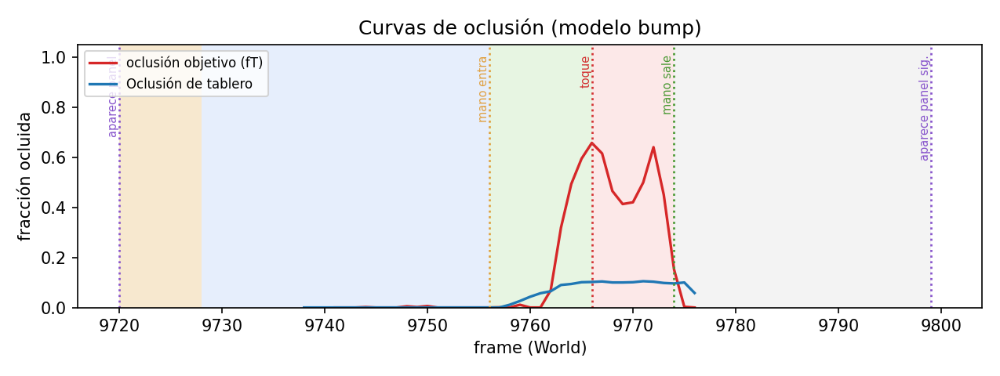

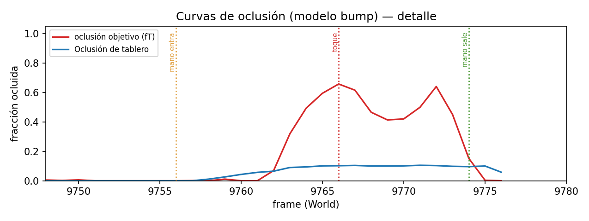

Por eso `motor_onset` se valida con la oclusión (post-hoc, sobre el `signal_trace`):

- Si la primera subida real de oclusión (objetivo o tablero) llega dentro de
  `motor_onset_artifact_gap` (15 *frames*), el contorno-perdido fue una entrada real y se
  mantiene (92,6 % de los casos medidos).
- Si llega mucho más tarde (no había mano sobre el tablero), es artefacto: `motor_onset` se
  mueve a la subida de oclusión y el *frame* del contorno se conserva como `motor_onset_live`.

Se registra la **causa** del artefacto en `motor_onset_source`: `curve_rise_homography` si el
contorno cayó con la homografía/pose no fiables (homografía perdida o rejilla desde referencia),
o `curve_rise_edge` si la mano estaba en el borde sin tapar celdas. Reparto medido (22
participantes): 47 homografía / 49 borde de 96 artefactos. *Por qué no basta `board_occ` para la entrada:* se mide desde el
alcance (no solo en recuperación), pero al ser un cambio de tablero completo sube tarde en
alcances locales (una mano en la esquina apenas lo mueve); la entrada real la marca el contorno
o la subida de `fT`.

Esta validación es parte del **modelo *bump*** post-hoc (apartado 11): sobre las dos curvas de
oclusión (objetivo `fT` y tablero `board_occ`) se extraen subida → pico → valle, y se anclan
`target_touch` = pico, `hand_exit` = valle, `motor_onset` = entrada validada. Todo se re-deriva
del `signal_trace` sin re-ver el vídeo ([`reprocess_landmarks.py`](../src/tools/reprocess_landmarks.py)).

### 12.2 Anomalías "fuera de target", validación de mirada y pieza tocada

A veces el participante se equivoca (mira o toca otra pieza). Lo que se puede detectar de
forma fiable es la **anomalía** (algo pasó fuera del target), y por separado dónde miró:

- **`error_type`** (de señales fiables) — `correct` (se confirmó el toque del target);
  `off_target` (hubo un alcance completo —la mano ENTRÓ y SALIÓ del tablero, `motor_onset`
  *y* `hand_exit`— pero ni se tocó el target ni la mirada se comprometió con él → pasó algo
  fuera del target); `no_touch` (miró el target y alcanzó, pero el toque no se confirmó). Vacío
  si el alcance no fue completo. No depende de localizar la pieza tocada.
- **`gaze_validated_piece` / `gaze_validated_cell` / `frame_validation`** — *qué* pieza
  validó la mirada: la celda de la última fijación de tablero (mismo detector I-DT que
  `target_found`, [`_idtFixations`](../src/core/StateMachineHandler.py)) antes del toque. Es
  la parte fiable de "fue a otro sitio": en un `off_target` indica a qué pieza miró.
- **`touched_piece` / `touched_cell`** — *EXPERIMENTAL, no fiable.* Intento de leer qué celda
  tapaba la mano desde la oclusión por celda ([`getCellOcclusionMap`](../src/core/BoardHandler.py),
  máscara de `board_occ` + focalidad sostenida). No funciona aún: la oclusión barata no separa
  el dedo del brazo (que ocluye muchas celdas) y el pico de oclusión suele caer en la
  retirada, no en el toque. Se conserva en el PKL para revisión y para el detector robusto
  futuro (correr el detector de toque del target por celda: compuertas color/edge/SSIM +
  separación local + sostenido, que sí distingue dedo de brazo). No dirige `error_type`. La
  validación visual de estos casos es la figura de debug ([`debug_flagged_trials.py`](../src/tools/debug_flagged_trials.py)).

La pieza de una celda se nombra con el layout del tablero (fijo en la sesión), construido de
todas las muestras de mirada (`board_coord` + color/forma). Esto añade la fase **`validation`**
en la secuencia (búsqueda → verificación → validación → motor → retirada) y la marca
`validation` en la línea de tiempo: un `off_target` se reconoce ahí como `validation` +
`motor_onset` + `hand_exit` sin `target_touch` (no acaba solo en "target no encontrado").
Detalle de columnas en la [guía §6](guia_procesamiento.md).

---

## 13. Limitaciones del equipo de medida (mecanismo)

El dispositivo es el **Pupil Labs Core** (Kassner, Patera & Bulling, 2014), grabado con **Pupil
Capture 3.5.7**: cámaras oculares a 200 Hz (192×192 px), cámara de escena (*World*) hasta
1080p/30 Hz (estas grabaciones a 1280×720). La exactitud nominal (0,60°, precisión 0,02°) es la
del mapeo 2D en laboratorio; en estas grabaciones el mapeo y la configuración varían entre
participantes, así que el error real es mayor y no uniforme. Esta sección explica el
mecanismo de cada limitación; los valores concretos por participante (configuración, ojo,
tasa de gaze, nº de calibraciones) están en
[caracterizacion_dataset.md](caracterizacion_dataset.md). Consecuencias para estos datos:

- **Configuración de mirada no uniforme entre participantes** (medido en los `.pldata`): conviven
  *2D monocular*, *2D binocular* y *3D monocular* (más un caso mixto). El mapeo 2D es más preciso
  en condiciones ideales (<1°) pero menos robusto al deslizamiento; el 3D es más robusto pero
  menos exacto (1,5–2,5°); el monocular pierde la convergencia binocular. Es heterogeneidad de
  calidad de dato (no de tarea): la mirada de un binocular 2D no es directamente comparable a
  la de un monocular 3D — relevante para cualquier análisis, no solo para este procesado. El reparto
  por participante está en [caracterizacion_dataset.md](caracterizacion_dataset.md).
- **Error angular → incertidumbre espacial.** La exactitud de 0,60° se degrada en uso
  naturalista (movimiento de cabeza, iluminación variable). Ese error angular se traduce en
  incertidumbre al asignar la mirada a una casilla: a mayor distancia participante–tablero y
  casillas más pequeñas, más probable que una muestra caiga en la casilla adyacente.
- **Detección de pupila y características individuales.** El algoritmo usa técnica de pupila
  oscura sobre la imagen infrarroja del ojo. El color del iris, la forma del párpado, la
  presencia de pliegue epicántico u otras características anatómicas influyen en la facilidad y
  precisión de esa detección. No están controladas en el diseño y explican parte de la variación
  entre participantes en muestras válidas y precisión (no es diferencia de hardware: el equipo es
  el mismo).
- **Deriva de la calibración.** El número de calibraciones varía por participante (de 1 a 5;
  reparto en [caracterizacion_dataset.md](caracterizacion_dataset.md)). Cuando hay varias, el
  gaze grabado usa la más reciente en cada instante (verificado en el código de Pupil 3.5: cada
  calibración exitosa reemplaza al *gazer* activo — `uniqueness="by_base_class"`), lo que acota la
  deriva entre bloques; pero en los participantes con una sola calibración no hay
  recalibración que acote la deriva intra-sesión. En todos los casos el residual de la
  calibración persiste y es mayor en la periferia del campo visual (la calibración extrapola peor
  lejos del centro; medido: la mirada se comprime ~2% del ancho del tablero hacia el centro). El
  modelo 3D incorpora compensación de deslizamiento (*slippage compensation*), que no lo elimina por
  completo. Cada calibración puede **reconstruirse offline** desde su `calib_data` con el mismo
  modelo polinómico que Pupil (validado a 0,00 px sobre 049; ver dataset doc), lo que habilita la
  compensación de error por participante descrita en §7.
- **Pérdida de señal.** Parpadeos, movimiento brusco o reflejo corneal desfavorable producen
  muestras ausentes o de baja confianza (≤0,6, descartadas). Esos fragmentos no se contabilizan;
  los totales previos al filtrado no se conservan (no se guardaron los ficheros de captura).

---

## 14. Parámetros clave

| Parámetro | Dónde | Valor | Qué controla |
|---|---|---|---|
| `board_contour_switch_state_threshold` | StateMachine | 4 | fotogramas sin contorno para cerrar el trial (motor_onset) |
| `board_contour_start_confirm_threshold` | StateMachine | 6 | fotogramas de contorno estable para iniciar el trial |
| `panel_detected_threshold` | StateMachine | 4 | fotogramas consecutivos para confirmar un panel |
| `target_occlusion_threshold` / `_separation` | StateMachine | 0.20 / 0.10 | umbral de toque por defecto y separación frente a control |
| `touch_threshold_by_color` | StateMachine | red 0.13 / yellow 0.15 / blue 0.20 / green 0.20 | umbral de toque por color (cálidos más bajos) |
| `occlusion_pixel_diff` / `_edge` / `_ssim` | BoardHandler | 60 / 50 / 0.55 | umbrales de los componentes de cambio (gris, Sobel, SSIM) |
| `target_occlusion_confirm_threshold` | StateMachine | 2 | fotogramas de oclusión sostenida para confirmar el toque |
| `target_warmup_frames` | StateMachine | 3 | espera mínima antes de vigilar el toque (panel barriendo) |
| `motor_recovery_max_frames` | StateMachine | 75 | ventana (~2,5 s) para vigilar toque + salida de mano |
| `motor_recovery_confirm` / `_miss_tolerance` | StateMachine | 3 / 2 | contorno sostenido para `hand_exit`, con tolerancia a parpadeo |
| `ft_enter_level` / `ft_exit_level` / `ft_exit_confirm` | StateMachine | 0.20 / 0.05 / 3 | entrada/salida/confirmación de `hand_exit` por oclusión local |
| `board_occ_enter_level` / `board_occ_exit_level` / `_confirm` | StateMachine | 0.12 / 0.05 / 3 | ídem por oclusión de tablero completo |
| `motor_onset_artifact_gap` | StateMachine | 15 | *frames* máx. del contorno-perdido a la subida de oclusión; por encima, el contorno fue artefacto y `motor_onset` se mueve a la curva (§12.1) |
| `_template_blend_every` | BoardHandler | 15 | cada cuántos fotogramas se refresca la plantilla de sesión |
| `rotation_flip_threshold` | ArucoBoardHandler | 3 | histéresis del giro 180° del tablero |
| `GAZE_CONFIDENCE_THRESHOLD` | EyeDataHandler | 0.6 | confianza mínima de la muestra de gaze (§7.3) |
| `BLINK_MARGIN_S` | EyeDataHandler | 0.05 | dilatación ±s de las ventanas de parpadeo excluidas (§7.3) |
| `SMOOTH_WINDOW` / `SMOOTH_VEL_THRESHOLD_PX` | EyeDataHandler | 4 / 15 | semiventana y umbral de sacada del suavizado de mirada (§7.3) |
| `GATE_MIN_GAIN_LOWER` / `GATE_MIN_BASE_PX` | gaze_calibration | 0.0 / 12 | compuerta de adopción de la corrección de deriva (§7.1) |
| `target_found_min_fixation_samples` / `_fixation_dispersion` | StateMachine | 6 / 0.06 | tamaño y dispersión de la fijación I-DT para `target_found` (§10) |
| `target_found_mass_threshold` | StateMachine | 0.34 | masa de la elipse sobre el objetivo para marcar `target_found` (§7.5) |

Los valores se han ajustado midiendo sobre muestra; no son nominales.

### 14.1 Modos de ejecución y fiabilidad

El procesado tiene un modo **lento/preciso** (por defecto) y uno **rápido** (`--fast_analysis`,
~6,5× más veloz) que submuestrea los estados `init`/`get_test_name`. El rápido puede saltarse
la detección de un panel marginalmente visible (ángulo/iluminación pobres) y perder el *trial*
entero: medido, un run rápido costó a 2 participantes ~la mitad de sus *trials*, mientras el
lento los recupera (P-A 6/11 → 11/11 en el bloque 0). El detector de toque/salida no cambia
(ejecución y recuperación van a *frame* completo en ambos modos): el modo solo afecta a qué
trials se detectan.

El criterio de diseño es que la calidad no dependa de recordar un flag. Por eso:

- El modo seguro (lento) es el *default* en los dos puntos de entrada (`process_video.py` y
  `run_all.py`); el rápido es un *opt-in* explícito, solo para iteración.
- El `topic` por defecto es `gaze` en ambos puntos de entrada.
- Cada salida graba `run_config` (procedencia, §2).
- `store_results` avisa en el log si un run sale incompleto (muchos *trials* sin detectar →
  posible submuestreo) o si es parcial (`start_frame`/`end_frame`): así el problema se detecta en el
  momento.

El post-hoc (modelo *bump*, §11–§12.1) se puede re-aplicar sin re-ver el vídeo con
[`reprocess_landmarks.py`](../src/tools/reprocess_landmarks.py), que recarga el `signal_trace`
persistido y reusa los mismos `_posthocBump` / `store_results` (sin duplicar lógica); con
`--report` regenera además los CSV combinados + HTML llamando a `process_outputs`.

---

## Referencias

Kassner, M., Patera, W., & Bulling, A. (2014). Pupil: An open source platform for pervasive eye
tracking and mobile gaze-based interaction. En *Adjunct Proceedings of UbiComp 2014* (pp.
1151–1160). ACM. https://doi.org/10.1145/2638728.2641695

(Referencias metodológicas sobre *gaze* vs *fixations* y *dwell time* en la
[guía de procesamiento](guia_procesamiento.md#referencias).)
