# Guía de Interfaz de datos

> Guía de **usuario** de los datos y salida de la aplicación: qué significan las salidas y cómo
> interpretarlas. Es autocontenida para entender, filtrar y analizar los CSV. El detalle interno
> (algoritmos, máquina de estados, decisiones de ingeniería, entradas/salidas) está en la
> [documentación técnica](documentacion_tecnica.md), que toma esta guía como base.
>
> Los datos concretos por participante viven en el informe HTML y los CSV, que se regeneran con
> cada procesamiento.

**Índice**

- [1. ¿Qué problema resuelve?](#1-qué-problema-resuelve)
- [2. Entradas (lo que necesita el programa)](#2-entradas-lo-que-necesita-el-programa)
  - [La secuencia experimental (qué se busca en cada *block* y *trial*)](#la-secuencia-experimental-qué-se-busca-en-cada-block-y-trial)
- [3. Cómo funciona, paso a paso](#3-cómo-funciona-paso-a-paso)
  - [Una sola máquina de estados, dos niveles de lectura](#una-sola-máquina-de-estados-dos-niveles-de-lectura)
  - [Cómo se detecta el inicio y el fin de cada *trial*](#cómo-se-detecta-el-inicio-y-el-fin-de-cada-trial)
  - [Marcas temporales del *trial* y fases](#marcas-temporales-del-trial-y-fases)
- [4. Un detalle clave: el vídeo y la mirada van a velocidades distintas](#4-un-detalle-clave-el-vídeo-y-la-mirada-van-a-velocidades-distintas)
  - [La frecuencia de muestreo del *gaze* no es 200 Hz, y varía entre participantes](#la-frecuencia-de-muestreo-del-gaze-no-es-200-hz-y-varía-entre-participantes)
  - [¿Por qué se usa *gaze* y no *fixations*?](#por-qué-se-usa-gaze-y-no-fixations)
- [5. Salidas (lo que se obtiene)](#5-salidas-lo-que-se-obtiene)
  - [¿Qué hay en el YAML/PKL que no esté en los CSV?](#qué-hay-en-el-yamlpkl-que-no-esté-en-los-csv)
- [6. Cómo se leen los dos CSV (lo esencial)](#6-cómo-se-leen-los-dos-csv-lo-esencial)
  - [6.1. `trials_data_<id>.csv` — resumen por *trial*](#61-trials_data_idcsv--resumen-por-trial)
  - [6.2. `trials_data_<id>_sequence.csv` — recorrido temporal](#62-trials_data_id_sequencecsv--recorrido-temporal)
  - [6.3. `trials_data_<id>_transitions.csv` — línea de tiempo del *trial*](#63-trials_data_id_transitionscsv--línea-de-tiempo-del-trial)
  - [6.4. `target_geometry.csv` — referencia del tablero](#64-target_geometrycsv--referencia-del-tablero)
- [7. Del conteo al tiempo: cuánto se mira cada cosa](#7-del-conteo-al-tiempo-cuánto-se-mira-cada-cosa)
  - [No todos los instantes tienen dato](#no-todos-los-instantes-tienen-dato)
- [8. Notas importantes para quien analice los CSV](#8-notas-importantes-para-quien-analice-los-csv)
- [9. Limitaciones metodológicas](#9-limitaciones-metodológicas)
  - [Del diseño experimental](#del-diseño-experimental)
  - [Del equipo de medida (Pupil Labs Core)](#del-equipo-de-medida-pupil-labs-core)
- [10. Magnitud del procesamiento](#10-magnitud-del-procesamiento)
- [Referencias](#referencias)

---

## 1. ¿Qué problema resuelve?

El experimento registra, con **gafas de seguimiento ocular** (Pupil Labs), a una persona que busca un objeto —un color y una forma, p. ej. "hexágono rojo"— en un **tablero físico** de fichas. Las gafas dejan dos señales que esta guía nombra constantemente: el **vídeo de la escena** (*World*, lo que ve la persona) y la **posición de la mirada** (*gaze*) en cada instante.

A partir de esas dos señales, el software reconstruye a qué casilla del tablero miraba en cada momento y, por *trial*, resume cuánto miró cada ficha y cada hueco y en qué fase de la búsqueda. El resto de la guía explica esas salidas y cómo interpretarlas.

---

## 2. Entradas (lo que necesita el programa)

Por cada participante existe una carpeta `data/<id>/` con:

| Entrada | Qué es |
|---|---|
| `world.mp4` | El vídeo de la escena (*World*) grabado por las gafas. |
| `world_timestamps.npy` | El instante de tiempo de cada imagen (*frame*) del vídeo. |
| `gaze.pldata` + `gaze_timestamps.npy` | La posición de la mirada (*gaze*) y su instante de tiempo. (También puede usarse *fixations*, que son miradas ya agrupadas con una *duración*.) |
| `camera_calib.json` | La **calibración de la cámara**, para corregir la deformación del objetivo (las líneas rectas vuelven a verse rectas). |

Además, hay ficheros de **configuración** comunes a todos (carpeta `cfg/`):

| Configuración | Qué define |
|---|---|
| `game_config.yaml` | Cómo es el tablero: una rejilla de 8 columnas × 5 filas (40 casillas), y para cada casilla su color, su forma y si contiene una ficha o es un hueco vacío. |
| `game_aruco_board.yaml` | Dónde están los **marcadores ArUco** (cuadros tipo código QR) que rodean el tablero y permiten localizarlo y enderezarlo. |
| `default_trials_config.yaml` | La **secuencia esperada** de búsquedas: qué objeto se busca en cada *block* y *trial*. (Algunos participantes tienen su propia versión en `cfg/trials_config_exceptions/`.) |
| `sample_shape_cfg/` | La descripción de los **paneles de estímulo** que se le muestran a la persona antes de cada *trial*. |

Colores posibles: rojo, verde, azul, amarillo. Formas posibles: círculo, hexágono, triángulo, cuadrado, trapecio.

### La secuencia experimental (qué se busca en cada *block* y *trial*)

El experimento son **6 *blocks* de 10 *trials***. El objetivo buscado en cada uno es fijo y se
define en `default_trials_config.yaml` (ahí está la versión textual, lista para cruzar por
`block_index` / `trial_index`). Aquí se muestra con el dibujo del estímulo que se enseña al
participante. Las filas son los *blocks* (0–5) y las columnas los *trials* (0–9), igual que en
los CSV. Algunos participantes tienen su propia variante en `cfg/trials_config_exceptions/`; en
ese caso manda la suya.

| Block \ Trial | 0 | 1 | 2 | 3 | 4 | 5 | 6 | 7 | 8 | 9 |
|---|---|---|---|---|---|---|---|---|---|---|
| **0** | 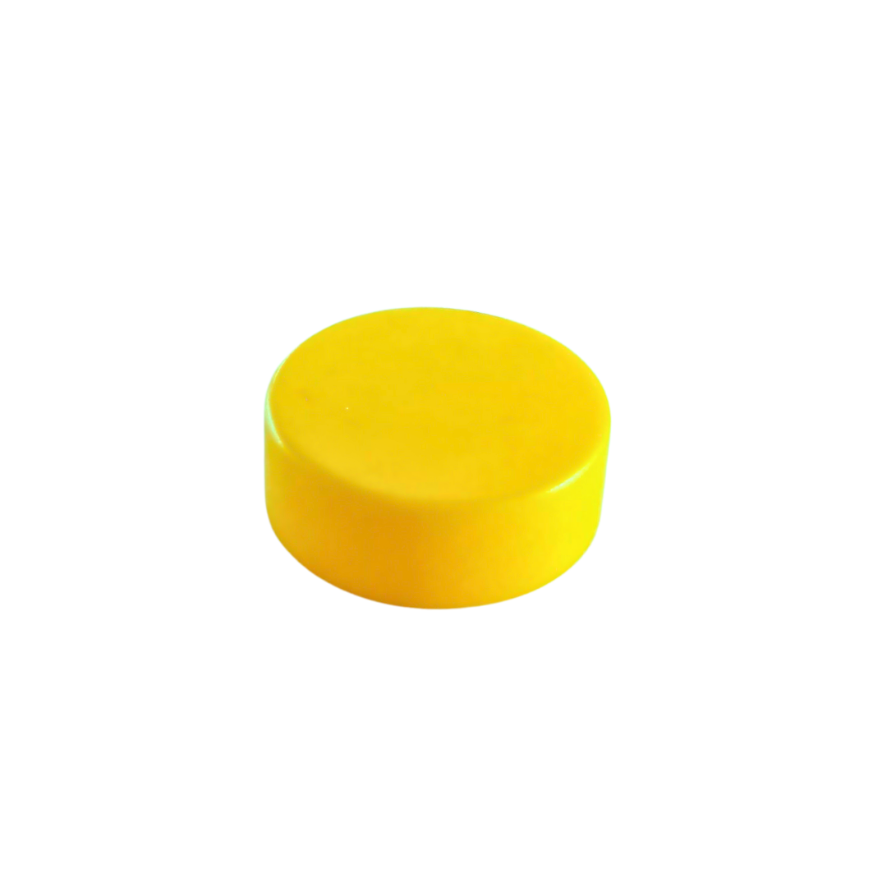 | 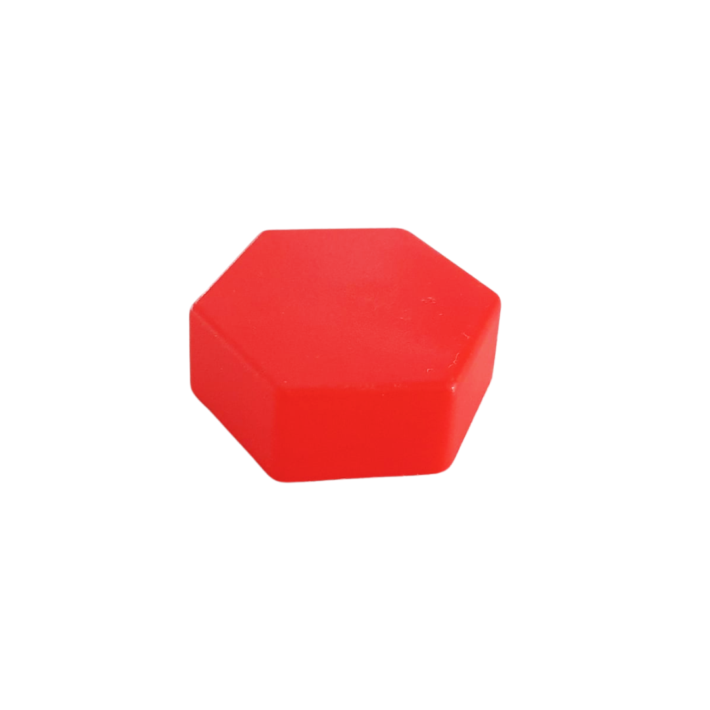 | 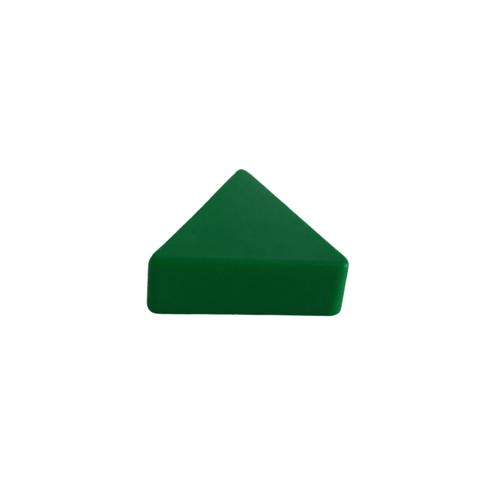 | 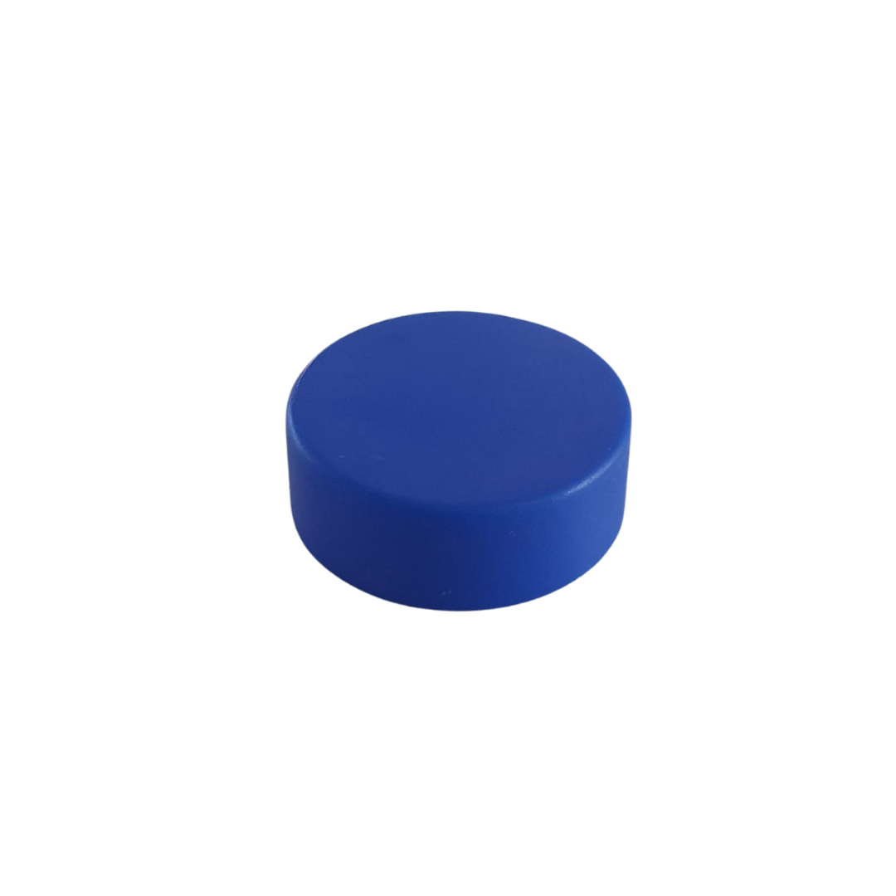 | 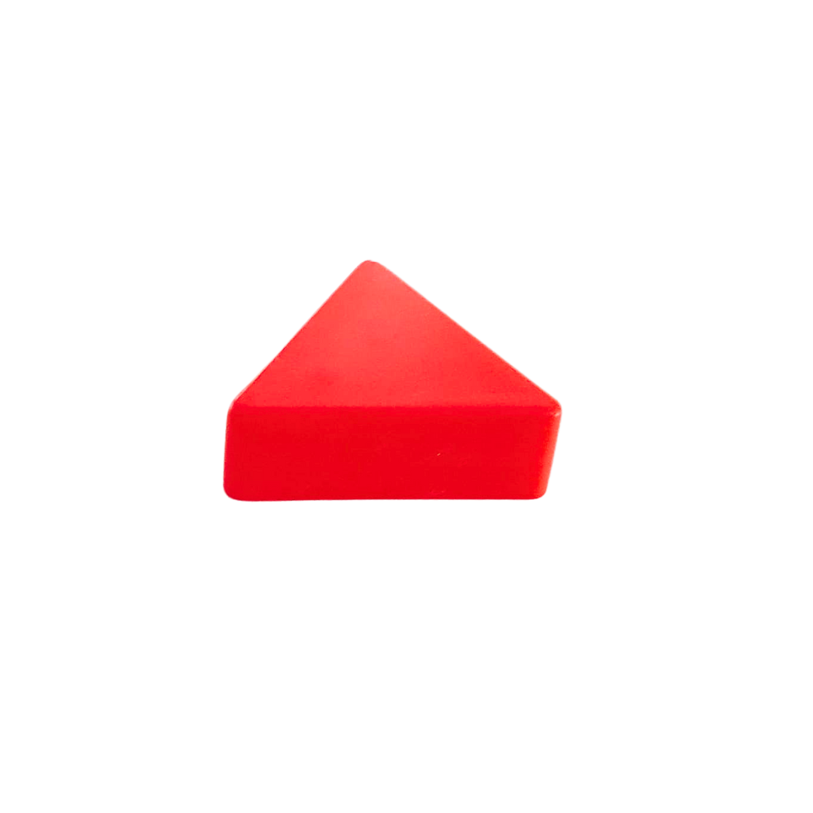 | 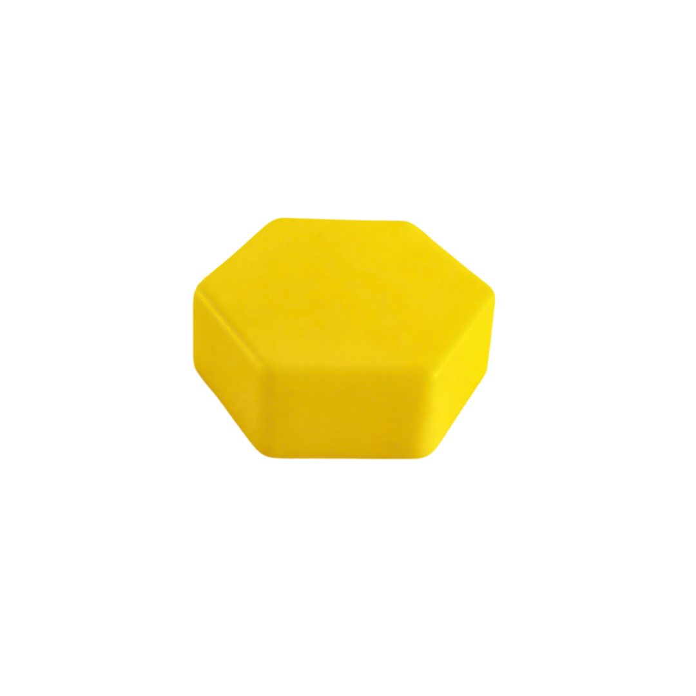 | 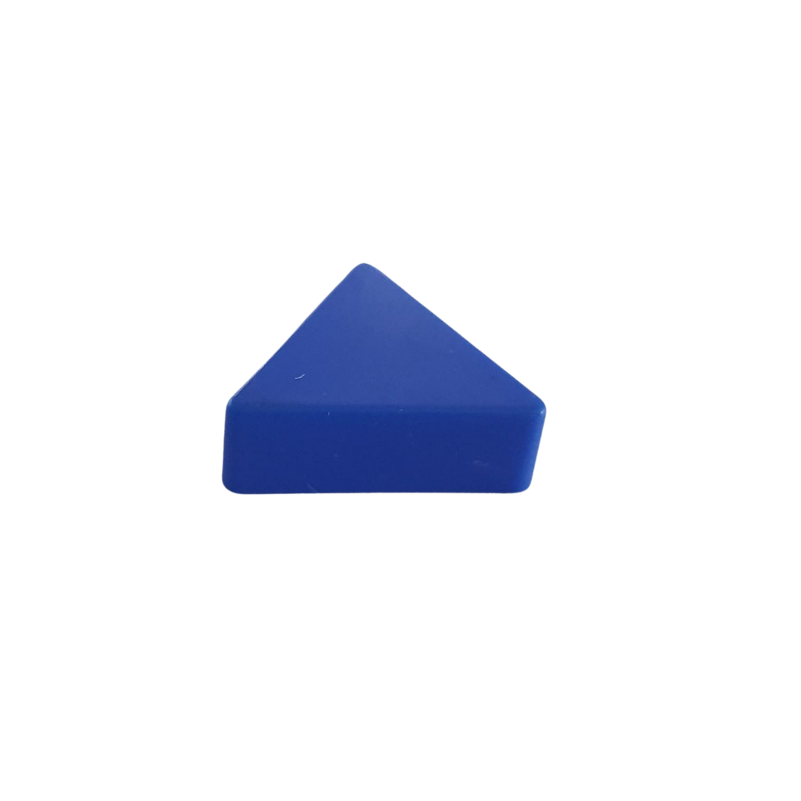 | 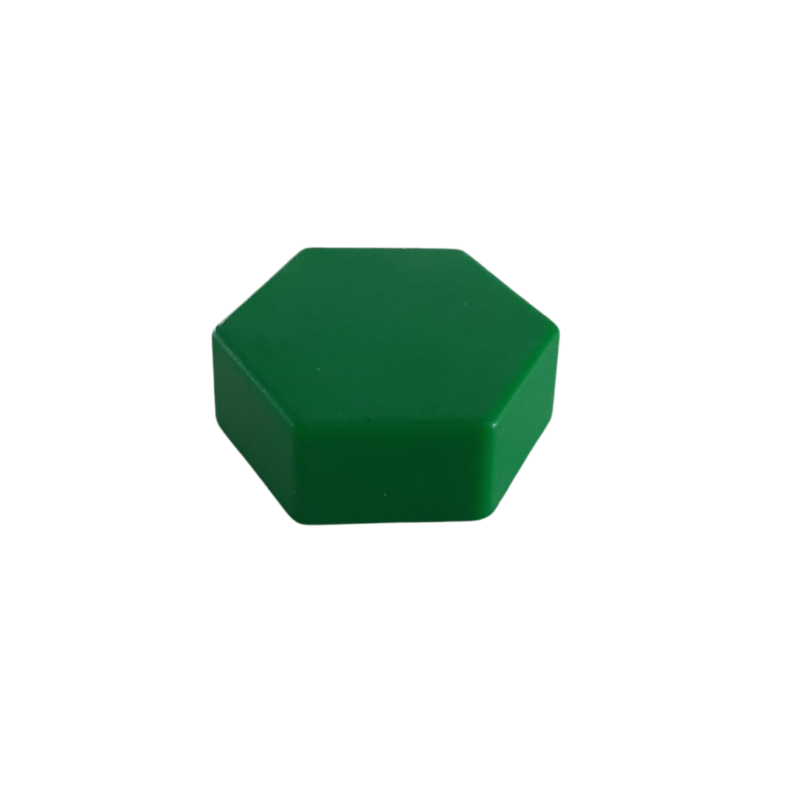 | 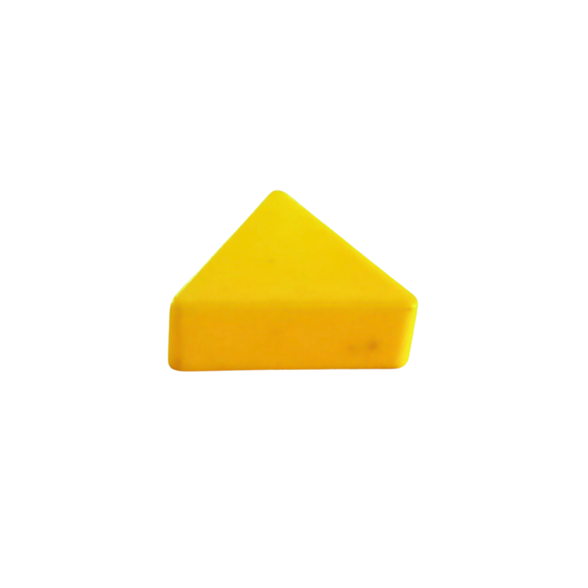 | 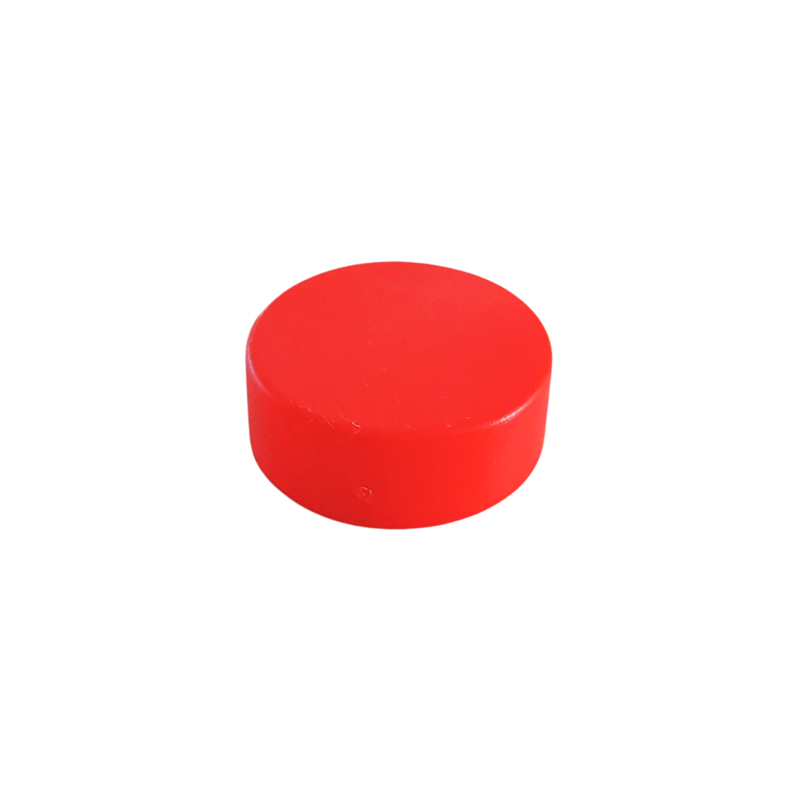 |
| **1** |  |  |  |  |  |  |  |  |  |  |
| **2** |  |  |  |  |  |  |  |  |  |  |
| **3** |  |  |  |  |  |  |  |  |  |  |
| **4** |  |  |  |  |  |  |  |  |  |  |
| **5** |  |  |  |  |  |  |  |  |  |  |

> ⚠️ **El *block* 3 se presenta con el tablero girado 180°**, por diseño. El procesamiento lo detecta y compensa automáticamente: las casillas, el toque y las marcas son correctos. Lo único que queda expresado en el marco rotado es el **índice absoluto de casilla** (`target_cord` / `board_coord`) del *block* 3 — relevante solo para análisis por posición absoluta en el tablero, no para "¿encontró / tocó el objetivo?". Por eso las figuras que dibujan la mirada sobre la imagen canónica del tablero no usan *trials* del *block* 3 (saldrían volteados).

---

## 3. Cómo funciona, paso a paso

El programa principal (`src/process_video.py`) recorre el vídeo de *World* **frame a frame** y, para cada uno, hace lo siguiente. Cada paso está implementado en un "módulo" (un fichero dentro de `src/core/`):

1. **Corrección de color e imagen** *(`ArucoBoardHandler.py`, `DistortionHandler.py`)*. Se ajusta el color y se corrige la deformación de la lente de la cámara, para que el tablero se vea con sus colores reales y sin curvaturas.

2. **Localizar el tablero y "enderezarlo"** *(`BoardHandler.py`)*. Usando los marcadores ArUco que rodean el tablero, el programa calcula la perspectiva y genera una **vista cenital** (como si mirásemos el tablero perfectamente desde arriba). Sobre esa vista enderezada, divide el tablero en su rejilla de 8×5 casillas.

3. **Identificar el panel de estímulo** *(`PanelHandler.py`)*. Cuando a la persona se le muestra el panel con el objeto a buscar, el programa lo detecta y deduce **qué color y forma** toca buscar en ese *trial*.

4. **Emparejar la mirada con el vídeo** *(`EyeDataHandler.py`)* — *ver apartado 4, es importante.*

5. **Saber en qué fase del experimento estamos** *(`StateMachineHandler.py`)*. Un "director de orquesta" (una *máquina de estados*) que va siguiendo el experimento:

   | Fase | Qué está pasando |
   |---|---|
   | `init` | En espera. Se vigila si aparece un panel de estímulo. |
   | `get_test_name` | El panel está visible: se ha identificado el objeto a buscar. |
   | `test_start_execution` | El panel desaparece. Se espera a que el tablero sea visible en su totalidad. |
   | `test_execution` | La persona busca. Se registra, en cada instante, a qué casilla mira. |
   | `test_motor_recovery` | La mano ha entrado en el tablero (fin del *trial* decidido). Se espera a que la mano salga del tablero para anotar `frame_hand_exit` antes de cerrar; si aparece ya el panel siguiente, cede de inmediato. |
   | `test_finish_execution` | Se guardan los resultados del *trial* y se vuelve a `init`. |

   `StateMachineHandler` también compara lo que ocurre con la **secuencia esperada** de *trials*. Si un *trial* que debía aparecer no aparece, o si hay un salto entre paneles, lo marca como **error** (ver apartado 8) en lugar de perder el dato.

### Una sola máquina de estados, dos niveles de lectura

Hay **una única máquina de estados** (`init` → `get_test_name` → … → `test_finish_execution`
→ `init`). No son dos máquinas; lo que hay son dos niveles independientes para leer su
resultado, que pueden ir bien o mal por separado:

- **Nivel detección** — si la máquina se mantuvo en sincronía con la secuencia esperada
  de paneles. Su ciclo abarca todo el procesamiento de cada panel. Falla a este nivel si
  un panel esperado no aparece (`missing_trial_error`) o aparece sin un inicio limpio
  (`transition_error`).
- **Nivel trial** — cómo acabó el *trial*. El *trial* (la unidad experimental) es una
  **ventana conductual** más estrecha dentro del mismo ciclo, delimitada por las marcas de
  comportamiento (apartado siguiente): empieza cuando la persona tiene el tablero delante y
  busca, y termina, a nivel de usuario, cuando toca la pieza. La misma máquina arranca
  antes (al detectar el panel) y sigue después del toque (espera a que la mano salga,
  `test_motor_recovery`) para re-sincronizar. A este nivel el *trial* acaba `test_finish_execution`
  (cierre limpio), `test_finish_by_next_panel` (interrumpido; duración = cota superior) o
  `test_finish_by_end_of_video`.

Los dos niveles fallan de forma independiente (la detección puede descuadrarse aunque los *trials* detectados estén bien, y un *trial* puede cerrarse "mal" con la detección en sincronía). Por eso en los CSV el **nombre del *trial*** (con prefijo de error o no) informa de la detección, el `Finish Status` informa de cómo acabó el *trial*, y las marcas `frame_*` dan los límites conductuales dentro de la ventana. Esta separación distingue *segmentación* (delimitar) de *decisión* (qué punto usar): el software publica todo y cada análisis elige.

**El *trial* como subconjunto de la ventana de procesamiento** (las marcas `frame_*` van debajo de cada hito):


```mermaid
flowchart LR
    subgraph PROC["Máquina de procesamiento · un ciclo completo (init → … → init)"]
        direction LR
        P0["panel detectado<br/>(get_test_name)"]
        E0["mirada anticipada<br/>frame_early_init"]
        subgraph TRIAL["TRIAL · ventana conductual (lo que se analiza)"]
            direction LR
            M1["tablero visible<br/>frame_init"]
            M2["ve el objetivo<br/>frame_target_found"]
            M3["mano entra<br/>frame_motor_onset"]
            M4["toca la pieza · FIN nivel usuario<br/>frame_target_touch (best-effort)"]
        end
        R["mano sale<br/>frame_hand_exit"]
        P1["panel siguiente →"]
        P0 --> E0 --> M1 --> M2 --> M3 --> M4 --> R --> P1
    end
    classDef pre fill:#ffe2b8,stroke:#e0a040,color:#222;
    classDef search fill:#d6e4f5,stroke:#3b82f6,color:#222;
    classDef motor fill:#cdebc6,stroke:#4a9933,color:#222;
    classDef neutral fill:#eeeeee,stroke:#999999,color:#444;
    class P0,P1 neutral;
    class E0 pre;
    class M1,M2 search;
    class M3,M4,R motor;
    style TRIAL fill:#f3fbef,stroke:#4a9933,stroke-width:2px;
    style PROC fill:#fbfbfb,stroke:#bbbbbb;
```

*Colores: naranja = mirada anticipada (`pre_start`); azul = búsqueda/verificación; verde = fase motora (entrar, tocar, salir).*

> La **ventana de procesamiento** (caja externa) arranca al detectar el panel y sigue hasta que la mano sale; el *trial* (caja interna) es el subconjunto conductual. El cierre robusto del trial (`frame_end`, estado `test_finish_execution`) coincide con `frame_motor_onset` (la mano cruza el borde); el toque (`frame_target_touch`) es el fin a nivel usuario, una marca aparte que no decide el cierre.

**La máquina de estados y sus dos ejes de resultado** (detección vs fin del *trial*):

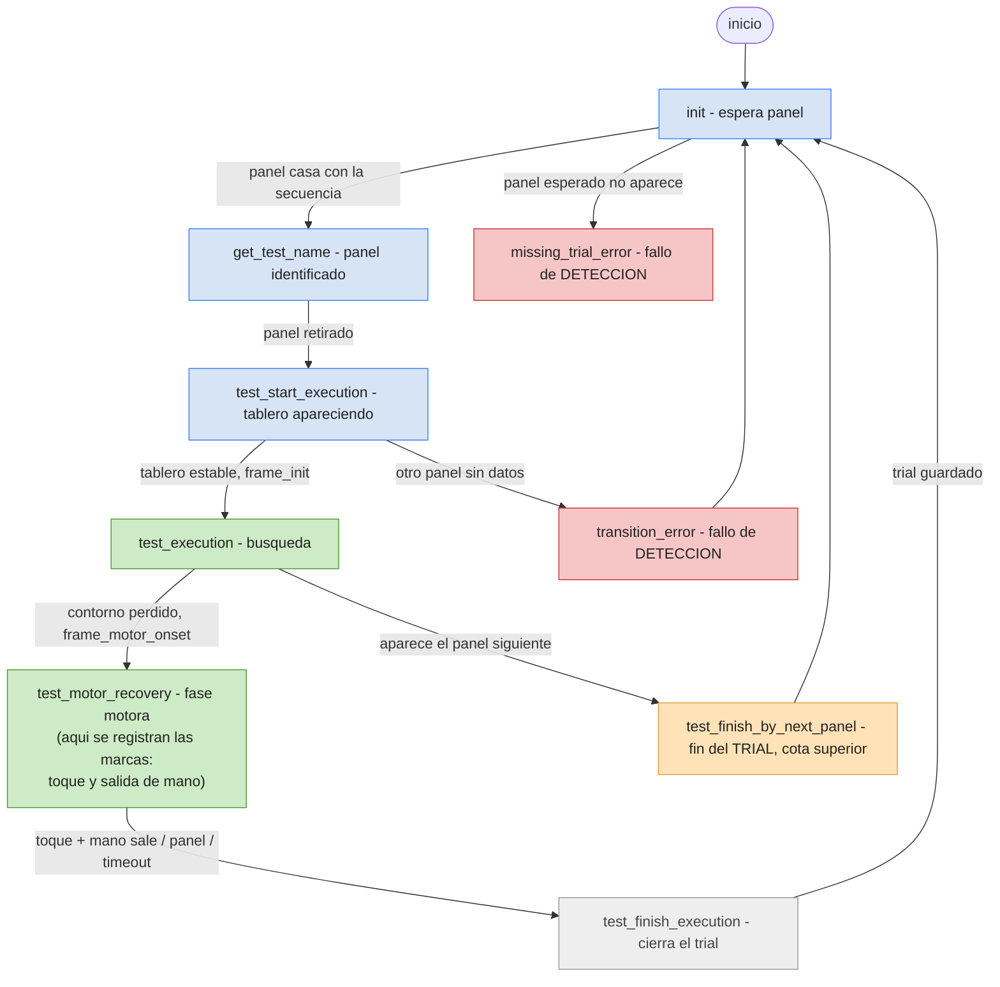
```mermaid
flowchart TD
    S([inicio]) --> INIT["init - espera panel"]
    INIT -->|panel casa con la secuencia| GTN["get_test_name - panel identificado"]
    INIT -->|panel esperado no aparece| MISS["missing_trial_error - fallo de DETECCION"]
    GTN -->|panel retirado| TSE["test_start_execution - tablero apareciendo"]
    TSE -->|tablero estable, frame_init| TE["test_execution - busqueda"]
    TE -->|contorno perdido, frame_motor_onset| TMR["test_motor_recovery - fase motora<br/>(aqui se registran las marcas:<br/>toque y salida de mano)"]
    TMR -->|toque + mano sale / panel / timeout| TFE["test_finish_execution - cierra el trial"]
    TFE -->|trial guardado| INIT
    TE -->|aparece el panel siguiente| PANEL["test_finish_by_next_panel - fin del TRIAL, cota superior"]
    TSE -->|otro panel sin datos| TERR["transition_error - fallo de DETECCION"]
    PANEL --> INIT
    TERR --> INIT
    classDef setup fill:#d6e4f5,stroke:#3b82f6,color:#222;
    classDef trial fill:#cdebc6,stroke:#4a9933,color:#222;
    classDef close fill:#eeeeee,stroke:#999999,color:#444;
    classDef err fill:#f6c6c6,stroke:#d33333,color:#222;
    classDef panel fill:#ffe2b8,stroke:#e0a040,color:#222;
    class INIT,GTN,TSE setup;
    class TE,TMR trial;
    class TFE close;
    class MISS,TERR err;
    class PANEL panel;
```

*Colores: azul = preparación/detección del panel; verde = trial activo (búsqueda + fase motora, donde caen el toque y la salida de mano); gris = cierre; naranja = fin válido pero interrumpido (cota superior); rojo = error de detección.*

> Las transiciones en cursiva marcan los dos ejes: los **errores de detección** (`missing_trial_error`, `transition_error`) dicen si la máquina se mantuvo en sincronía; el `Finish Status` (`test_finish_execution`, `test_finish_by_next_panel`, `test_finish_by_end_of_video`) dice cómo acabó el *trial*. Son independientes.

### Cómo se detecta el inicio y el fin de cada *trial*

El proceso es completamente **automático**: no hay anotación manual de ningún *trial*. El inicio y el fin se infieren del vídeo a partir de las referencias que se pueden extraer de forma sistemática mediante análisis de imagen:

- **Inicio del *trial* (re-basado a la búsqueda):** el *trial* empieza al inicio de la búsqueda —la primera mirada sobre el tablero mientras el panel se está retirando—, no a "tablero completamente visible". La pose del tablero se conoce por los marcadores ArUco (homografía) antes de que el contorno se reconstruya, así que la búsqueda anticipada cuenta como parte del *trial*. El `frame_init` (tablero confirmado, racha de detección estable retrotraída a su primer *frame*) se sigue publicando como referencia interna, pero el inicio del *trial* es `frame_search_start` (= `frame_early_init` cuando hubo mirada anticipada, o `frame_init` si no la hubo). Así `trial_duration_s` incluye la búsqueda anticipada real (y cuenta más fijaciones).
- **Mirada anticipada (ventana previa):** mientras el panel se está retirando hay un intervalo en el que parte del tablero ya es visible (la pose se conoce por los ArUcos y la posición de la rejilla por una referencia de sesión) pero el borde completo aún no. Todas las muestras de *gaze* de ese intervalo se registran en la secuencia, etiquetadas según dónde caen: `pre_start` (casilla del tablero), `on_panel` (sobre el panel de muestra, por su polígono proyectado cuando sus ArUcos son visibles), `blank` (casilla aún tapada: se ve blanco plano) o `not_board` (fuera del tablero). Se conservan todas para tener la vista completa (que cada análisis filtre lo que quiera). Ninguna suma a los contadores por color+forma del CSV resumen; solo cuenta la mirada anticipada `pre_start` cuando el inicio se retrotrae sobre ella. El tiempo del intervalo se publica en `anticipation_lead_s`.
- **Fin del *trial* (criterio robusto, por defecto):** el tablero deja de ser detectable porque la mano lo oclúye al cruzar el borde para alcanzar la pieza. Tras varios *frames* consecutivos sin contorno el *trial* se cierra y el `end_capture` se retrotrae al último *frame* con el tablero visible. Estado resultante: `test_finish_execution`. Ese instante de entrada de la mano se publica como `frame_motor_onset` (detección por contorno, robusta). El fin (`frame_end`) se mantiene en este criterio robusto; la salida de la mano (`frame_hand_exit`) y el toque se publican como marcas aparte dentro de la fase motora.
- **Salida de la mano (`frame_hand_exit`):** en la fase motora se vigila la **oclusión** del tablero y de la casilla objetivo respecto a su referencia limpia; cuando esa oclusión, tras haber subido (la mano entró), vuelve de forma sostenida a su valor de reposo, se anota la salida de la mano del tablero. Si la pose del tablero no está disponible, se recurre a la reaparición del contorno.
- **Panel como máscara:** mientras el panel se retira, se localiza (por sus ArUcos o por su dorso blanco) y se excluye tanto de la mirada como de la detección de borde y de la oclusión de mano — así el panel no rompe el contorno ni finge entrada de mano, pero la mano entrando por la zona libre sí se detecta.
- **Toque del objetivo (marca `frame_target_touch`, *mejor esfuerzo*, no cierra el *trial*):** de forma complementaria se intenta detectar el instante en que la mano alcanza la pieza objetivo (la pieza se toca, no se extrae). Se vigila la apariencia del entorno de la casilla objetivo en la vista cenital y se compara con su apariencia de referencia (detección de cambio, no de color: funciona con manga negra, blanca o de cualquier color). El entorno del objetivo se divide en sus píxeles blancos (bordes/separaciones) y de color, y la oclusión sólo se confirma cuando ambos cambian (doble margen), lo que reduce falsos positivos por sombras parciales. Para descartar cambios globales (desplazamientos de la proyección, movimiento, iluminación), el cambio del objetivo debe destacar sobre la mediana de varias celdas de control alejadas, y debe sostenerse ~0,2 s (un dedo que sólo pasa por encima al buscar no cuenta). La vigilancia no empieza hasta que la cartulina del panel ha dejado de tapar el objetivo (mientras se retira barrería sobre el tablero y lo ocluiría de forma espuria). Esta marca es de mejor esfuerzo y puede faltar o adelantarse en algunos *trials* (ver apartado 8): se publica como una columna más para quien quiera usarla como fin alternativo, pero no decide el cierre del *trial*, de modo que su imprecisión no afecta a la segmentación ni descuadra la secuencia.
- **Casos especiales:** si el panel del siguiente *trial* se detecta con un *trial* aún en ejecución, el *trial* se cierra en el último *frame* con tablero visible con estado `test_finish_by_next_panel` (la duración es una **cota superior**: incluye desde la cogida hasta el giro hacia la mesa). Si la grabación termina con un *trial* en curso, se cierra igual con estado `test_finish_by_end_of_video`.

### Marcas temporales del *trial* y fases

Más allá del inicio y el fin, el software registra varias **marcas temporales** (en número de *frame* del vídeo de *World*) que segmentan el *trial* en fases con sentido cognitivo y motor. La segmentación se separa de la decisión: el software publica todas las marcas y deja que cada análisis elija qué punto usar como inicio o fin.

| Marca (columna `frame_*` del CSV) | Qué señala |
|---|---|
| `frame_search_start` | **Inicio del *trial*:** primera *gaze* sobre el tablero mientras el panel se retira (= `frame_early_init`), o `frame_init` si no hubo mirada anticipada. |
| `frame_init` | Tablero confirmado en su totalidad (referencia interna; ya no es el inicio del *trial*). |
| `frame_target_found` | Primera **fijación** (no una mirada de paso) cuya **masa de mirada** sobre la casilla objetivo alcanza el umbral (0,30; consciente del error del aparato, no un voto duro de centroides): cuándo se ve el objetivo. La fijación se detecta por dispersión (criterio I-DT). |
| `frame_validation` | **Última fijación de tablero antes del toque** (o del fin si no hubo toque): el instante en que la mirada se compromete con la pieza que se va a tocar. Su celda/pieza se publican en `gaze_validated_cell`/`gaze_validated_piece`. |
| `frame_motor_onset` | La mano entra en el tablero (cruce del borde; pérdida del contorno). Robusta. |
| `frame_target_touch` | La mano **alcanza la pieza objetivo** (toque). Marca de *mejor esfuerzo* (ver apartado 8): puede faltar o adelantarse; no cierra el *trial*. |
| `frame_hand_exit` | La mano sale del tablero tras responder (la oclusión local del objetivo o del tablero vuelve a su valor de reposo). |
| `frame_end` | Fin del *trial*: cruce del borde del tablero por la mano (criterio robusto). |

A partir de ellas se derivan las **fases** que aparecen en la columna `Phase` del CSV de secuencia (una por muestra de *gaze*) y como duraciones en el CSV resumen. Se registran todas las muestras (que cada análisis filtre la fase que quiera); las fases son temporales (el momento del *trial*) o de localización (dónde cayó la mirada en la ventana previa):

- **`pre_start`**: *gaze* sobre una casilla del tablero durante la retirada del panel — parte del *trial* (inicio re-basado); su tiempo es `anticipation_lead_s`.
- **`on_panel`**: *gaze* sobre el panel de muestra (el estímulo) mientras se retira.
- **`blank`**: *gaze* sobre una casilla del tablero aún tapada por el panel (se ve blanco plano). Se conserva la casilla mirada.
- **`not_board`**: *gaze* fuera del tablero en esa ventana previa.
- **`search`** (búsqueda visual): desde el inicio hasta `frame_target_found`.
- **`verification`**: desde `frame_target_found` hasta `frame_validation` (mira el objetivo tras hallarlo).
- **`validation`**: desde `frame_validation` (última fijación antes del toque) hasta la entrada de la mano: la mirada ya está comprometida con la pieza que va a tocar.
- **`motor`** (alcance): desde la entrada de la mano hasta el toque (`frame_target_touch`).
- **`withdraw`**: desde el toque hasta que la mano sale (`frame_hand_exit`).

> **Qué cuenta en el resumen (`trials_data_<id>.csv`):** solo la mirada antes de que la mano entre en el tablero, es decir las fases `search`, `verification` y `validation` (las muestras registradas mientras el tablero es visible). Las fases `motor` y `withdraw` (registradas durante la fase motora, con la mano ya sobre el tablero), y las de la ventana previa `pre_start`, `on_panel`, `blank`, `not_board`, se registran en la secuencia pero no suman a los contadores por color+forma (la única excepción es la mirada anticipada `pre_start` que queda dentro del inicio re-basado, que sí pasa a contar como `execution`).

> En objetivos de **borde** (fila inferior/superior) las fases pueden solaparse (la mano entra y toca casi a la vez, o el objetivo se ve y se alcanza sin pausa): las duraciones de esas fases tienden a ~0. Ese 0 es un solapamiento real de los eventos en el tiempo, no una marca que falte (una marca ausente aparece como celda vacía, no como 0).

Algunas marcas pueden faltar en un *trial* concreto (p. ej. no hay `frame_target_touch` si el toque fue demasiado sutil para confirmarse, o no hay `frame_target_found` si nunca se registró *gaze* válido sobre el objetivo); en el CSV aparecen entonces como celda vacía. Las marcas son **independientes**: que falte una no afecta a las demás ni a la segmentación del *trial*.

**Qué representa la ventana del *trial* (para juzgar si encaja con tu análisis).** El inicio y el fin se infieren de la imagen —visibilidad del tablero, mirada y oclusión—, no de un marcador cognitivo directo (no hay otra referencia temporal que se pueda extraer de forma sistemática del vídeo para todos los participantes). En consecuencia, la ventana puede incluir un breve margen inicial antes de que arranque la búsqueda activa, y termina en la **respuesta motora** (la mano alcanza la pieza), no en el instante de la decisión. La segmentación se aplica igual a todos los participantes, así que cada análisis puede comprobar si esa ventana es la que necesita y, si no, recomponer su propio intervalo con las marcas `frame_*`.

6. **Proyectar la mirada sobre el tablero**. Para cada punto de *gaze* se calcula su posición en la vista cenital del tablero y, con eso, **en qué casilla cae**: de qué color y forma es esa casilla, y si es una **ficha** o un **hueco vacío**.

---

## 4. Un detalle clave: el vídeo y la mirada van a velocidades distintas

El **vídeo de *World*** se graba a 30 imágenes por segundo y resolución 1280×720 (720p, confirmado en todos los participantes), mientras que la mirada (*gaze*) se registra a una frecuencia bastante mayor. Esto se tiene en cuenta al proyectar (`EyeDataHandler.py`):

- Cada medida de *gaze* se asigna al *frame* del vídeo de *World* que le corresponde. Esa correspondencia se decide comparando los instantes de tiempo (*timestamps*): se mira en qué *frame* de *World* "cae" el instante de cada mirada. (El dato de *gaze* no trae un número de *frame* ya puesto; se calcula a partir de los tiempos.)
- En el caso de las *fixations* (miradas con duración), esa mirada se reparte por todos los *frames* que dura.
- Como la mirada va más rápida que el vídeo, a un mismo *frame* del vídeo le suelen corresponder varias muestras de *gaze*.

### La frecuencia de muestreo del *gaze* no es 200 Hz, y varía entre participantes

La especificación nominal del Pupil Labs Core es de 200 Hz, pero **la frecuencia real del *gaze* exportado** es distinta y no es la misma para todos los participantes (se han observado configuraciones de grabación a ≈124 Hz y a ≈248 Hz según el participante). Por eso el software no asume un valor fijo: la mide de forma empírica a partir de los *timestamps* de las muestras y la guarda en la salida de cada participante (campo `gaze_sampling_rate` en `data_<id>.yaml`/`.pkl`).

La frecuencia se calcula como **1 / (mediana del intervalo entre muestras consecutivas)**, que es robusta frente a pausas puntuales. Junto a ella se computa la **continuidad** (`gaze_continuity`): la fracción de intervalos dentro de ±20 % de esa mediana. Un valor cercano a 1 indica un flujo regular y continuo, sin muestras descartadas en origen, de modo que la frecuencia es un reloj uniforme fiable; un valor más bajo advierte de un muestreo menos regular en ese participante. La frecuencia (`gaze_sampling_rate`) se guarda en la salida por participante (`data_<id>.pkl`/`.yaml`); la continuidad no se serializa ahí, sino que se publica, junto a las frecuencias, en el CSV de frecuencias del lote (`informe_comparativa_frequencies.csv`) y en el informe HTML. Los valores concretos de cada participante figuran en ese informe del lote, no en esta guía, que describe el método.

**Por qué importa:** convertir conteos de *gaze* en tiempo (apartado 7) exige usar la frecuencia real de ese participante. Usar 200 Hz para todos sobreestimaría el muestreo y, por tanto, subestimaría los tiempos de mirada (en los participantes a 124 Hz, en un factor ≈1,6); y mezclar participantes grabados a frecuencias distintas sin corregir introduciría un sesgo sistemático entre ellos.

**Consecuencia práctica para el análisis:** los conteos de los CSV cuentan muestras de *gaze*, no imágenes de vídeo. Por eso un *trial* puede tener más muestras que *frames*. Cómo convertir esos conteos en tiempo se explica en el apartado 7.

Aparte, se aplican dos ajustes: solo se usan las miradas con **confianza suficiente** (se descartan las que tienen una fiabilidad de 0,6 o menos, en una escala de 0 a 1; este filtrado se hace al cargar los datos) y se voltea el eje vertical, porque las gafas usan el origen abajo-izquierda y las imágenes lo usan arriba-izquierda. El umbral de 0,6 es el que sugiere la propia Pupil Labs: *«In our experience useful data carries a confidence value greater than ~0.6»* ([documentación de Pupil Player](https://docs.pupil-labs.com/core/software/pupil-player/)).

### ¿Por qué se usa *gaze* y no *fixations*?

Las gafas pueden ofrecer dos tipos de dato: la **mirada cruda** (*gaze*: la posición del ojo muestreada a intervalos fijos) o las **fijaciones** (*fixations*: agrupaciones de mirada que un algoritmo interpreta como "una parada" sobre un punto). En este proyecto se trabaja con *gaze*, por dos motivos:

- Las *fixations* dependen de cómo se parametrice el detector (umbrales de dispersión, duración mínima, etc.). Como señalan Ehinger et al. (2019), *«it is difficult to establish what an eye movement is, as the definition typically depends on the used algorithm, reference frame, and individual researcher»*; en muchos sistemas las fijaciones se definen de forma residual como todo lo que no es sacada ni parpadeo. Sin una parametrización clara y estándar los resultados no son replicables y, además, la agrupación en fijaciones descarta información entre eventos. En este caso, añadido a eso, no había suficientes *fixations* para el análisis.
- *Gaze* se usa como **medida absoluta y replicable**: al muestrearse a una frecuencia conocida y constante, cada muestra equivale a una fracción fija de tiempo, sin depender de ningún detector ni de sus parámetros. En la literatura técnica este enfoque se denomina análisis de ***dwell time*** (tiempo de permanencia de la mirada) mediante análisis *frame-by-frame*: en lugar de detectar fijaciones, se clasifica directamente cada muestra de *gaze* según el área de interés en la que cae, y el tiempo acumulado en cada área es la medida de resultado (Vansteenkiste et al., 2015). Este enfoque es especialmente adecuado en contextos naturalistas con eye-trackers portátiles, donde los algoritmos de detección de fijaciones son menos robustos (Land & Hayhoe, 2001). Los conteos resultantes son comparables entre participantes y reproducibles.

---

## 5. Salidas (lo que se obtiene)

Todo se guarda en `<output_root>/<topic>/<id>/` (por ejemplo `OutputData_v<version>/gaze/044/`), según el nombre del participante. Por defecto tanto los datos de entrada como la salida viven en el disco externo (`/media/quique/EXTERNAL_USB1/BusquedaVisualAnalysis/`, carpetas `InputData/` y `OutputData_v<version>`); ambas rutas pueden cambiarse con los argumentos `--data_root`/`--output_root` o las variables de entorno `EEHA_DATA_ROOT`/`EEHA_OUTPUT_ROOT`. Para procesar varios participantes en paralelo existe `run_all.py` (descubre los participantes del directorio de datos y limita los procesos simultáneos y los hilos de OpenCV de cada uno). Se generan varios ficheros con la **misma información en distintos formatos**:

| Fichero | Para qué sirve |
|---|---|
| **`trials_data_<id>.csv`** | Resumen por *trial*. *(base de los análisis)* |
| **`trials_data_<id>_sequence.csv`** | Recorrido temporal de la mirada. *(base de los análisis)* |
| **`trials_data_<id>_transitions.csv`** | Línea de tiempo del *trial*: cambios de estado de la máquina y marcas conductuales (toque, salida de mano, etc.) intercalados por *frame*. *(ver 6.3)* |
| `data_<id>.yaml` | Todos los datos en formato legible por humanos. |
| `data_<id>.pkl` | Los mismos datos, en formato para volver a cargarlos rápido desde Python. |
| `result_log_<id>.txt` | Un informe de texto con tablas-resumen (reparto de tiempo y de miradas, y una tabla por *trial*). |
| `debug_<id>.mp4` | (Solo si se activa la visualización) Vídeo de comprobación con todo dibujado encima. |

Y, una sola vez por lote (en la carpeta de salida, no por participante), generados por `src/tools/process_outputs.py`:

| Fichero de lote | Para qué sirve |
|---|---|
| `combined_trials_<topic>.csv`, `combined_sequence_<topic>.csv`, `combined_transitions_<topic>.csv` | Los tres CSV anteriores apilados de todos los participantes (con una primera columna `participant`). |
| `target_geometry.csv` | **Tabla de referencia del tablero** (una fila por casilla): posición en la rejilla y en el plano métrico (mm) y la distancia de alcance (mm). Es una propiedad del tablero, igual para todos los participantes; por eso se publica aquí una vez en lugar de repetirla en cada *trial* (ver 6.4). |
| `informe_comparativa.html`, `informe_comparativa_frequencies.csv` | Informe HTML comparativo entre versiones y CSV de frecuencias por participante. |

### ¿Qué hay en el YAML/PKL que no esté en los CSV?

Los CSV bastan para casi todo, pero el `data_<id>.yaml` (y su equivalente `.pkl`) guarda algunos campos extra que pueden ser útiles si un análisis se queda corto:

- **`target_cord` y `target_norm_coord`**: la posición del objetivo en el tablero (la casilla y su coordenada normalizada). Permite, por ejemplo, medir la distancia de la mirada al objetivo o si llegó a mirarse. No está en los CSV.
- **`init_capture` y `end_capture`**: los números de *frame* exactos de inicio y fin de cada *trial* (los CSV solo dan la duración en segundos).
- **`video_fps`**: la frecuencia del vídeo de *World* usada para los cálculos.
- **`frames_info` y `fixations_info`**: el reparto de *frames* y de muestras de *gaze* por fase (también resumido en `result_log_<id>.txt`).
- **`state_transitions`**: la lista cruda de cambios de estado de la máquina (los mismos que el CSV `..._transitions.csv`, antes de intercalar las marcas).
- **`run_config` y `slow_analysis`**: la procedencia del procesado — con qué opciones se generó (modo lento/rápido, `topic`, datos *offline*, rango de *frames*). Permite saber sin adivinar cómo se produjo un resultado y descartar que una opción de ejecución lo haya degradado.
- **`signal_trace` y `bump`**: por *trial*, el perfil de oclusión por *frame* (objetivo y tablero) y los *landmarks* derivados de él (entrada/toque/salida, congruencia). Es la base del post-hoc: permite re-derivar las marcas sin re-procesar el vídeo.

---

## 6. Cómo se leen los dos CSV (lo esencial)

Primero, dos conceptos que aparecen en ambos:

- **Ficha vs. hueco.** Cada casilla del tablero o bien tiene una ficha física de un color y forma, o bien es un hueco vacío reservado para una ficha de ese tipo. Un mismo "color + forma" puede estar en el tablero como ficha en un sitio y como hueco vacío en otro. Los CSV distinguen las dos cosas: no es lo mismo mirar la ficha que mirar su hueco.
- **`not_board`.** Cuando la mirada cae fuera del tablero, se registra con color y forma `not_board`.

### 6.1. `trials_data_<id>.csv` — resumen por *trial*

Cada fila resume cuánto miró la persona a un color+forma concreto durante un *trial*. Hay una fila por cada combinación de color y forma que recibió alguna mirada en ese *trial*.

| Columna | Significado |
|---|---|
| `block_index` | Número de *block* (0–5). |
| `trial_index` | Número de *trial* dentro del *block* (0–9). |
| `trial_name` | **Objeto que se estaba buscando** en ese *trial*, p. ej. `red_hexagon` (color_forma). |
| `Color` | Color de la casilla mirada (`red`, `green`, `blue`, `yellow`) o `not_board`. |
| `Shape` | Forma de la casilla mirada (`circle`, `hexagon`, `triangle`, `square`, `trapezoid`) o `not_board`. |
| `Piece Fixations` | Nº de muestras de *gaze* que cayeron sobre la **ficha** de ese color+forma. |
| `Slot only Fixations` | Nº de muestras de *gaze* que cayeron sobre el **hueco vacío** de ese color+forma. |
| `trial_duration_s` | **Duración del *trial* en segundos** (tiempo real). Re-basada: desde `frame_search_start` (inicio de la búsqueda) hasta `frame_end`. Se repite en todas las filas del *trial*. |
| `anticipation_lead_s` | Tiempo (s) de **mirada anticipada**: cuánto antes de que el tablero quede confirmado (`frame_init`) el participante ya miraba al tablero durante la retirada del panel (= `frame_init − frame_search_start`). 0 si no anticipó. Este tiempo forma parte del *trial*. |
| `anticipatory_gaze` | **Covariable de anticipación**: nº de fijaciones sobre el tablero durante la retirada del panel. 0 = esperó a que se retirara; alto = anticipó. Permite controlar estadísticamente "anticipa vs espera". |
| `time_to_target_s` | Tiempo (s) desde el inicio hasta la primera mirada al objetivo (`frame_target_found`). Vacío si nunca se registró *gaze* sobre el objetivo. |
| `target_found_confidence` | **Confianza graduada [0,1] de que miró la pieza objetivo**, consciente de la incertidumbre del aparato: masa de la elipse de mirada sobre la casilla objetivo, máximo por fijación del *trial* (ver [§7.4-7.5](documentacion_tecnica.md)). Es el valor continuo detrás de la marca `frame_target_found`, que se dispara en la **primera fijación con masa ≥0,30** (umbral `target_found_mass_threshold`): así una mirada en la frontera del objetivo, dentro del error del aparato, cuenta como encontrada, en vez de exigir la mayoría de centroides en la celda exacta. La columna continua permite graduar más fino si el análisis lo necesita (p. ej. ≥0,5 = casilla más probable; 0,2–0,5 = frontera o contigua), pero esos cortes finos son orientativos. En la cohorte la mediana es ~0,67 (≈0,76 en los trials con objetivo encontrado) y llega a ~0,99 en fijaciones muy centradas (la σ se encoge al promediar). Vacío si la calibración no tiene modelo de incertidumbre. |
| `search_duration_s` | Tiempo (s) de **búsqueda**: desde el inicio hasta que la mano entra en el tablero. Vacío si no se detectó la entrada. |
| `reach_duration_s` | Tiempo (s) de **alcance**: desde que la mano entra hasta el toque. Vacío si falta alguna de las dos marcas. |
| `withdraw_duration_s` | Tiempo (s) de **retirada**: desde el toque hasta que la mano sale (`frame_hand_exit`). Vacío si falta alguna marca. |
| `target_row`, `target_col` | **Posición del objetivo** en la rejilla (fila 0 = lejos/arriba; columna 0..7). Covariable de distancia (grueso). La distancia de alcance en mm (covariable tipo Fitts) no se repite aquí: es una propiedad fija de la casilla y vive en la tabla de referencia `target_geometry.csv` (ver 6.4); se une por `trial_name` o por `target_row`/`target_col`. |
| `frame_search_start`, `frame_init`, `frame_target_found`, `frame_validation`, `frame_motor_onset`, `frame_target_touch`, `frame_hand_exit`, `frame_end` | **Marcas temporales crudas** en nº de *frame* del vídeo de *World* (ver apartado 3). Permiten recomponer cualquier intervalo. Vacías cuando el evento no se observó. `frame_validation` = la última fijación antes del toque (cuando la mirada se compromete con la pieza que va a tocar). |
| `touched_piece`, `touched_cell` (experimental) | Intento de leer qué pieza tapó la mano por oclusión. No es fiable (la oclusión barata no separa el dedo del brazo); se incluye solo para revisión. No condiciona `error_type`. La celda va como cadena `"fila,columna"`. Para ver qué pasó en un trial flagged, usa la figura de debug (`debug_flagged_trials.py`). |
| `gaze_validated_piece`, `gaze_validated_cell` | **Pieza que validó la mirada** (color_forma) y su celda (cadena `"fila,columna"`): la última fijación de tablero antes del toque (= `frame_validation`). En un `off_target` indica a qué pieza miró (la parte fiable de "fue a otro sitio"). |
| `error_type` | Anomalía del *trial*, derivada solo de señales **fiables** (el toque del objetivo, la entrada/salida de la mano y la última fijación de tablero; no usa `touched_*`): `correct` (se confirmó el toque del objetivo) · `off_target` (alcance completo —la mano entró y salió del tablero— pero ni se tocó el objetivo ni la última fijación se comprometió con él → la respuesta fue a otro sitio) · `no_touch` (alcance completo y la última fijación sí cayó en el objetivo, pero no se confirmó toque — probablemente toque demasiado sutil para la señal). Vacío cuando el alcance no fue completo (falta la entrada o la salida de la mano) o no hay casilla objetivo. |
| `Finish Status` | Cómo terminó el *trial*: `test_finish_execution` = criterio por defecto, el tablero dejó de detectarse al cruzar la mano el borde; `test_finish_by_next_panel` = cerrado al aparecer el panel siguiente — duración **cota superior** (ver apartado 3); `test_finish_by_end_of_video` = cerrado por fin de grabación. Otro valor indica final anómalo. El toque de la pieza no es un estado de fin: se publica como marca aparte (`frame_target_touch`). |

Las columnas de duración por fase y los `frame_*` se repiten en todas las filas del mismo *trial* (igual que `trial_duration_s`), porque describen el *trial*, no la casilla mirada.

> **Orden real de las columnas en el fichero** (la tabla anterior agrupa por significado; el CSV las escribe en este orden): `block_index, trial_index, trial_name, Color, Shape, Piece Fixations, Slot only Fixations, trial_duration_s, time_to_target_s, target_found_confidence, search_duration_s, reach_duration_s, withdraw_duration_s, frame_search_start, frame_init, frame_target_found, frame_validation, frame_motor_onset, frame_target_touch, frame_hand_exit, frame_end, anticipatory_gaze, anticipation_lead_s, target_row, target_col, touched_piece, touched_cell, gaze_validated_piece, gaze_validated_cell, error_type, Finish Status`. Únete siempre por nombre de columna, no por posición.

**Ejemplo real** (participante 044, *block* 1, *trial* 0, buscando el **hexágono rojo**):

```
block,trial,trial_name,Color,Shape,Piece Fix.,Slot Fix.,dur_s,status
1,0,red_hexagon,green,hexagon,20,0,1.64,test_finish_execution
1,0,red_hexagon,red,trapezoid,31,0,1.64,test_finish_execution
1,0,red_hexagon,red,square,44,0,1.64,test_finish_execution
1,0,red_hexagon,red,triangle,0,20,1.64,test_finish_execution
```

Se lee así: durante este *trial* (que duró 1,64 s), la persona miró 20 veces la ficha del hexágono verde, 31 veces la ficha del trapecio rojo, 44 veces la ficha del cuadrado rojo y 20 veces el hueco vacío del triángulo rojo (0 veces a su ficha). Es decir, exploró sobre todo piezas rojas (el color que buscaba) antes de encontrar el objetivo.

### 6.2. `trials_data_<id>_sequence.csv` — recorrido temporal

Cada fila es **una muestra de *gaze* individual**, en orden cronológico. Sirve para reconstruir el recorrido de la mirada por el tablero a lo largo del *trial*.

| Columna | Significado |
|---|---|
| `block_index` | Número de *block* (0–5). |
| `trial_index` | Número de *trial* dentro del *block* (0–9). |
| `trial_name` | Objeto buscado en ese *trial*. |
| `Color` | Color de la casilla donde cayó esta mirada (o `not_board`). |
| `Shape` | Forma de esa casilla (o `not_board`). |
| `Piece=1/Slot=0` | Si esa casilla es ficha o hueco vacío. En el CSV aparece como `True`/`False` (pese a que la cabecera diga `1/0`). |
| `Phase` | Fase en la que cae esta muestra (ver apartado 3). Temporales del *trial*: `search` (hasta la primera mirada al objetivo), `verification` (objetivo visto, mano aún fuera), `validation` (desde la última fijación antes del toque: la mirada se compromete con la pieza que va a tocar), `motor` (mano alcanzando, hasta el toque) y `withdraw` (tras el toque, la mano se retira). Ventana previa (retirada del panel): `pre_start` (casilla del tablero), `on_panel` (sobre el panel de muestra), `blank` (casilla aún tapada), `not_board` (fuera del tablero). Se registran todas; en el resumen solo cuentan las anteriores a la entrada de la mano (`search`/`verification`/`validation`). |
| `Frame_N` | **Número de imagen (*frame*) del vídeo de *World*** en la que se registró esta mirada. |
| `trial_duration_s` | Duración total del *trial* en segundos (se repite). |
| `Board Coord` | **Casilla del tablero** en forma `[columna, fila]` (`[-1, -1]` si cayó fuera). |
| `Board norm Coord` | Posición dentro del tablero como `[x, y]` entre 0 y 1 (0,0 = esquina superior izquierda; 1,1 = inferior derecha). Útil para dibujar el recorrido sobre la imagen del tablero. |
| `Cell Dist` | **Reparto de probabilidad sobre casillas** dado el error del aparato: las 3 casillas más probables con su masa, `"col,fila:masa\|…"` (p.ej. `"4,2:0.30\|4,3:0.27\|5,2:0.21"`). Sale de la elipse de incertidumbre de la mirada (§7.4-7.5 de la [doc técnica](documentacion_tecnica.md)). Que se reparta en 2–3 casillas es la resolución real (σ≈½ casilla). Vacío sin modelo de incertidumbre, o si la mirada es tapada (`on_panel`/`blank` → ver `Onboard Mass`). |
| `Onboard Mass` | **Masa total de probabilidad sobre el tablero** [0,1]: indica si miraba al tablero (≈1) o casi fuera (≈0). Es 0 para mirada sobre el panel (`on_panel`) o sobre celda tapada (`blank`): no son observaciones de casilla visible (la posición sigue en `Board norm Coord`, y `Phase` desambigua). |
| `Finish Status` | Cómo terminó el *trial* (igual que arriba). |

**Ejemplo real** (mismas primeras miradas del *trial* anterior):

```
block,trial,trial_name,Color,Shape,Pieza?,Frame,dur_s,Casilla,PosNorm,status
1,0,red_hexagon,green,hexagon,True,169,1.64,"[5, 3]","[0.63, 0.62]",test_finish_execution
1,0,red_hexagon,green,hexagon,True,169,1.64,"[5, 3]","[0.63, 0.62]",test_finish_execution
1,0,red_hexagon,green,hexagon,True,170,1.64,"[5, 3]","[0.63, 0.62]",test_finish_execution
```

Se lee así: en la imagen 169 del vídeo, la mirada estaba en la casilla [columna 5, fila 3], que es la ficha del hexágono verde, situada hacia el centro-derecha del tablero. Que haya varias filas con el mismo `Frame_N` (169) es justo lo explicado en el apartado 4: a una misma imagen del vídeo le corresponden varias muestras de *gaze* porque la mirada se registra más rápido que el vídeo.

Con este CSV se puede reconstruir el recorrido de la mirada por el tablero a lo largo del *trial*, coloreado por fase, desde la búsqueda hasta el objetivo:

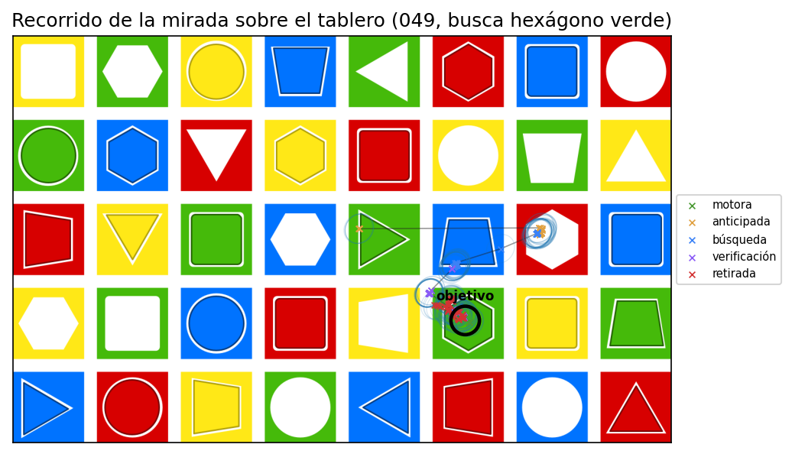

Más ejemplos con distintas piezas objetivo (cada uno un *trial* real del mismo participante, coloreado por fase; el objetivo va rodeado en negro):

| | |
|---|---|
| 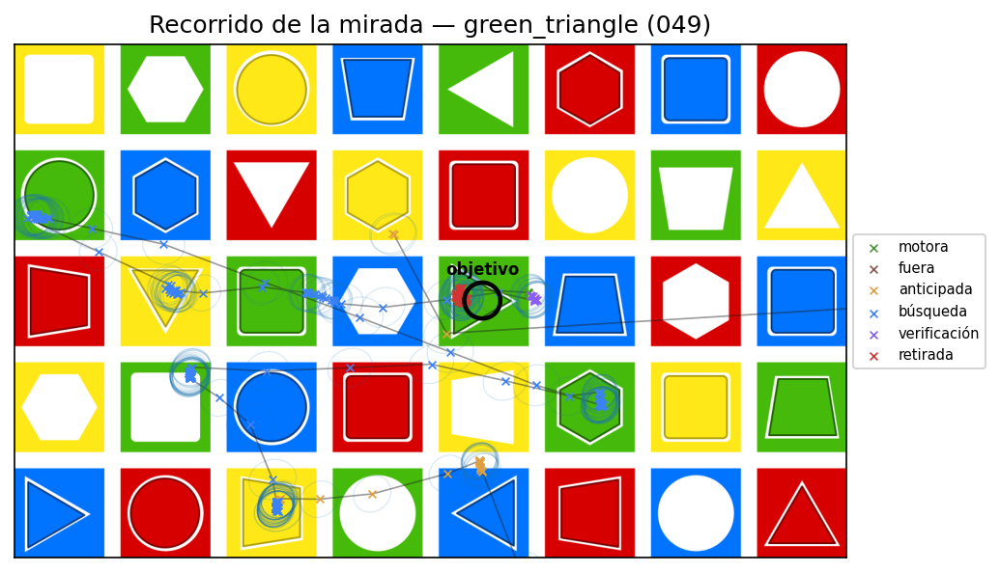 | 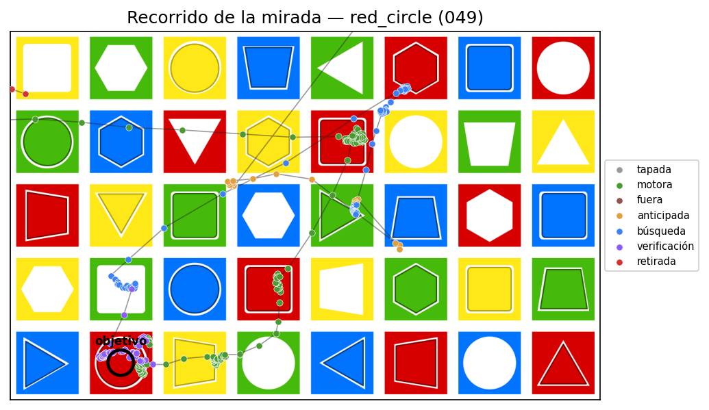 |
| 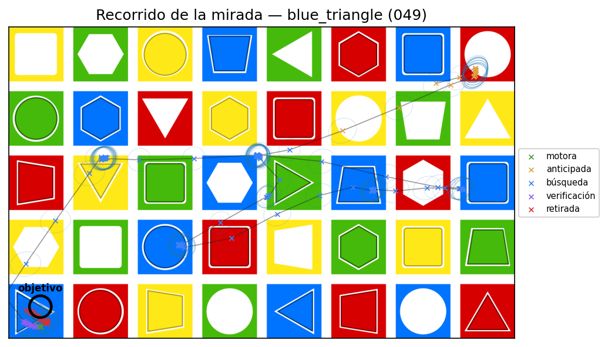 | 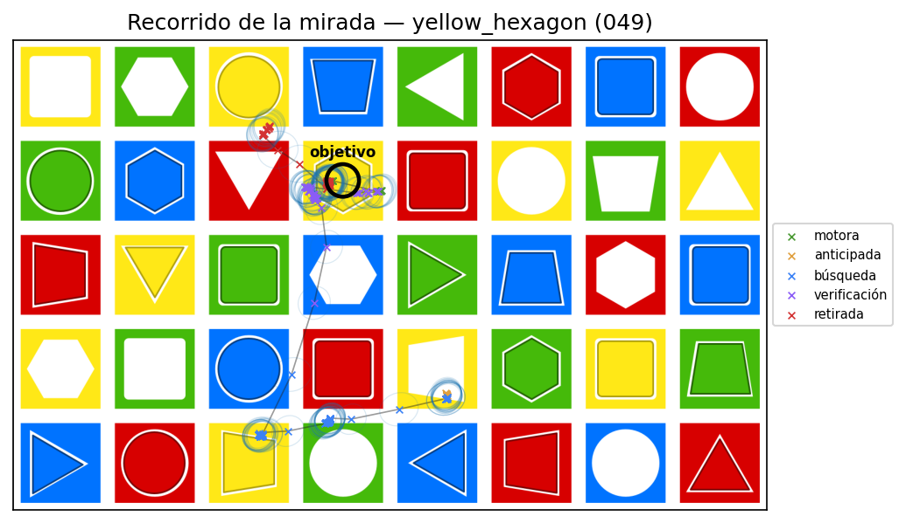 |
| 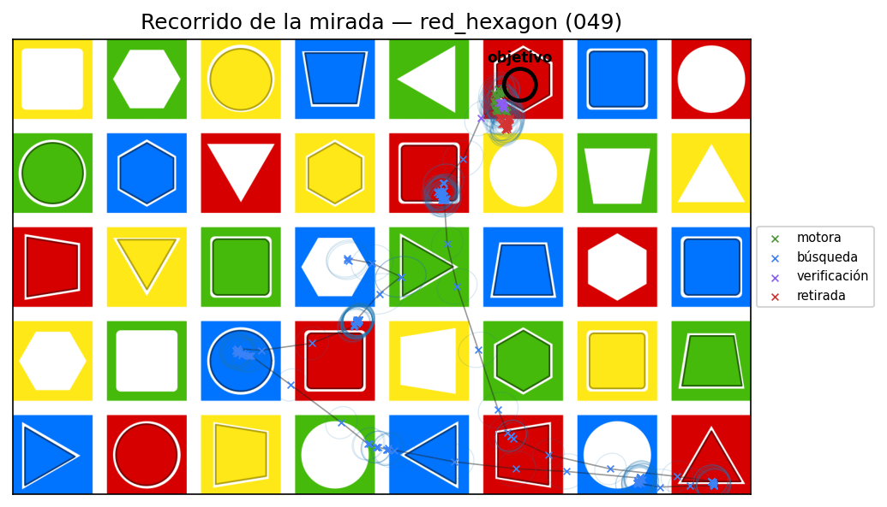 | 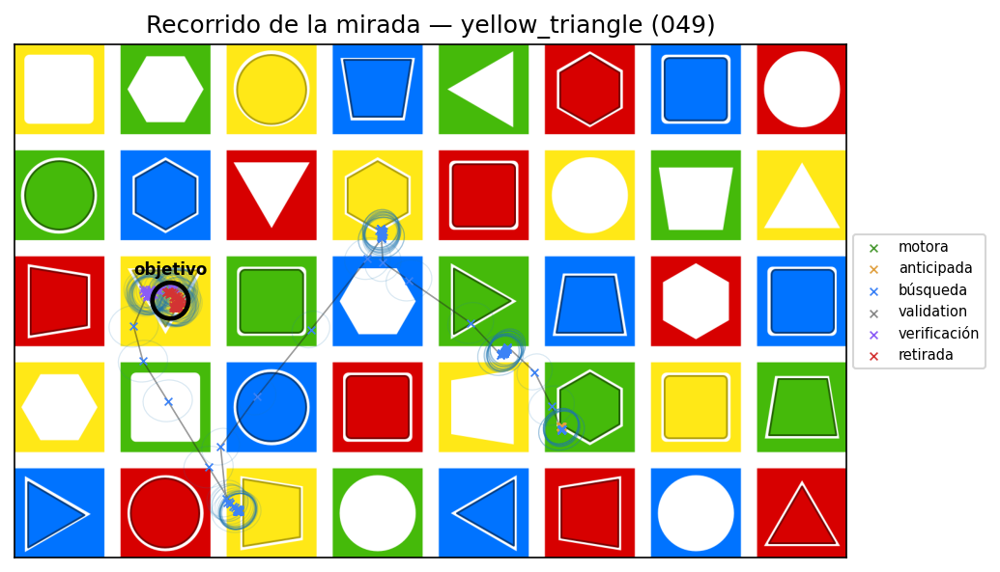 |

### 6.3. `trials_data_<id>_transitions.csv` — línea de tiempo del *trial*

Una **única tabla cronológica por *trial*** que mezcla dos tipos de fila: los cambios de estado de la máquina y las marcas conductuales (toque, salida de mano, etc.), todas con su *frame* exacto. Permite reconstruir, de un vistazo, qué pasó y cuándo en cada *trial*.

| Columna | Significado |
|---|---|
| `block_index`, `trial_index`, `trial_name` | *Block*, *trial* y objeto buscado a los que pertenece el evento. |
| `frame`, `time_s` | *Frame* del vídeo de *World* y su tiempo en segundos. |
| `event` | Tipo de fila: `state_change` (cambio de estado) o el nombre de una marca: `search_start`, `target_found`, `validation`, `motor_onset`, `target_touch`, `hand_exit`, `trial_end`. `validation` = la mirada se compromete con una pieza (última fijación antes del toque). Un `off_target` (§6.1) se reconoce aquí como `validation` + `motor_onset` + `hand_exit` sin `target_touch`. |
| `from_state`, `to_state` | Estado de origen y destino (solo en filas `state_change`; vacíos en las marcas). |

Cómo se usa: filtra `event == 'state_change'` para ver solo la máquina de estados; filtra por los nombres de marca para ver solo las marcas conductuales; lee todas las filas (ya vienen ordenadas por *frame*) para la línea de tiempo completa.

> **El toque no es un estado, es una marca.** La máquina tiene 6 estados (`init`, `get_test_name`, `test_start_execution`, `test_execution`, `test_motor_recovery`, `test_finish_execution`); el toque, la primera mirada al objetivo, la entrada y la salida de la mano son marcas que ocurren dentro de esos estados (por eso `target_touch` no cierra el *trial*: ver apartado 8). Esta tabla las une en un solo eje temporal sin mezclar los dos conceptos en el motor.

**Ejemplo real** (participante 049, *block* 0, *trial* 7, buscando el **hexágono verde**):

```
block,trial,trial_name,frame,time_s,event,from_state,to_state
0,7,green_hexagon,9236,309.501,state_change,init,get_test_name
0,7,green_hexagon,9252,310.038,state_change,get_test_name,test_start_execution
0,7,green_hexagon,9261,310.339,search_start,,
0,7,green_hexagon,9266,310.507,state_change,test_start_execution,test_execution
0,7,green_hexagon,9274,310.775,target_found,,
0,7,green_hexagon,9284,311.110,motor_onset,,
0,7,green_hexagon,9284,311.110,trial_end,,
0,7,green_hexagon,9285,311.143,target_touch,,
0,7,green_hexagon,9291,311.344,state_change,test_execution,test_motor_recovery
0,7,green_hexagon,9294,311.445,hand_exit,,
0,7,green_hexagon,9296,311.512,state_change,test_motor_recovery,test_finish_execution
0,7,green_hexagon,9296,311.512,state_change,test_finish_execution,init
```

Nótese que `trial_end` (cruce del borde, robusto) cae antes que `target_touch` (un par de *frames* después): es real, la mano ya está sobre el tablero cuando toca la pieza (ver apartado 3). El mismo CSV apilado de todos los participantes es `combined_transitions_<topic>.csv`.

### 6.4. `target_geometry.csv` — referencia del tablero

Tabla de **referencia única** (una fila por casilla del tablero), igual para todos los participantes, que se publica una sola vez por lote. Evita repetir en cada *trial* propiedades que son fijas de la casilla. Se une al resumen por `trial_name` (= `color_forma`) o por `target_row`/`target_col`.

| Columna | Significado |
|---|---|
| `trial_name` | `color_forma` de la pieza (clave de unión con el resumen). |
| `color`, `shape`, `is_piece` | Color, forma y si es ficha (`True`) o hueco (`False`). |
| `target_row`, `target_col` | Posición en la rejilla (fila 0 = lejos/arriba; columna 0..7). |
| `target_x_mm`, `target_y_mm` | Centro de la casilla en el **plano métrico** del tablero (mm). |
| `reach_distance_mm` | **Distancia de alcance** (covariable tipo Fitts): distancia recta 2D en el plano del tablero (mm) desde el lado de entrada del participante (centro-abajo) hasta el objetivo. No es la trayectoria 3D real. |

---

## 7. Del conteo al tiempo: cuánto se mira cada cosa

La idea central para los análisis es sencilla: **como el *gaze* se muestrea a intervalos regulares, contar muestras de *gaze* equivale a medir tiempo.** (Cuando en esta guía se habla de "muestras" o de los conteos del CSV, siempre se refiere a muestras de *gaze*.) Cada muestra representa un intervalo de muestreo: `1 / f_gaze` segundos, donde `f_gaze` es la frecuencia real de ese participante (apartado 4; campo `gaze_sampling_rate` en la salida). Por tanto:

```
tiempo mirando algo  ≈  (nº de muestras de gaze sobre eso)  ×  (1 / f_gaze)
```

Esos "nº de muestras" son justo los conteos del CSV resumen: las columnas `Piece Fixations` y `Slot only Fixations`. Por ejemplo, 44 muestras sobre una ficha, en un participante muestreado a 124 Hz, equivalen a `44 / 124 = 0,35 segundos`. Ese mismo conteo a la frecuencia nominal de 200 Hz daría `0,22 s`: usar 200 Hz cuando la frecuencia real es 124 Hz subestima el tiempo en un factor ≈1,6. De ahí que se use siempre la frecuencia medida del participante, no un valor fijo.

**Punto delicado: `f_gaze` se calcula sobre *todas* las muestras (válidas e inválidas), no solo las válidas.** Cada muestra ocupa un intervalo de muestreo del aparato (≈8,07 ms a 124 Hz), tanto si su confianza supera el umbral como si no. Las muestras descartadas por baja confianza son huecos sin dato (no sabemos a dónde miraba en ese instante), pero no alargan la muestra válida anterior: la siguiente muestra válida no "dura" hasta que aparece, sigue durando un intervalo de muestreo. Calcular `f_gaze` solo con las muestras válidas daría una frecuencia menor (≈80 Hz en los participantes a 124 Hz) y, al dividir por ella, inflaría artificialmente los tiempos de mirada. Por eso el denominador es la frecuencia de muestreo del aparato, medida sobre el flujo completo.

Importante: la frecuencia que importa aquí es la del *gaze* (`f_gaze`), no la del vídeo de *World*. Son dos relojes distintos (apartado 4): la duración del *trial* se mide con el vídeo de *World* (`frames / f_world`), y el tiempo mirando cada cosa se mide con las muestras de *gaze* (`muestras / f_gaze`).

### No todos los instantes tienen dato

No hay que esperar que haya dato de mirada para todo el tiempo del *trial*. Pueden darse tres situaciones:

- **Sin dato.** La máquina no registró *gaze* en ese instante, o la muestra se descartó por baja confianza (≤ 0,6). Ese tiempo no se contabiliza (no sabemos a dónde miraba).
- **Fuera del tablero.** Hay muestra, pero la mirada cae fuera del tablero: se cuenta aparte, como `not_board` (es "mirando fuera", no se pierde).
- **Sobre una casilla.** Se cuenta en el color+forma correspondiente.

**Consecuencia:** la suma de los tiempos de todas las casillas (más `not_board`) no tiene por qué coincidir con la duración total del *trial*, porque hay huecos sin dato. Los tiempos por casilla son, por tanto, tiempo de mirada efectivamente medido, no un reparto del 100 % del *trial*.

---

## 8. Notas importantes para quien analice los CSV

- **Los conteos son de muestras de *gaze*, no de imágenes de vídeo.** Por la diferencia de velocidad (apartados 4 y 7), un *trial* puede tener más muestras que *frames*; la duración en segundos sí es tiempo real.
- **`trial_duration_s` está re-basada al inicio de la búsqueda.** Empieza en el inicio de la búsqueda (mirada anticipada durante la retirada del panel) y termina al cruzar la mano el borde, así que incluye la búsqueda anticipada y la respuesta motora. Ver la subsección "Cómo se detecta el inicio y el fin" en el apartado 3.
- ***Trials* con error.** Algunos *trials* no se segmentan bien (el procesado no detectó el panel esperado, o hubo un salto entre paneles — suele ser un fallo de detección, no del participante). Se reconocen porque el `trial_name` empieza por `missing_trial_error_` o `transition_error_`, y suelen tener duración 0 o estado anómalo. Conviene filtrarlos antes de analizar. Hay dos scripts de comprobación: `src/tools/check_correct_output.py` (avisa de carpetas con ficheros faltantes o con muchos errores) y `src/tools/check_correct_trials.py` (compara, participante a participante, los *trials* detectados frente a la secuencia esperada).
- **La marca `frame_target_touch` es de *mejor esfuerzo*.** Detecta el instante del toque de la pieza objetivo a partir del cambio de imagen en la casilla, pero cuando sólo se ve parte de los marcadores ArUco del tablero la vista cenital se desplaza y el toque puede adelantarse (~0,5–1 s, al entrar la mano en la zona) o no registrarse. No cierra el *trial* (eso lo hace `frame_end`, robusto), así que su imprecisión no descuadra nada; pero si se usa como fin alternativo, conviene tratarla con cautela y contrastarla con `frame_motor_onset`/`frame_end`.
- **Comprueba con qué modo se procesó.** El `data_<id>.pkl` guarda `run_config` (modo lento/rápido, `topic`, rango de *frames*). El modo rápido acelera ~6,5× pero puede perder *trials* de paneles marginalmente visibles; el lento (por defecto) los detecta. Un run incompleto o parcial avisa en el `process_log`/`result_log` ("WARNING: N/M expected trials were NOT detected" o "PARTIAL run"). Si ves muchos `missing_trial_error` en un participante, revisa que se procesara en modo lento antes de concluir que el participante falló esos *trials*.
- **De CSV a gráficos.** Hay scripts que dibujan el recorrido de la mirada sobre la imagen del tablero (`src/tools/project_paths.py`, `src/tools/data_analysis.py`) y un vídeo con la mirada superpuesta sobre la grabación original (`src/tools/project_data.py`).

---

## 9. Limitaciones metodológicas

### Del diseño experimental

- **Delimitación temporal del *trial*.** El inicio y el fin del *trial* se detectan a partir de la visibilidad del tablero en el vídeo, no de un marcador cognitivo directo. El período registrado incluye un posible retardo al inicio y termina en la respuesta motora, no en el momento de la decisión. Es la única marca temporal sistemática disponible; su ventaja es que es consistente entre participantes. Ver apartado 3 para el detalle.
- **Uso de *gaze* en lugar de *fixations*.** La elección de *gaze* como unidad de medida implica trabajar con muestras crudas en lugar de eventos perceptivos interpretados. El tradeoff entre replicabilidad y granularidad perceptiva se discute en el apartado 4.

### Del equipo de medida (Pupil Labs Core)

El dispositivo empleado es el **Pupil Labs Core** (Kassner, Patera & Bulling, 2014), un eye-tracker binocular portátil de código abierto. Sus especificaciones técnicas relevantes son: cámaras oculares a **200 Hz** (192×192 px), cámara de escena (*World*) hasta 1080p/30 Hz —**estas grabaciones a 1280×720/30 Hz**—, exactitud de **0,60°** y precisión de **0,02°** (ambas con calibración y en condiciones de laboratorio).

- **Error angular y su traducción espacial.** La exactitud de 0,60° se obtiene en condiciones controladas; en uso naturalista (movimiento de cabeza, variabilidad de iluminación, tarea real) el error puede ser mayor. Este error angular se traduce en una incertidumbre espacial al asignar la mirada a una casilla del tablero: cuanto mayor sea la distancia participante–tablero y más pequeñas sean las casillas, más probable es que una muestra de *gaze* quede asignada a la casilla adyacente en lugar de la correcta.
- **Calidad de la señal y pérdida de datos.** En momentos de parpadeo, movimiento brusco o reflejo corneal desfavorable, el aparato puede no registrar *gaze* o registrarlo con baja confianza. Las muestras con confianza ≤ 0,6 se descartan (ver apartado 4); esos fragmentos no se contabilizan. Aunque la frecuencia nominal del dispositivo es 200 Hz, el número efectivo de muestras válidas varía entre participantes (los valores concretos por participante están en el informe HTML y los CSV; ver apartado 10), lo que refleja diferencias en la calidad de la señal y no diferencias de hardware.
- **Características oculares individuales como variable no controlada.** Las características anatómicas del ojo (color del iris, forma del párpado, etc.) influyen en la facilidad y precisión con que se detecta la pupila. No están controladas en el diseño y pueden explicar parte de la variación entre participantes en número de muestras válidas y en precisión. *(El mecanismo de detección de pupila se detalla en la [documentación técnica](documentacion_tecnica.md).)*
- **Deriva de la calibración.** La calibración se realiza al inicio de la sesión. Si las gafas se desplazan levemente durante el experimento —algo habitual en tareas naturalistas con movimiento de cabeza—, la correspondencia entre la dirección de mirada estimada y la posición real en la imagen puede degradarse progresivamente. El dispositivo incorpora compensación de deslizamiento (*slippage compensation*) mediante el modelo 3D del ojo, pero no elimina por completo este efecto.

---

## 10. Magnitud del procesamiento

El volumen **concreto** procesado por lote —duración de vídeo, *frames*, muestras de
*gaze* válidas (confianza > 0,6), *trials* segmentados y frecuencias por participante— se
recoge en el **informe HTML** (`informe_comparativa.html`) y en los **CSV combinados**,
regenerados con cada procesamiento. Así los números acompañan siempre a la versión vigente de
los datos y esta guía describe solo cómo se interpretan.

El informe HTML está pensado para **dos lecturas**: un resumen gráfico rápido para el equipo de
análisis y una herramienta de *debug* para desarrollo. Sus pestañas:

| Pestaña | Qué muestra |
|---|---|
| **Detección** | *Trials* reales segmentados vs errores de detección, por participante y versión (salud de la segmentación). |
| **Tipo de fin** | Estado de cierre de cada *trial*. |
| **Cobertura marcas** | % de *trials* con cada marca (`motor_onset`/`target_touch`/`hand_exit`…) detectada, por versión. |
| **Duración del trial (s)** | Duración por *trial* y versión. |
| **Toque** | Cobertura del toque y diagnóstico (por qué se detectó o no). |
| **Frecuencias** | Frecuencia de *gaze* y continuidad por participante. |
| **Comportamiento** | *Resumen exploratorio* de la última versión: qué mira la gente según el objetivo (matrices color/forma), qué piezas cuestan más (encontrado vs tocado), y el tiempo de respuesta a lo largo del experimento (selector de hito + curvas por color por bloque). |

Las pestañas comparan **primera vs última versión** por defecto (el resto se activan con su casilla); *Frecuencias* y *Comportamiento* son de la versión vigente.

> La variación del número de muestras válidas entre participantes refleja diferencias de
> calidad de señal y características oculares individuales (apartado 9), no del equipo
> (idéntico para todos). Los totales previos al filtrado por confianza no se conservan
> (no se guardaron los ficheros originales de captura).

---

## Referencias

Ehinger, B. V., Groß, K., Ibs, I., & König, P. (2019). A new comprehensive eye-tracking test battery concurrently evaluating the Pupil Labs glasses and the EyeLink 1000. *PeerJ*, *7*, e7086. https://doi.org/10.7717/peerj.7086

Kassner, M., Patera, W., & Bulling, A. (2014). Pupil: An open source platform for pervasive eye tracking and mobile gaze-based interaction. En *Adjunct Proceedings of the 2014 ACM International Joint Conference on Pervasive and Ubiquitous Computing* (pp. 1151–1160). ACM. https://doi.org/10.1145/2638728.2641695

Land, M. F., & Hayhoe, M. (2001). In what ways do eye movements contribute to everyday activities? *Vision Research*, *41*(25–26), 3559–3565. https://doi.org/10.1016/s0042-6989(01)00102-x

Pupil Labs. (2024). *Pupil Player documentation*. https://docs.pupil-labs.com/core/software/pupil-player/

Salvucci, D. D., & Goldberg, J. H. (2000). Identifying fixations and saccades in eye-tracking protocols. En *Proceedings of the Eye Tracking Research and Applications Symposium* (pp. 71–78). ACM. https://doi.org/10.1145/355017.355028

Vansteenkiste, P., Cardon, G., Philippaerts, R., & Lenoir, M. (2015). Measuring dwell time percentage from head-mounted eye-tracking data: Comparison of a frame-by-frame and a fixation-by-fixation analysis. *Ergonomics*, *58*(5), 712–721. https://doi.org/10.1080/00140139.2014.990524
